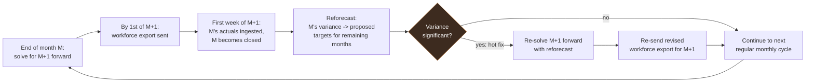

# 01. System Overview

## Problem

A program manager runs several concurrent projects staffed from a shared pool of people. Each project has a monthly labor spend target driven by funding profile and period of performance, not by task completion. Each person has finite monthly capacity and a loaded cost that changes over time as salary, overhead, and fee rates change.

The planning task is: allocate hours across (project, person, month) so that each project lands on its monthly spend target, nobody is overbooked, staffing bounds are respected, and the plan does not thrash between revisions.

Doing this by hand is a constraint satisfaction problem with hundreds of interacting cells. A MILP solver already exists and does it well. The gap is representation: MS Project is the current front end, and its API is a poor integration surface for Python tooling.

## What this system is

A thin, purpose-built planning tool with three parts:

1. A structured editing surface where humans maintain constraints and review results.
2. A Python service that pulls constraints, solves, and writes back assignments.
3. An ingest path that reconciles actual charged hours against the plan.

## What this system is not

Naming these explicitly, because each has been the death of a similar tool elsewhere.

- **Not a scheduler.** No predecessors, no durations, no critical path, no leveling engine. Projects are single tasks. If precedence relationships appear in requirements, this is the wrong tool and the design should be revisited from scratch.
- **Not a timekeeping system.** Actual hours originate elsewhere and are imported. The system never becomes the system of record for time charged.
- **Not an accounting system.** It computes planned and actual labor cost for planning purposes. It does not close books, does not handle indirect pools, and its numbers are not authoritative for billing.
- **Not multi-tenant.** Single organization, single planning group, tens of people and tens of projects. Design decisions favor clarity over scale.
- **Not a replacement for the funding document.** PoP dates and budgets are transcribed from contract documents; the system does not manage or version those documents.

## Operational goals

These come from the original requirement and shape the objective in `04-solver-design.md` more than any single constraint does.

- **Steady pulse.** Assignments should be as stable month to month as possible: no sudden drop to zero, no repeated phase-in/phase-out for the same person on the same project. This is a management goal, not just a modeling nicety.
- **Ramp-up.** A project's first month or two is ideally staffed only by PIs, co-PIs, and key technical contributors, with the rest of the team phased in once there is a project plan. Confirmed as a real, routine pattern (not hypothetical) — enforced by planners setting narrower `bounds` for early months, which is why bounds are per-month (`03-data-model.md`), not by a separate solver feature.
- **Spend out by PoP end, achieved by reforecasting, not in-solve trade-off.** A linear monthly spend profile is the naive default but rarely what actually happens; a project is routinely over or under its monthly target and the response is to modulate the remaining months to converge on near-zero variance by PoP end. The solver itself still treats whatever is currently in `targets` as dominant — the redistribution happens between solves, when a closed month's actuals trigger a reforecast of the remaining months' targets, split proportionally to their existing target shares and always reviewed by the PM before it's written. See "Reforecasting" in `04-solver-design.md`.
- **A project should never finish with unspent budget.** The stated goal is stronger than "near-zero variance": a project's total labor spend should land at or slightly above its funded ceiling by PoP end — a small overspend (on the order of 0.1%-1%) is acceptable, underspend is not. This is a staffing decision as much as a planning one: staff are expected to be held onto, or pulled in part-time from elsewhere in the org, specifically to spend a project out fully. That only works if the org's total available staff-hours genuinely cover the portfolio's total demand — see the staffing-balance assessment below.
- **Staffing balance is an assessment, not an auto-remediation.** The system should be able to compare total available spend *capacity* against total portfolio spend *demand* — in dollars, not raw hours, since not all person-hours are equivalent (salary and applicable wrap rate both vary) — month by month and in aggregate, and surface the imbalance: surplus capacity (find outside-portfolio work for excess staff) or a shortfall (pull in staff from elsewhere), the same way an infeasibility report names a binding constraint without resolving it. Finding the actual outside work or the actual extra staff is the planner's call.
- **Fragmentation defaults.** Absent a planner override, every worker gets a soft limit of 2 concurrent projects and a hard limit of 4. Exceeding the soft limit should be rare.
- **Idle capacity is a signal for humans, not a solver target.** When a solve leaves someone under-booked, the expected response is a planner investigating — renegotiating that person's bounds, or finding them work outside this system's tracked projects — not the solver forcing an assignment to zero it out. `W_idle` stays a low tie-breaker weight for this reason.
- **NCE as a release valve.** When worker constraints can't be satisfied within a project's period of performance, the system should be able to point at a no-cost extension (lengthening the PoP with no added funding) as a possible fix, not just report infeasibility. Confirmed as v1.1 scope, diagnostics-only — not yet built.

## Users and their loops

**Program manager (primary).** Weekly to monthly cadence. Adjusts bounds and targets, triggers a solve, reviews the task view and resource view, investigates variance. Cares about: does the plan hit the target, and who is over capacity.

**Resource owner / line manager.** Reviews the resource view for their people. Cares about: is anyone underutilized, is anyone fragmented across too many projects, is anyone booked past capacity.

**Analyst / the person maintaining this system.** Runs the solver, tunes weights, diagnoses infeasibility, extends the model. Cares about: reproducibility and being able to diff two scenarios.

**Workforce (recipient only, no tool access).** Never opens Grist or the solver. Receives a plain export of their own hours by project for the immediate next month, on or before the 1st. Cares about: what they're assigned to work on next month. Never sees cost, rate, or salary information — the workforce export is scoped to worker/project/hours only, by design.

## Primary workflow

Confirmed as the actual operating cadence, not a hypothetical:

```
1. End of month M: planners solve for M+1 and as many subsequent
   months as they can, using bounds/targets/capacity edited in Grist
   and whatever reforecast was accepted from M-1's actuals (M's own
   actuals aren't in yet at this point — see below).
2. By the 1st of M+1: the workforce export (hours only, no cost) is
   generated and sent out.
3. First week of M+1: M's actuals land via ingest. M becomes a
   closed month; its allocation is fixed.
4. Reforecast computes M's target-vs-actual variance and proposes an
   updated target profile for the project's remaining open months
   (including M+1, now in progress).
5. If the variance is significant, planners re-solve M+1 forward
   using the reforecast ("a hot fix") and re-send a revised workforce
   export for M+1. If not, the cycle just continues at step 1 for
   the next month.
6. PM reviews task view and resource view; accepted plans are
   snapshotted to git as the new baseline.
```



The baseline snapshot in step 6 matters more than it looks. The solver's stability objective measures churn against the last accepted baseline, so without a deliberate accept step there is nothing to be stable relative to.

The one-month lag is structural, not a bug to fix: a month's actuals are never available in time to inform the solve that plans that same month. Reforecasting always works one cycle behind, correcting the *next* solve rather than the one already sent out — except in a hot fix, which is exactly the exception built to shorten that lag when the miss is big enough to matter.

## Scale assumptions

These bound the engineering, and every one of them is deliberately generous relative to the real case.

| Dimension | Expected | Design ceiling |
|---|---|---|
| Projects | 5 to 30 | 100 |
| People | 10 to 60 | 250 |
| Planning horizon | 12 to 24 months | 60 months |
| Allocation cells | roughly 10k | roughly 500k |
| Solve time | seconds | under 5 minutes |
| Concurrent editors | 1 to 3 | 10 |

At the design ceiling the MIP has on the order of 500k continuous variables and a similar count of binaries, which is past what an open source solver handles comfortably. Mitigations, if the ceiling is ever approached: restrict the allowable assignment set so that most (project, person) pairs never generate variables, drop binaries where semi-continuous behavior is not actually needed, and solve rolling windows rather than the full horizon. See `04-solver-design.md`.

## Glossary

| Term | Meaning |
|---|---|
| PoP | Period of performance. The contractual window during which a project may incur cost. |
| ODC | Other direct costs. Non-labor, non-travel direct charges. |
| OH | Overhead. An indirect rate applied to direct labor. |
| Fee | Profit component applied on top of cost, in cost-plus structures. |
| FTE | Full-time-equivalent. Bounds are entered and stored in hours, not FTE fraction; an aggregate %FTE per person per month is computed as a reporting check (`assigned_fte`), not a solver input. |
| UFY | The corporate fiscal year, starting July 1. Wrap rates are set annually at this boundary, even though they are stored per calendar month. |
| NCE | No-cost extension. Lengthening a project's period of performance with no additional funding. |
| Rate structure | Which single rate layer (project, OH, or fee) applies to a given project. |
| Wrap rate | The multiplier from base hourly rate to a specific layer's loaded rate (project, OH, or fee). |
| Loaded cost | Labor cost after applying the applicable rate layer. |
| Hard bound | A constraint the solver may never violate. Infeasibility is the correct outcome if it cannot be met. |
| Soft bound | A preference. Violation is permitted and penalized in the objective. |
| Baseline | The last human-accepted allocation, used as the reference for plan stability. |
| Cell | One (project, person, month) allocation entry. |
| Locked cell | A cell whose hours a human has pinned. The solver treats it as a fixed value. |
| Closed month | A month whose actuals are final. Assignments are fixed to actuals. |
| Reforecast | The step, triggered after a closed month's actuals land, that proposes redistributing that month's target-vs-actual variance across a project's remaining open months, proportional to their existing target shares. Always PM-reviewed before being written. |
| Hot fix | An unplanned second solve for the current (in-progress) month, triggered when the just-closed month's reforecast reveals a variance significant enough that the already-distributed workforce export for the current month should be revised and re-sent. |
