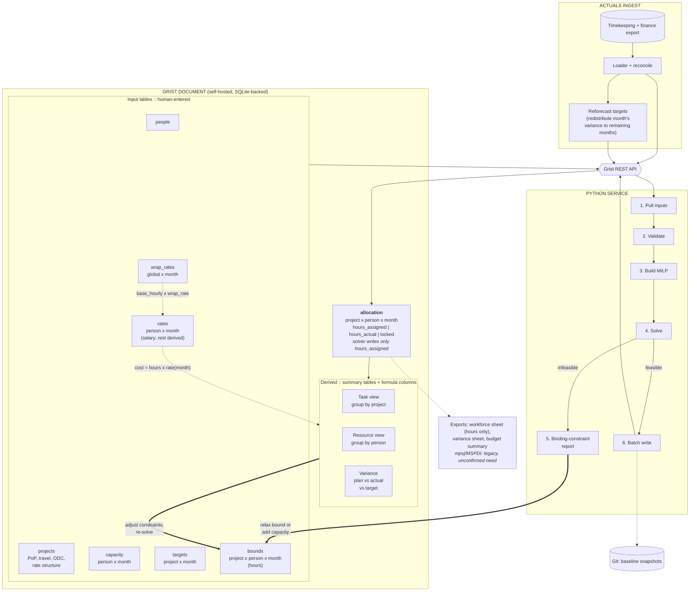
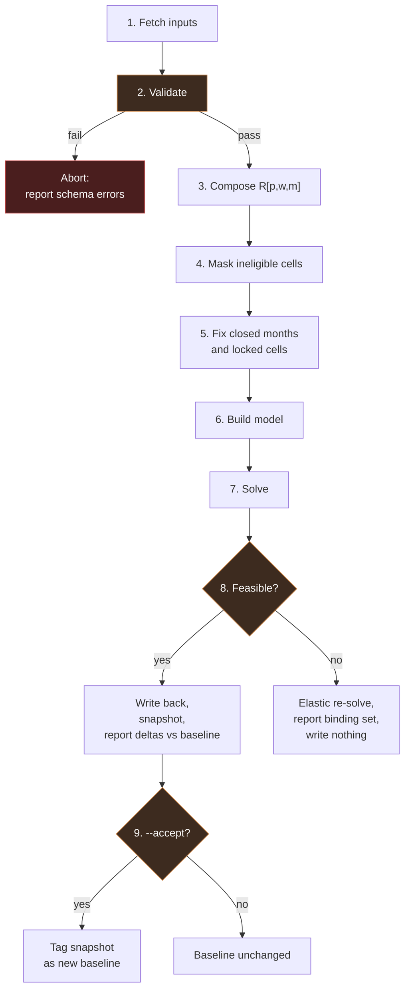

# 02. System Architecture

## Component diagram



## Components

### Grist document

Serves three roles that would otherwise require three separate builds: a typed editing grid, a formula engine for derived cost columns, and a reporting layer via summary tables.

Chosen over a custom UI because the derived views are the bulk of the UI work, and Grist gives them as summary tables over `allocation` with zero code. Chosen over Excel because it has typed columns, referential integrity through reference columns, row-level access rules, and a REST API rather than a file format.

**Responsibilities:** persist all tables; enforce column types and references; compute derived cost and rollup columns; render task and resource views; provide access control.

**Explicit non-responsibility:** the MILP does not run here. Grist formulas are per-cell and evaluated server-side in a sandbox. A global optimization does not belong in that execution model.

### Python service

A batch process, not a daemon. Invoked by CLI or by a scheduled job. Stateless between runs; all state lives in Grist and git.

**Responsibilities:** pull and validate inputs; compose rates into per-cell cost coefficients; build and solve the MILP; write assignments back; produce diagnostics; snapshot baselines.

### Actuals ingest

Reads an export from the timekeeping and finance system, maps charge codes to (project, person, month), aggregates hours, and writes `hours_actual`. Runs on its own cadence, independent of solving. The source system is confirmed; the exact export format is not yet in hand, so early development targets a synthetic, randomly generated dataset shaped like the eventual real export rather than blocking on integration access.

Reconciliation is the hard part, not the loading. Charge code to project mapping is many-to-one and changes over time. See `05-interfaces.md`.

Immediately downstream of a successful ingest for a closed month, **reforecasting** computes the variance between that month's target and its actual spend and proposes an updated `targets` profile for the project's remaining open months, so the plan keeps converging on its funded total even though no single month's number is sacred. See "Reforecasting" in `04-solver-design.md`.

### Git snapshot store

Every solve writes its full input set and resulting allocation as JSON. Accepted baselines are tagged. This gives scenario diffing, reproducibility, and an audit trail without building any of those features, and it is what makes the plan stability objective meaningful.

## Boundaries and why they are where they are

**The REST API is the only path into Grist.** Nothing reads or writes the underlying SQLite file directly, even though the format is open and it would be faster. Bypassing the API bypasses formula recalculation and access rules, and it would make a second consumer (notebook, dashboard, what-if CLI) a special case. One boundary, many clients.

**The solver writes one column.** `allocation.hours_assigned`. Not costs, not rollups, not status flags. This is what makes the write step a single idempotent batch operation and makes it obvious what a solve did and did not change.

**Derived values never cross the boundary inbound.** The service pulls raw inputs and recomputes rates itself rather than reading Grist's computed cost columns. The two implementations of the cost composition (Grist formula and Python) are then cross-checked in tests. Duplicating the logic is deliberate: it catches drift that a single implementation would hide.

## Control flow: a solve run

```
allocsolver solve --horizon 2026-09:2027-08 [--dry-run] [--accept]

  1. Fetch      people, projects, rates, capacity, targets, bounds, allocation
                as of a single API read window.
  2. Validate   Pydantic models, then cross-table checks:
                  - every bounds row references a live person and project
                  - rates cover every person for every month in horizon
                  - capacity covers every person for every month in horizon
                  - hard_min <= soft_min <= soft_max <= hard_max
                  - targets fall within project PoP
                Validation failures abort before the solver runs. Reporting
                twelve schema errors beats reporting one infeasibility.
  3. Compose    R[p,w,m], the loaded hourly cost coefficient per cell.
  4. Mask       Zero out cells outside PoP, outside employment window, or
                where the (project, person) pair is not permitted.
  5. Fix        Closed months to actuals; locked cells to their pinned value.
  6. Build      Variables, constraints, objective (see 04).
  7. Solve      With a time limit and a MIP gap tolerance.
  8. Branch     Feasible -> write back, snapshot, report deltas vs baseline.
                Infeasible -> re-solve the elastic relaxation, report the
                binding set, write nothing.
  9. Accept     Only with --accept: tag the snapshot as the new baseline.
```



Steps 8 and 9 are separate on purpose. A solve that is not accepted still writes `hours_assigned` so the operator can look at it in the views, but it does not move the baseline. Otherwise every exploratory solve resets the reference that plan stability is measured against, and the stability term becomes meaningless.

## Deployment

Two containers plus a scheduler entry.

```
grist:        gristlabs/grist-core, volume-mounted document store
allocsolver:  python image, invoked ad hoc or by cron/systemd timer
```

Grist defaults to SQLite storage, which is adequate at this scale. Postgres is available if concurrent editing becomes a problem, which at 1 to 3 editors it will not.

**Future work, tracked but not blocking v1:** the planning group's actual track record with shared files (shared drives, hand-edited spreadsheets) is that people routinely overwrite each other's work, not because Grist-level concurrency is unusually fragile but because the group needs technical guardrails, not just goodwill. Grist's row-level access rules and the solver's single-writer-per-column discipline (see Boundaries, above) already help, but a real conflict-detection or locking mechanism for human edits is worth designing deliberately once this tool is in daily use, rather than assuming discipline will hold. This does not block `[OPEN-6]`'s read-consistency deferral, which is a narrower, lower-stakes question about the solver's own read burst.

Secrets: a Grist API key in the environment, scoped to the planning document. The service needs write access to `allocation` only, which Grist access rules can enforce at column level.

## Failure modes worth designing for

| Failure | Handling |
|---|---|
| Rate table has a gap for a person-month | Validation error before solve. Never interpolate silently. |
| Capacity missing for a person-month | Validation error. Defaulting to 0 hides staffing gaps; defaulting to full time overbooks. |
| Solve exceeds time limit | Return best incumbent with its MIP gap, flagged as not proven optimal. |
| Genuinely infeasible | Elastic re-solve, report binding constraints. Never write. |
| Write partially succeeds | Batch write is a single API transaction. On failure, nothing is written and the prior state stands. |
| Charge code maps to no project | Ingest quarantines the row and reports it. Never drops it. |
| Someone hand-edits assigned hours in Grist | The next solve overwrites it unless the cell is locked. This is intended, and is why `locked` exists. |
| Two planners edit overlapping bounds/targets at the same time | Not currently guarded beyond Grist's own row-level behavior. Known real-world failure mode with this planning group on shared files elsewhere; tracked as future work, not solved here. |
