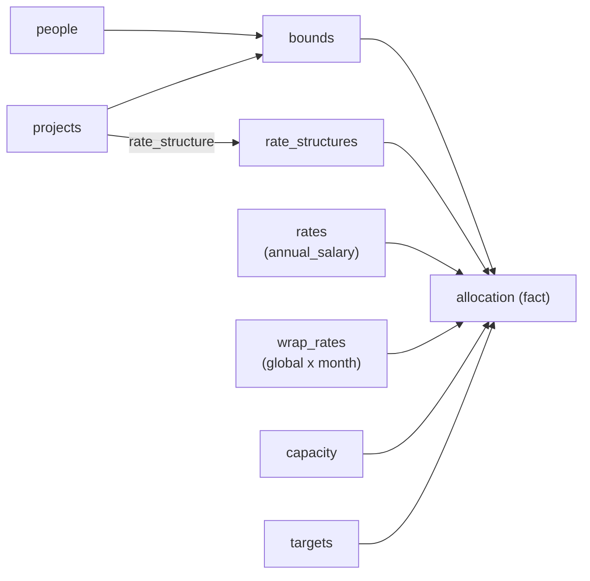
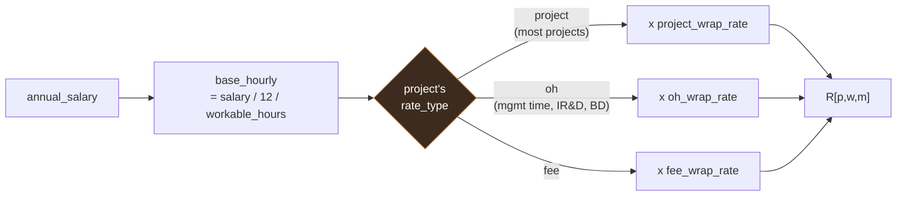

# 03. Data Model

## Shape

A star schema. One fact table (`allocation`), seven dimension and parameter tables, one join table (`bounds`). The two user-facing views described in the original requirement are pivots of the fact table, not stored structures.



The "task view" groups `allocation` by project and the "resource view" groups it by person. Neither is a table. Storing both is how the same number ends up with two values.

## Time granularity

The month is the atomic time unit throughout. Represented as `YYYY-MM` text or as the first-of-month date, consistently, everywhere. `[OPEN-1]`

Mixing month representations across tables is the single most likely source of silent join failures in this schema, so the choice is made once and enforced by a Pydantic validator, not by convention.

## Tables

### `people`

| Column | Type | Notes |
|---|---|---|
| `person_id` | text, PK | Stable. Never reuse after departure. |
| `name` | text | Display only. |
| `active_from` | month | First month employable. |
| `active_to` | month, nullable | Last month employable. Null means open-ended. |
| `soft_max_concurrent_projects` | int | Fragmentation limit, penalized above. Default 2. |
| `hard_max_concurrent_projects` | int | Fragmentation limit, never exceeded. Default 4. |

`active_from` / `active_to` exist so that departures and new hires are modeled rather than handled by deleting rows, which would orphan history.

Two fragmentation limits, not one: the source requirement is explicit that a worker should rarely be spread across many projects for a small percentage each, but that this is a preference to be traded off, not an absolute rule — hence a soft ceiling that costs an objective penalty above it, and a hard ceiling that the solver may never cross. Defaults of 2 (soft) and 4 (hard) apply to every worker unless a planner overrides them; this replaces the earlier single, nullable `max_concurrent_projects` field.

### `projects`

| Column | Type | Notes |
|---|---|---|
| `project_id` | text, PK | |
| `name` | text | |
| `pop_start` | month | |
| `pop_end` | month | |
| `rate_structure` | ref -> `rate_structures` | Which cost layers apply. |
| `travel_budget` | decimal | Carried, not optimized. `[OPEN-4]` |
| `odc_budget` | decimal | Carried, not optimized. `[OPEN-4]` |
| `status` | enum | `active`, `pending`, `closed`. Non-active excluded from solve. |

### `rate_structures`

Not in the original requirement, but required to keep `rate_structure` from being a free-text field that the cost composition has to pattern match on.

**Resolved (`[OPEN-2]`).** This is a *selection*, not a stack: a project's hours are costed at the project rate, the OH rate, or the fee rate — one of the three, chosen by the project's rate structure — never a multiplicative or additive combination of them. Most projects select `project`. Internally funded efforts — management time, internal R&D (IR&D), business development — are the "special circumstances" that select `oh` or `fee` instead.

| Column | Type | Notes |
|---|---|---|
| `structure_id` | text, PK | e.g. `direct`, `oh-charged`, `fee-charged`. |
| `rate_type` | enum | `project`, `oh`, or `fee`. Selects which single wrap rate applies to hours on this project. |

This replaces an earlier draft of this table (`apply_oh` / `apply_fee` / `composition` bools) that assumed a multiplicative or additive stack.

### `wrap_rates`

Global reference data, not per person — not present in earlier drafts of this schema, and needed to hold the corporate-wide multipliers the notes describe separately from any individual's salary.

| Column | Type | Notes |
|---|---|---|
| `month` | month, PK | |
| `workable_hours` | decimal | Standard workable hours that month; the divisor for everyone's hourly rate. Displayed prominently alongside the month in the task/resource views so planners always see the reference figure they're working against. |
| `project_wrap_rate` | decimal | Multiplier from base hourly rate to fully-loaded project cost. |
| `oh_wrap_rate` | decimal | Multiplier from base hourly rate to fully-loaded OH-pool cost. |
| `fee_wrap_rate` | decimal | Multiplier from base hourly rate to fully-loaded fee-pool cost. |

**Each of the three wrap rates is complete in itself.** A project wrap rate already embeds whatever fringe, G&A, or other percentage components make it up on the finance side; the system treats it as one opaque number and never decomposes or recomposes it further. Selecting `oh_wrap_rate` or `fee_wrap_rate` is not "adding OH on top of project rate" — it is *replacing* the project multiplier with a different, equally complete one.

Stored dense per month like `rates`, but in practice these four values change only at the corporate fiscal year boundary (UFY, starting July 1), not monthly. The entry workflow should be organized around UFY, even though the table itself stays calendar-month grained for join simplicity.

### `rates`

Time-phased, per person. This is the table that makes cost a function of month.

| Column | Type | Notes |
|---|---|---|
| `person_id` | ref -> `people`, PK part | |
| `month` | month, PK part | |
| `annual_salary` | decimal | The only stored input. Everything cost-related is computed from it at read time. |

**Resolved (`[OPEN-3]`).** `annual_salary` is the sole entered value; there is no `project_rate` / `oh_rate` / `fee_rate` stored per person. A person doesn't have three parallel rates sitting on their row — the wrap rate is a property of the *project*, not the *person*. Cost composition happens at the point a specific (project, person, month) cell is costed:

```
base_hourly[w,m] = annual_salary[w,m] / 12 / workable_hours[m]
R[p,w,m]         = base_hourly[w,m] x wrap_rate[ rate_structures[p].rate_type, m ]
```

`workable_hours` and the three wrap rates come from `wrap_rates`, keyed by month and selected by the costed project's `rate_type` — never derived, always a specified reference value.

**Dense, not sparse.** One row per person per month in the horizon, even when nothing changes. Sparse "effective from" rows require the reader to implement as-of lookup correctly in two places (Grist formula and Python), and as-of lookups are where off-by-one-month bugs live. At 60 people over 60 months this is 3600 rows, which is nothing. In practice this column rarely changes and can be generated from a sparse editing table if hand entry of the dense form is tedious.

### `capacity`

| Column | Type | Notes |
|---|---|---|
| `person_id` | ref -> `people`, PK part | |
| `month` | month, PK part | |
| `available_hours` | decimal | Net of holiday and planned leave. |

Not present in the original requirement, and load-bearing. If capacity is the only coupling between projects, then this table *is* the coupling. Without it the solver has nothing to contend over and will happily book a person 400 hours in March.

### `bounds`

| Column | Type | Notes |
|---|---|---|
| `project_id` | ref, PK part | |
| `person_id` | ref, PK part | |
| `month` | month, PK part | Resolved per-month, `[OPEN-5]`. |
| `hard_min` | decimal, hours | Solver may never go below when assigned. |
| `soft_min` | decimal, hours | Penalized below. |
| `soft_max` | decimal, hours | Penalized above. |
| `hard_max` | decimal, hours | Solver may never exceed. |
| `eligible` | bool | False means this pair generates no variable at all. |

**Units (resolved, `[OPEN-7]`).** These four bounds are entered and stored in **hours**, not FTE fraction. An earlier reading of the notes suggested FTE percentage, since that's the mental model planners start from — but in practice planners are expected to be responsible for exact hour counts against a month's known workable hours, not a percentage abstraction; a defaulted "every month is 160 hours" is exactly the kind of imprecision this tool exists to remove. `wrap_rates.workable_hours` is displayed alongside each month in the views specifically so a planner always has the reference figure to work against when entering an hours-based bound.

An aggregate **%FTE check** is still useful, just as a derived report rather than an input: see `assigned_fte[w,m]` in the Derived section below.

**Invariant:** `0 <= hard_min <= soft_min <= soft_max <= hard_max`. Enforced at validation, not at write time, so that mid-edit states are permitted in the UI.

`eligible` is a performance lever as much as a modeling one. Marking ineligible pairs cuts variable count directly, and at the design ceiling that is the difference between a solve and a timeout.

**Resolved (`[OPEN-5]`): per month.** `bounds` is a real `projects x people x months` grid, needing a grid editor, not a simple list. This is confirmed for two independent reasons: the notes describe an explicit ramp-up pattern (a project's first month or two staffed only by PIs, co-PIs, and key technical contributors, phased in afterward, enforced by varying these bounds across months), and separately, plan review and replanning happen on a monthly cadence in practice — bound adjustments are the routine case, not the exception.

### `targets`

| Column | Type | Notes |
|---|---|---|
| `project_id` | ref, PK part | |
| `month` | month, PK part | |
| `labor_spend_target` | decimal | |
| `target_tolerance` | decimal, nullable | Band within which deviation is unpenalized. |
| `target_type` | enum | `soft` (penalized) or `hard` (constrained). |

`target_type` matters. A funding cap that legally cannot be exceeded is a different object from a burn target you are trying to hit. Modeling both as soft deviation will eventually produce a plan that overruns a ceiling because the penalty was cheaper than the alternative.

**`soft` is the normal case, confirmed.** In practice a project is routinely over or under its monthly target, and the response is to modulate the remaining months' targets so total spend lands near zero variance by PoP end — not to hold each month to its original number. See "Reforecasting" in `04-solver-design.md` for the mechanism (resolved: proportional split across remaining open months, always human-reviewed). `hard` is reserved for a genuine, legally binding funding ceiling, expected to be rare.

### `allocation` (fact table)

| Column | Type | Notes |
|---|---|---|
| `project_id` | ref, PK part | |
| `person_id` | ref, PK part | |
| `month` | month, PK part | |
| `hours_assigned` | decimal | **Solver-owned.** |
| `hours_actual` | decimal, nullable | **Ingest-owned.** |
| `locked` | bool | Human pin. Solver fixes the variable. |
| `lock_note` | text, nullable | Why. Unexplained locks become permanent. |
| `solve_id` | text | Which solve run last wrote this row. |

Three writers, three disjoint column sets, no overlap. That is what makes concurrent solving and ingest safe without locking.

## Derived, never stored

Every one of these is a formula column or summary table in Grist, and a computed property in Python.

| Derived value | Definition |
|---|---|
| `assigned_cost[p,w,m]` | `hours_assigned x R[p,w,m]` |
| `actual_cost[p,w,m]` | `hours_actual x R[p,w,m]` |
| Project / person totals | Sum of the above, grouped by project or person, optionally also by month |
| Delta hours | `hours_assigned - hours_actual` (task/resource view "Delta hours") |
| Delta cost | `assigned_cost - actual_cost` (task/resource view "Delta cost") |
| Spend variance | `assigned_cost - target`, at the project x month level. Distinct from the assigned-vs-actual delta above: this tracks plan against funding target, not plan against reality. |
| Utilization / idle | `sum over projects of hours_assigned / available_hours`; `idle = available_hours - sum over projects of hours_assigned` |
| `assigned_fte[w,m]` | `sum over projects of hours_assigned[p,w,m] / available_hours[w,m]` |
| Cumulative project spend (to date) | `sum over m' <= m of assigned_cost[p,*,m']` and the same for `actual_cost`; feeds the budget summary export's "expended" figures. |
| Remaining budget | `(sum over all m of target[p,m]) - cumulative assigned_cost` (planned) and the same substituting `actual_cost` (actual); feeds the budget summary export's "remaining" figures. |

Storing any of these creates a second source of truth that goes stale on the first retroactive rate correction, and retroactive rate corrections are routine.

**`assigned_fte[w,m]`** is the reporting-side answer to `[OPEN-7]`: bounds are entered in hours, but planners still think in FTE terms, so this aggregate is computed and surfaced — from either the task view (per person, per project row) or the resource view (per person, across all their projects) — as a check, never as a solver input. It divides by `available_hours[w,m]` (that person's actual capacity that month, net of leave) rather than the global `wrap_rates.workable_hours`, so it reads correctly for someone on partial leave instead of understating how full their month already is.

**Idle capacity is a planner-facing signal, not a solver target.** When a solve leaves someone with leftover capacity, the expected response is a human investigating — renegotiating that person's bounds or fragmentation limit, or finding them work outside this system's tracked projects — not the solver being pushed to eliminate idle time on its own. This is why `W_idle` stays a low tie-breaker weight in the objective (`04-solver-design.md`) rather than a dominant term.

## Rate composition

`R[p,w,m]` is the loaded hourly cost of person `w` on project `p` in month `m`. It is a constant at solve time, which is what keeps the model linear.

**Resolved (`[OPEN-2]`, `[OPEN-3]`).** A base hourly rate multiplied by exactly one wrap rate, selected by the project's rate structure:

```
base_hourly[w,m] = annual_salary[w,m] / 12 / workable_hours[m]

R[p,w,m] = base_hourly[w,m] x wrap_rate[ rate_structures[p].rate_type, m ]
```

where `wrap_rate[project, m]`, `wrap_rate[oh, m]`, and `wrap_rate[fee, m]` are `project_wrap_rate[m]`, `oh_wrap_rate[m]`, and `fee_wrap_rate[m]` from `wrap_rates`, each a complete, atomic multiplier — never decomposed further. Most projects have `rate_type = project`; internally funded efforts (management time, IR&D, business development) are the exception, using `oh` or `fee` instead.



Selection, not stacking: exactly one branch is taken per project, never a combination of the three.

This replaces an earlier draft that assumed OH and fee compose multiplicatively or additively on top of the project rate, and an earlier draft of `rates` that stored `project_rate` / `oh_rate` / `fee_rate` per person. Neither survives: the wrap rate is a property of the project being costed, not something carried on the person's row.

Implementation lives in exactly one function, `costing.rates.loaded_rate()`, mirrored by one Grist formula, with a test asserting the two agree across the full cross product of structures and a fixture rate table.

## Referential rules

- Deleting a person or project is forbidden while allocation rows reference it. Use `status` and `active_to` instead.
- `bounds` rows for ineligible pairs are kept, not deleted, so that eligibility history survives.
- `allocation` rows are created by the solver for eligible in-PoP cells and are not deleted when eligibility changes. A cell that becomes ineligible gets `hours_assigned = 0`.
