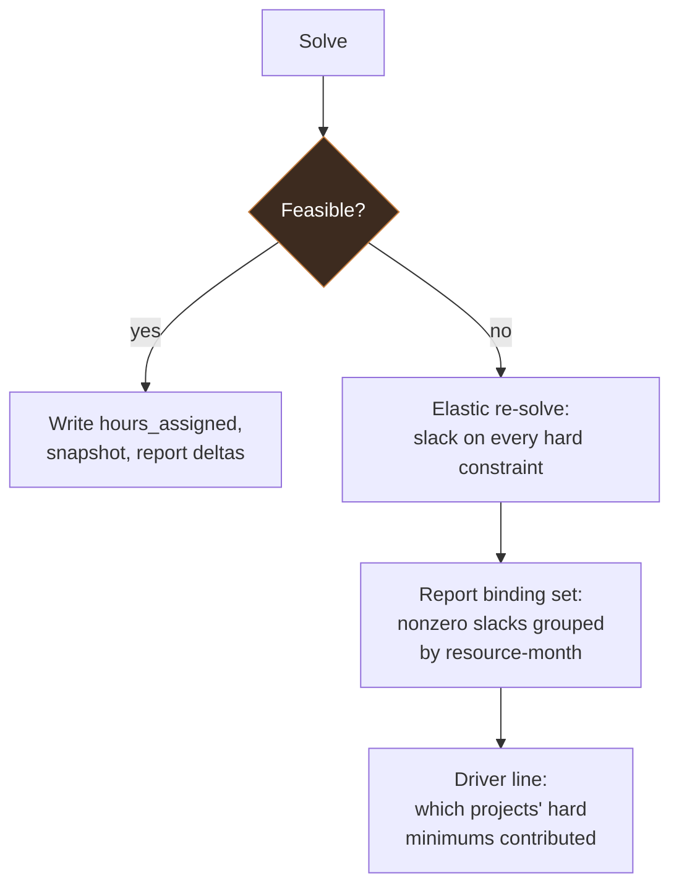

# 04. Solver Design

## Sets

| Symbol | Meaning |
|---|---|
| `P` | Projects with status `active`, indexed `p` |
| `W` | People, indexed `w` |
| `M` | Months in the solve horizon, ordered, indexed `m` |
| `E` | Eligible cells, the subset of `P x W x M` where the pair is eligible, `m` is within `[pop_start[p], pop_end[p]]`, and `m` is within `[active_from[w], active_to[w]]` |
| `F` | Fixed cells, the subset of `E` that is locked or in a closed month |

Variables are generated over `E`, not over the full cross product. At the design ceiling this is the difference between a tractable model and an intractable one.

## Parameters

| Symbol | Source | Meaning |
|---|---|---|
| `R[p,w,m]` | composed from `rates` and `wrap_rates` | Loaded hourly cost |
| `cap[w,m]` | `capacity` | Available hours |
| `hmin, smin, smax, hmax [p,w,m]` | `bounds` | Hour bounds (resolved `[OPEN-7]`: hours, not FTE fraction) |
| `T[p,m]` | `targets` | Monthly labor spend target |
| `tol[p,m]` | `targets` | Unpenalized deviation band |
| `base[p,w,m]` | last accepted baseline | Prior assigned hours |
| `fix[p,w,m]` | `allocation` | Value for cells in `F` |
| `soft_maxproj[w], hard_maxproj[w]` | `people` | Concurrent project limits, soft and hard |

An earlier draft of this design read the notes as specifying `hmin, smin, smax, hmax` in FTE fraction, which would have needed a build-time conversion to hours via `cap[w,m]`. That reading was overridden: planners enter and expect to see hours directly, so no conversion happens here. The FTE view is reconstructed only for reporting — see `assigned_fte[w,m]` in `03-data-model.md`.

## Decision variables

| Variable | Domain | Meaning |
|---|---|---|
| `x[p,w,m]` | continuous, `>= 0` | Hours assigned |
| `y[p,w,m]` | binary | 1 if the person is staffed on the project that month |
| `u[p,w,m]` | continuous, `>= 0` | Shortfall below soft min |
| `o[p,w,m]` | continuous, `>= 0` | Excess above soft max |
| `dp[p,m], dm[p,m]` | continuous, `>= 0` | Spend over and under target |
| `idle[w,m]` | continuous, `>= 0` | Unassigned capacity |
| `cp[p,w,m], cm[p,w,m]` | continuous, `>= 0` | Churn up and down vs baseline |
| `frag[w,m]` | continuous, `>= 0` | Project count above the soft fragmentation limit |

`y` is why this is a MILP rather than an LP. Without it, `hard_min` would force every eligible person onto every project at their minimum, which is nonsense. `y` makes `x` semi-continuous: either zero, or at least `hard_min`.

## Constraints

**C1. Semi-continuous assignment.** For all `(p,w,m)` in `E`:

```
hmin[p,w,m] * y[p,w,m]  <=  x[p,w,m]  <=  hmax[p,w,m] * y[p,w,m]
```

Both bounds gated by `y`. The upper gate is what forces `x = 0` when `y = 0`.

**C2. Soft bounds with elastic slack.** For all `(p,w,m)` in `E`:

```
x[p,w,m] + u[p,w,m]  >=  smin[p,w,m] * y[p,w,m]
x[p,w,m] - o[p,w,m]  <=  smax[p,w,m] * y[p,w,m]
```

Gating by `y` prevents charging a soft-min penalty for a person who is simply not on the project. Without the gate, the objective pays to staff people it should leave off.

**C3. Capacity.** For all `w`, `m`:

```
sum over p of x[p,w,m]  +  idle[w,m]  =  cap[w,m]
```

Written as an equality with an explicit `idle` term rather than as an inequality. Uncovered capacity is a real cost (it lands in overhead or B&P), so the model should see it and be able to trade against it. If uncovered capacity is genuinely free, set its weight to zero; do not change the constraint.

**C4. Spend target.** For all `p`, `m`:

```
sum over w of R[p,w,m] * x[p,w,m]  -  T[p,m]  =  dp[p,m] - dm[p,m]
```

For `target_type = hard`, additionally:

```
sum over w of R[p,w,m] * x[p,w,m]  <=  T[p,m]
```

which makes the target a ceiling rather than an aim point. A funding cap and a burn target are different objects and this is where the difference lives.

Tolerance is handled by penalizing only the portion outside the band, via `dp' >= dp - tol[p,m]` with `dp' >= 0` and penalizing `dp'`.

**C5. Fixed cells.** For all `(p,w,m)` in `F`:

```
x[p,w,m] = fix[p,w,m]
```

Applied as variable bound fixing rather than as a constraint row, which lets presolve remove them entirely.

**C6. Fragmentation.** For all `w`, `m`:

```
sum over p of y[p,w,m]  <=  hard_maxproj[w]                 (hard, always enforced)
sum over p of y[p,w,m]  <=  soft_maxproj[w] + frag[w,m]      (soft, frag penalized)
```

Two-tiered per the notes: it should be *rare* for a worker to exceed the soft limit, not impossible, so it is penalized rather than forbidden, while the hard limit is a true ceiling. Defaults are `soft_maxproj = 2`, `hard_maxproj = 4` for every worker unless a planner overrides them.

**C7. Churn linearization.** For all `(p,w,m)` in `E \ F`:

```
x[p,w,m] - base[p,w,m]  =  cp[p,w,m] - cm[p,w,m]
```

`cp + cm` is then the absolute deviation from baseline, valid as a linearization because the objective minimizes both terms.

## Objective

```
minimize
    W_target    * sum over p,m   ( dp'[p,m] + dm'[p,m] )      / norm_dollars
  + W_soft      * sum over E     ( u[p,w,m] + o[p,w,m] )      / norm_hours
  + W_idle      * sum over w,m   ( idle[w,m] )                / norm_hours
  + W_churn     * sum over E\F   ( cp[p,w,m] + cm[p,w,m] )    / norm_hours
  + W_headcount * sum over E     ( y[p,w,m] )                 / norm_count
  + W_frag      * sum over w,m   ( frag[w,m] )                / norm_count
```

**Normalization is not optional.** Spend deviation is in dollars, soft violations are in hours, headcount is a count. Without dividing each term by a scale factor, the weights are uninterpretable and tuning becomes trial and error. Use the horizon totals as the norms: total target dollars, total capacity hours, total eligible cells.

**Suggested starting weights:** target 100, soft 10, frag 8, churn 5, idle 3, headcount 1. Target dominance is deliberate. The stated purpose of the tool is hitting whatever is currently in `targets`; everything else is a tiebreaker among plans that hit it. `frag` is placed above `churn` because the notes call out fragmentation as something that "should be rare," language stronger than the general churn-avoidance goal.

**The churn term is the one people leave out and regret.** Without it, a one-line change to a bound produces a completely reshuffled plan, because the solver is indifferent among equally optimal solutions and will return whichever one branch-and-bound reached first. Operators lose trust in a tool that scrambles the plan for no visible reason, and they stop re-solving, and then the tool is dead. Five percent weight on stability buys the plan's credibility.

**Resolved (`[OPEN-9]`): non-linear spend is achieved by reforecasting `targets`, not by loosening this weighting.** An earlier draft of this design considered demoting `W_target` below `W_churn`/`W_frag` so the solver itself could trade a month's target adherence for stability within a single solve. That is not the mechanism: target dominance at the objective level stays as documented above. Instead, when a month closes and actuals land, the variance between that month's target and its actual spend is redistributed across the project's *remaining* open months before the next solve — see **Reforecasting** below. The solver always tries hard to hit whatever is currently in `targets`; it's `targets` itself that gets updated to reflect reality.

### Reforecasting

Computed once actuals for a closed month `M` are ingested, which the confirmed operating cadence puts in the first week of month `M+1` — after `M+1`'s own solve already ran at the end of `M`, since `M`'s actuals don't exist yet at that point. So reforecasting is always one cycle behind whatever it's correcting, working on the most recently closed month to inform the *next* solve:

```
variance[p,M] = T[p,M] - actual_cost[p,M]     (positive = underspent, negative = overspent)

for each remaining open month m in (M, pop_end[p]]:
    T[p,m] <- T[p,m] + share(variance[p,M], m)
```

**Resolved (`[OPEN-11]`): `share()` splits the variance proportionally** to each remaining month's existing target share, preserving the plan's relative shape rather than flattening it. Reforecasting always produces a *proposed* updated `targets` table for the PM to review, never a silent overwrite — consistent with this design's existing posture (`--dry-run` as the default, `--accept` as an explicit step) and confirmed as the right posture by the PM: the actual monthly rhythm is that planners review the prior month's plan, adjust values for the current and future months themselves, and manually trigger the re-solve — reforecasting proposes a starting point for that review, it doesn't replace it.

**Whether to act on it — the "hot fix" — is a judgment call, not an automatic trigger.** Confirmed cadence: planners solve at the end of month `M` for `M+1` forward and distribute by the 1st. `M`'s actuals land in the first week of `M+1`. *If* the resulting variance is significant, planners re-solve `M+1` (now in progress) incorporating the reforecast and re-send a revised assignment — a hot fix. If not, nothing happens until the next regular monthly cycle. No numeric threshold is defined for "significant"; it's left to planner judgment in v1. This keeps the project's total planned spend converging on its funded amount by PoP end even though no single month's target is held sacred, which is exactly the "modulated month by month... to spend to near zero by the end" pattern described as the normal operating mode.

### Lexicographic alternative

If weight tuning proves unstable, solve in stages instead:

```
1. Minimize target deviation.        -> D*
2. Constrain deviation <= D* * 1.02, minimize soft violations.  -> S*
3. Constrain both, minimize churn.
```

Slower (three solves) but produces defensible answers: "we hit the target, then among target-hitting plans we minimized bound violations." That sentence is easier to defend in a program review than a weight vector.

## Infeasibility diagnostics

A bare `infeasible` is useless to a program manager. The system never surfaces one.



**Elastic re-solve.** On infeasibility, rebuild with a slack variable on every hard constraint, penalized at a weight far above any other objective term:

```
C1':  x >= hmin * y - s_hmin
C1':  x <= hmax * y + s_hmax
C3':  sum_p x  <=  cap + s_cap
C4':  hard targets get s_target
```

This model is always feasible. The nonzero slacks are exactly the constraints that had to break, and their magnitudes are the required relaxation. The report reads:

```
INFEASIBLE. Minimum relaxation to reach feasibility:

  capacity   J. Doe        2026-11    +38.0 h   over available 160.0
  capacity   J. Doe        2026-12    +12.5 h
  hard_min   PROJ-C / R. Smith 2027-02  -8.0 h  (hard_min 40, achievable 32)

  Driver: PROJ-A and PROJ-C both require J. Doe at hard_min in Nov,
          totaling 198 h against 160 h capacity.
```

The last line is the part that gets acted on, and it is derived by grouping nonzero slacks by resource-month and listing which projects' hard minimums contribute.

**IIS as a secondary tool.** An irreducible infeasible subsystem is more rigorous and less readable. Provide it behind `--iis` for the analyst, not in the default path. SCIP supports it, but OR-Tools' `MPSolver` wrapper (the primary solve path, see `06-code-structure-and-dependencies.md`) doesn't expose it — `--iis` drops down to `PySCIPOpt` directly for this one path, an accepted extra dependency scoped to a rarely-used analyst tool.

**No-cost extension (NCE) as a remediation option.** The notes ask for the solver to be able to recommend extending a project's period of performance with no additional funding when worker constraints otherwise can't be met. This is not yet modeled. Candidate approach: when the binding driver in the elastic re-solve is capacity contention concentrated near a project's `pop_end`, re-run the diagnostic with that project's `pop_end` relaxed by one or more months and report whether the binding set clears. This would be diagnostic-only in v1 — the tool reports "extending PROJ-C by 2 months resolves the binding constraint," it does not change `pop_end` itself. Scope and mechanics are open: `[OPEN-10]`.

## Performance

| Lever | Effect | When to reach for it |
|---|---|---|
| Restrict `E` via `eligible` | Cuts variables and binaries proportionally | First. Always. Most pairs are never real. |
| Drop `y` where `hmin = 0` and no fragmentation limit | Removes binaries entirely for those cells | When binaries dominate solve time |
| MIP gap tolerance of 0.5 to 1 percent | Large speedup, negligible plan difference | Routine. Optimality to the penny is meaningless when rates are estimates. |
| Warm start from baseline | Faster convergence, better incumbents early | Routine, once a baseline exists |
| Rolling horizon | Solve 12 months, freeze the first 3, roll | Only past roughly 100k cells |
| Fix closed months by bound rather than constraint | Presolve eliminates them | Routine |

Set a wall-clock limit (300 s default). On timeout, return the incumbent with its proven gap and flag the result as not optimal. A 1 percent gap plan delivered in a minute beats a proven optimum nobody waited for.

## Testing the model

Property tests matter more than example tests here, because the failure mode is a subtly wrong plan rather than a crash.

- **Feasibility monotonicity:** relaxing any bound never worsens the optimal objective.
- **Capacity respected:** no person exceeds `cap` in any month, in any returned solution.
- **Semi-continuity:** every nonzero `x` is at least its `hard_min`.
- **Fixed cells honored:** locked and closed-month cells match input exactly.
- **Churn sanity:** re-solving with unchanged inputs returns the baseline unchanged.
- **Fragmentation tiers:** no person exceeds `hard_maxproj` in any month; exceeding `soft_maxproj` only ever happens with a nonzero `frag` penalty charged.
- **Rate agreement:** Python `loaded_rate()` matches the Grist formula across the full structure cross product, and against the `base_hourly x wrap_rate` decomposition.
- **Reforecast conservation:** redistributing a month's variance across the remaining open months never changes the project's total planned-plus-actual spend, only its shape.

The churn test is the regression canary. If it starts failing, either the model became degenerate or someone removed the stability term.
