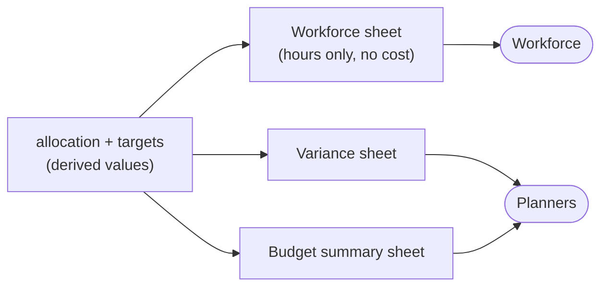

# 05. Interfaces

## Grist REST API

Base: `{GRIST_URL}/api/docs/{DOC_ID}`. Auth by bearer token in the environment.

### Read

```
GET /tables/{tableId}/records[?filter={...}]
```

All input tables are pulled in a single burst at the start of a run. Records come back as `{id, fields: {...}}`; the wrapper flattens to Pydantic models immediately so that Grist's envelope shape does not leak past `io/grist.py`.

**Read consistency:** Grist does not offer a snapshot read across tables. Two mitigations, both cheap: record the document's action log position before and after the read burst and abort if it moved, or accept the risk given 1 to 3 editors and a read burst measured in hundreds of milliseconds. Start with the second, implement the first if it ever bites. `[OPEN-6]`

### Write

```
PATCH /tables/Allocation/records     update existing rows
PUT   /tables/Allocation/records     upsert by key
```

Prefer `PUT` with `require: {project_id, person_id, month}` so that new cells and updated cells are one call. The entire write is one request per batch of up to a few thousand records, which makes it effectively atomic at the batch level.

**Never written by the solver:** `hours_actual`, `locked`, `lock_note`, and every column of every other table. Enforce this in code by giving the write client an explicit column allowlist, and enforce it again in Grist access rules so that a bug cannot corrupt human input.

### Client contract

```python
class GristClient:
    def fetch_table(self, table: str, model: type[T]) -> list[T]: ...
    def upsert_allocation(self, rows: list[AllocationWrite]) -> int: ...
    def action_log_position(self) -> int: ...
```

Three methods. Everything else the service needs is composition over these. Keeping this surface small is what makes swapping Grist for Postgres later a one-file change rather than a rewrite.

## Actuals ingest

The hard part is mapping, not loading.

### Input

A CSV or Excel export from the timekeeping and finance system: hours per worker per project, in some period grouping. The source system is identified; the exact column layout of its export is not yet in hand. Expected minimum columns: employee identifier, charge code, date or period, hours. Everything else ignored.

Until real export access exists, development and testing run against a synthetic, randomly generated dataset shaped like the eventual real export, rather than blocking on integration. The tolerant-reader posture below (don't assume column order or exact headers) is written with that eventual real export in mind, not the synthetic one.

Confirmed cadence: actuals for a closed month land in the *first week* of the following month — after that month's own forward solve has already run and been distributed. Ingest and reforecasting always work one cycle behind the solve they inform; see "Reforecasting" in `04-solver-design.md`.

### Mapping table

Lives in Grist alongside the rest, since it needs human maintenance.

| Column | Notes |
|---|---|
| `charge_code` | As it appears in the export |
| `project_id` | Target project |
| `effective_from` | Month this mapping starts |
| `effective_to` | Nullable |

Charge code to project is many-to-one and changes over time, which is why the mapping is time-phased rather than a static dictionary. Reorganizations retroactively rename codes; a static map silently misallocates history when that happens.

Employee identifier to `person_id` needs the same treatment if the timekeeping system's identifiers do not match. Assume they do not.

### Pipeline

```
1. Parse       tolerant reader; do not assume column order or exact headers
2. Normalize   identifiers, trim, uppercase charge codes, parse dates
3. Map         charge_code + month -> project_id; employee -> person_id
4. Quarantine  unmapped rows to a report; never drop, never guess
5. Aggregate   sum hours by (project_id, person_id, month)
6. Write       hours_actual via upsert
7. Report      total hours in, mapped, quarantined, and rows written
8. Reforecast  for each project with a newly closed month, compute
                variance against that month's target and propose an
                updated target profile for the remaining open months
                (see `04-solver-design.md`). Proposal only — written to
                `targets` only on explicit accept, same posture as solve.
                Acting on it (re-solving the in-progress month as a
                "hot fix") is always a separate, human-judged decision,
                not automatic.
```


Step 4 is the one that gets cut for time and should not be. An unmapped charge code that silently disappears makes actual cost quietly understated, and nobody notices until a variance review months later.

### Reconciliation report

After each ingest, emit:

- Total hours in the export vs total hours written. These must agree, or the difference must be fully accounted for by quarantined rows.
- Cells with actuals but no plan (unplanned work).
- Cells with plan but no actuals in a closed month (planned work that did not happen).

Both of the last two are planning signals, not errors, and both are invisible without this report.

## CLI

```
allocsolver validate      --data-dir data                checks only, no solve

allocsolver solve         --data-dir data
                          [--time-limit 300] [--mip-gap 0.01]
                          [--export-dir output]

allocsolver advance-month --data-dir data [--output-dir output]
                          [--time-limit 300] [--mip-gap 0.01]
                          [--seed N] [--yes]
                          the simulated real-time engine: solve the
                          current month forward, simulate that month's
                          actuals, close it, propose (and on --yes,
                          apply) a reforecast, one month per invocation

allocsolver ingest        --file actuals.csv [--dry-run]
allocsolver reforecast    --project <id> [--dry-run] [--accept]
allocsolver diff          --from <snap> --to <snap>
allocsolver snapshot      --list | --show <id> | --accept <id>
allocsolver export        --format mspdi --out plan.xml     (legacy, see below)
allocsolver iis           --horizon ...          analyst tool, infeasibility only
```

**Implemented:** `validate`, `solve`, `advance-month` — all three work against a local JSON data directory (`io/local.py`), not yet a live Grist document. `solve`'s `--export-dir` and `advance-month`'s automatic per-month bundle are what actually produce the three confirmed export formats today, rather than a standalone `export --format ...` verb.

**Still design-only** (this section's original target shape, not yet built): `ingest` against a real timekeeping export, `reforecast` as its own CLI verb (the mechanism itself is implemented and used internally by `advance-month`, just not exposed standalone), `diff`, `snapshot`, `iis`, and the `mspdi` export format.

`--dry-run` on `ingest` (once built) writes nothing and prints the deltas it would have made, matching `solve`'s posture of never writing without being asked.

## Snapshots

Every run writes a directory to the snapshot repo:

```
snapshots/2026-08-24T140312Z-a3f9c1/
    inputs.json        every input table as pulled, verbatim
    allocation.json    resulting hours_assigned
    objective.json     term-by-term breakdown, weights, MIP gap, solve time
    diagnostics.json   binding constraints, if any
    meta.json          solve_id, horizon, code version, solver version
```

Committed to git; accepted baselines get a tag. This gives reproducibility, scenario diffing, and an audit trail for free.

`inputs.json` is the important one. Storing the full inputs means any solve can be replayed exactly, months later, against a different code version, which is the only reliable way to answer "why did the plan say that in November."

`allocsolver diff` compares two snapshots cell by cell and reports movement grouped by project and by person, which is what a program review actually wants to see.

## Exports

Confirmed: only planners use Grist/the solver directly. Everyone else is a recipient of a plain export, never a user of the tool. Three formats are confirmed requirements; a fourth (MSPDI) is legacy and now unconfirmed.



### Workforce assignment sheet

Sent to the workforce by the 1st of each month. Deliberately excludes all cost, rate, and salary information — this is the one export that leaves the planning group's trust boundary, so the column set is a hard allowlist, not just "whatever's convenient to include":

| Column | Notes |
|---|---|
| Worker name | |
| Project name | |
| Hours assigned | For the immediate next month. |
| (Additional months) | Optional, if known — in practice, lately only the immediate next month is populated. |

### Variance sheet

For planners. One row per (worker, project):

| Column | Notes |
|---|---|
| Worker name | |
| Project name | |
| Hours assigned | |
| Actual hours billed | |
| Delta | `assigned - actual` |

**Implemented timing detail.** In the per-month output produced by `advance-month` (`06-code-structure-and-dependencies.md`'s `reforecast/` and `reports/exports.py`), each dated folder `output/<month>/` names its variance file `<month-1>_variance.csv` — the *previous* month's, not its own. A month's actuals aren't known until the month after it closes, so the variance a given cycle can meaningfully report is always one month behind the one it just solved. The work-assignment file in the same folder is prefixed with `<month>` itself, since that plan genuinely is for `<month>`, sent before it starts.

### Budget summary sheet

For planners, one per project. A metadata block plus a monthly matrix:

```
Metadata:
    Project name
    PoP dates
    Labor budget (the fixed funded ceiling; see labor_budget in 03-data-model.md)
    Budget expended (planned)
    Budget expended (actual)
    Budget remaining (planned)
    Budget remaining (actual)

Monthly matrix (columns = each month in the PoP):
    Planned spend
    Actual spend
    Delta
```

Budget expended/remaining are measured against `labor_budget` — the project's fixed funded total — not a sum of whatever the monthly targets currently say, since reforecasting redistributes the latter without changing the former.

A project's budget summary is also copied into a persistent `completed_project_reports/` folder (sibling to the dated per-month folders, not itself month-named) the one month its PoP actually ends, so a project's final report doesn't require hunting through every dated folder to find.

All three are computed entirely from existing derived values (`03-data-model.md`'s Derived section) — no new stored data, just a new rendering. Format is CSV by default (universally readable, no dependency); `openpyxl` (already an optional extra for timekeeping `.xlsx` input) covers `.xlsx` output too if that's ever preferred over CSV.

### Manual pre-assignments

A planner's own input, kept in a file separate from anything the solver or the ingest/reforecast machinery writes: `pre_assignments.json`, one `bounds`-shaped row per manual decision (bring a specific person onto a specific project for a specific month, at specific hour bounds). `advance-month` applies it — upserting each entry into `bounds` by `(project_id, person_id, month)`, running full plan validation so a typo'd id is caught immediately — then clears it before solving. The override itself persists permanently in `bounds`; the file is only ever "this cycle's new manual decisions," not a running log.

### Staffing balance assessment

Not one of the three confirmed exports, but implemented alongside them (`reports/staffing_balance.py`): `staffing_balance.csv`, one row per month, comparing total available spend *capacity* against total portfolio spend *demand* — in dollars, not raw hours, since not all person-hours are equivalent (salary and applicable wrap rate both vary person to person and month to month, so an hour of capacity and an hour of demand aren't fungible units to compare directly). Capacity is valued at each person's standard "direct" project rate (capacity itself isn't tied to any one project's rate structure); demand uses each cell's real `loaded_rate()`. Real demand comes from a solve's `hours_assigned` if one exists, otherwise `bounds.soft_max` as the planner's intended demand before any solve. Each row is flagged `surplus`, `shortfall`, or `balanced`, plus a `TOTAL` row across the whole horizon.

This exists because "spend every project out fully" (`01-system-overview.md`'s operational goals) only works if the org's total staff-hours genuinely cover the portfolio's total demand. The report is deliberately an assessment, not a remediation — like an infeasibility report naming a binding constraint without relaxing it, this names the imbalance (find outside-portfolio work for a surplus month, pull in staff from elsewhere for a shortfall one) without deciding how to fix it.

### MS Project export (legacy, unconfirmed need)

Originally speculative, for stakeholders who might need a `.mpp`-family file. Now that the actual downstream consumers are confirmed (workforce: hours only; planners: the three exports above), no one has actually asked for MSPDI/`.mpp`. Kept as optional and low-priority rather than removed, since `01-system-overview.md` names MS Project as the system being replaced and some other legacy consumer may still exist — but don't build this before the three confirmed exports.

`mpxj` via JPype writes MSPDI XML (it reads `.mpp` but does not write it), so the round trip is: generate MSPDI, open in Project, save as `.mpp` if required. Requires a JVM in the container.

The mapping is lossy by construction, and should be, since the whole premise is that Project's model does not fit:

| This system | MSPDI |
|---|---|
| Project | Task |
| Person | Resource |
| Cell hours | Timephased assignment work |
| Bounds | Nothing. Dropped. |
| Spend target | Nothing. Dropped. |
| Rate structure | Resource standard rate, flattened |

Export is one-way. There is no import path, and adding one would reintroduce exactly the coupling this design exists to remove.
