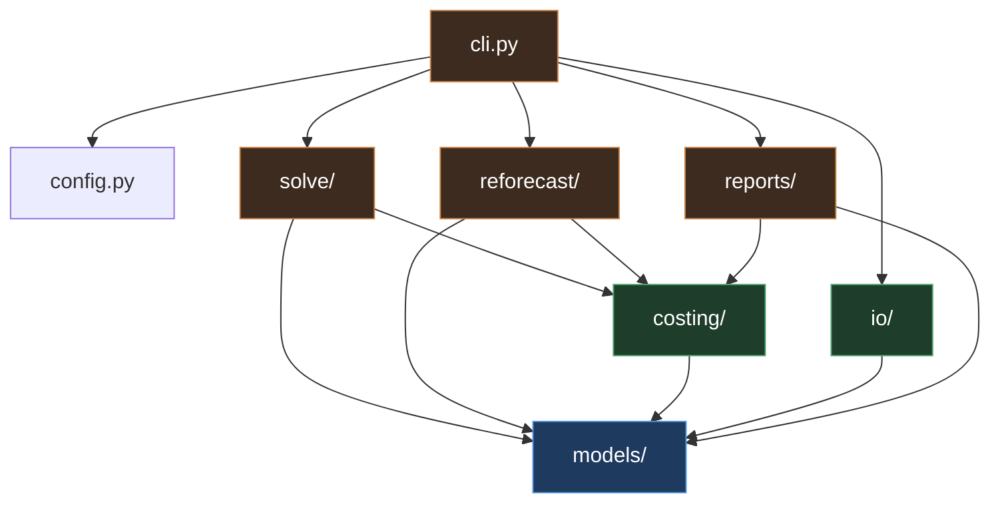

# 06. Code Structure and Dependencies

## Package layout

```
allocsolver/
    __init__.py
    config.py                 settings, env, weight defaults
    cli.py                    Typer entry points

    models/                   Pydantic. Depends on nothing internal.
        __init__.py
        calendar.py           Month type, horizon, ordering, parsing
        people.py
        projects.py           Project, RateStructure
        rates.py           Rate (annual_salary only), WrapRate
        capacity.py
        bounds.py          hard/soft min/max, in hours
        targets.py
        allocation.py         AllocationRow, AllocationWrite
        plan.py               Plan aggregate: the full validated input set

    costing/                  Depends on models only.
        rates.py              loaded_rate(), the single cost composition
        masks.py              eligibility, PoP windows, employment windows

    solve/                    Depends on models + costing.
        variables.py          variable generation over E
        constraints.py        C1 through C7
        objective.py          terms, normalization, weights
        build.py              assembles the model
        run.py                solve, timeout, gap, warm start
        elastic.py            always-feasible relaxation
        diagnostics.py        binding-constraint report, IIS wrapper
        result.py             SolveResult

    reforecast/               Depends on models + costing. Not the solver.
        variance.py           target-vs-actual variance for a closed month
        redistribute.py       spreads variance across a project's
                              remaining open months, proportional to
                              their existing target shares (resolved
                              `[OPEN-11]`)
        propose.py            builds the proposed `targets` update for
                              review, mirroring solve's dry-run/accept posture

    io/                       Depends on models only.
        local.py              implemented: load/save a Plan as one JSON
                              file per table — used by the CLI and the
                              standalone examples; the live Grist document
                              (below) is the other Plan I/O backend
        pre_assignments.py    implemented: the planner's manual
                              pre-assignment inbox — load, apply
                              (upsert into bounds, fully re-validated),
                              and clear `pre_assignments.json`
        synthetic.py           implemented: perturbs a solved month's
                              hours into plausible hours_actual,
                              standing in for a real timekeeping import
        timekeeping.py        not yet built: real actuals parse, map,
                              quarantine
        mapping.py            not yet built: charge code and employee
                              resolution
        snapshot.py           not yet built: git-backed snapshot read
                              and write
        mpxj_export.py        legacy, guarded import, unconfirmed need

    The `GristClient` from `05-interfaces.md` is implemented, but lives outside
    this package: `grist_planner/planner_api/grist_client.py`, alongside the
    FastAPI service that uses it (`docs/08-grist-ui-design.md`). It depends on
    `httpx` and `fastapi`, neither of which the core solver needs — keeping them
    out of `allocsolver`'s own dependency list is why the Grist integration is a
    separate deployment rather than a fourth module in `io/`.

    reports/                  Depends on models + costing.
        views.py              task view, resource view pivots; includes
                              assigned_fte reporting check
        variance.py
        exports.py            the three confirmed CSV exports: workforce
                              assignment sheet (no cost columns), variance
                              sheet, budget summary sheet
        diff.py               snapshot comparison
        render.py             rich terminal output

tests/
    unit/
    property/                 hypothesis strategies over Plan
    fixtures/                 small hand-checked planning scenarios,
                              plus the synthetic generator's output
    test_rate_parity.py       Python vs Grist formula agreement

grist/
    schema.json               document schema export, version controlled
    formulas/                 formula column source, mirrored from costing

deploy/
    docker-compose.yml
    .env.template
```

## Internal dependency graph



**Invariants, enforced by an import-linter contract in CI:**

- `models/` imports nothing from the package. It is pure schema.
- `costing/` never imports `solve/`, `reforecast/`, or `io/`.
- `solve/` never imports `io/`. The solver receives a `Plan` object and returns a `SolveResult`. It has no idea Grist exists.
- `reforecast/` never imports `io/` or `solve/`, for the same reason: it operates on `Plan`-shaped data in and a proposed `targets` update out, independent of Grist and of the MILP.
- No cycles anywhere.

That third rule is what makes the solver testable without a network, replayable from a snapshot, and swappable behind a different storage layer.

## External dependencies

### Core runtime

| Package | Version | License | Why |
|---|---|---|---|
| Python | 3.11+ | PSF | `datetime` improvements, `tomllib`, better typing |
| `pydantic` | ^2.7 | MIT | Schema, validation, JSON round trip for snapshots |
| `httpx` | ^0.27 | BSD-3 | Grist REST client, sync and async, connection reuse |
| `ortools` | ^9.10 | Apache-2.0 | MILP modeling and solving, via `linear_solver` (MPSolver) with the bundled SCIP backend. |
| `polars` | ^1.0 | MIT | Pivots and aggregation for views and ingest |
| `python-dateutil` | ^2.9 | Apache-2.0 / BSD-3 | Month arithmetic |
| `typer` | ^0.12 | MIT | CLI |
| `rich` | ^13 | MIT | Diagnostics and report rendering |
| `tomli-w` | ^1.0 | MIT | Weight config write-back |

### Optional

| Package | License | Guard |
|---|---|---|
| `mpxj` | LGPL-2.1 | Extra `[msproject]`. Pulls JPype and needs a JVM. Legacy, unconfirmed need — see `05-interfaces.md`. |
| `JPype1` | Apache-2.0 | Transitive from `mpxj` |
| `openpyxl` | MIT | Extra `[excel]`, only if timekeeping exports `.xlsx`, or for `.xlsx` report exports |
| `duckdb` | MIT | Extra `[analysis]`, ad hoc snapshot querying |
| `PySCIPOpt` | MIT | Extra `[iis]`. Direct SCIP access for `--iis` only; bypasses OR-Tools' generic wrapper for that one path. |

### Development

| Package | License | Why |
|---|---|---|
| `pytest` | MIT | |
| `hypothesis` | MPL-2.0 | Property tests over generated plans |
| `ruff` | MIT | Lint and format |
| `mypy` | MIT | Strict mode. The schema is the design; typing enforces it. |
| `import-linter` | BSD-2 | Enforces the layering contract above |

### Infrastructure

| Component | License | Notes |
|---|---|---|
| `grist-core` | Apache-2.0 | Self-hosted via Docker |
| SQLite | Public domain | Grist's document format |
| Git | GPL-2.0 | Snapshot store. Used as a tool, not linked. |

## Solver choice

**Google OR-Tools, via `linear_solver` (`MPSolver`), with SCIP as the backend.** Apache-2.0, actively maintained, and the tool this design has targeted from the original requirement onward. `MPSolver` is OR-Tools' generic algebraic-modeling interface — it is not CP-SAT, and nothing here needs CP-SAT: hours are naturally continuous, and `MPSolver` handles continuous-plus-binary MILPs directly against SCIP (bundled, no separate install) or CBC. SCIP is generally considered the strongest fully open-source MIP solver available, competitive with commercial solvers on many benchmark classes, which matters once the design ceiling's ~500k-variable models are in play.

**The one real cost: IIS is harder to reach.** `04-solver-design.md`'s `--iis` analyst tool wants an irreducible infeasible subsystem. SCIP supports this natively, but OR-Tools' `MPSolver` wrapper is intentionally generic across backends and doesn't expose it. Getting IIS out means dropping past OR-Tools into SCIP's own Python API (`PySCIPOpt`) for that one code path — a second dependency, used only behind `--iis`, not in the default flow. This is an accepted tradeoff, not an oversight: the elastic-relaxation report is the default, always-on diagnostic (see `04-solver-design.md`), and it does not depend on IIS. `--iis` stays a secondary, analyst-only escape hatch that may need its own backend access.

**Alternatives, and why not:**

- **CP-SAT** (part of OR-Tools). Excellent, but wants integer domains. Discretizing hours to some fixed granularity (quarter hours, minutes) to use it is a real option but adds a modeling wrinkle for no clear gain over `MPSolver`+SCIP on a naturally continuous quantity.
- **HiGHS, via `highspy`.** Fast, MIT licensed, and gives direct, first-class IIS access — the strongest argument in its favor. Passed over in favor of the explicit preference for OR-Tools; revisit only if SCIP-via-OR-Tools proves to be a real performance problem in practice, which is not expected at this design's scale.
- **PuLP.** A modeling layer, not a solver — would sit on top of CBC/HiGHS/others rather than replacing this choice. Not needed: OR-Tools' `MPSolver` already gives an algebraic-enough interface without an extra dependency layer.
- **Pyomo** (BSD-3). More capable modeling layer than either PuLP or `MPSolver`, more ceremony than this model needs.
- **Gurobi / CPLEX.** Faster and better diagnostics. Commercial licensing. Worth revisiting only if the design ceiling is approached in practice.

Isolate the choice behind `solve/run.py` so that swapping it is a one-file change. Do not let solver-specific types escape into `result.py`.

## License posture

Every runtime dependency is permissive (MIT, BSD, Apache-2.0). Nothing copyleft is linked into the service.

Two things to keep an eye on:

- **`mpxj` is LGPL-2.1.** Fine for internal use and fine as a dynamically linked optional extra. It becomes a question only if this tool is ever distributed as a binary artifact. Keeping it behind an optional extra means the default install has no LGPL component at all.
- **`hypothesis` is MPL-2.0.** Weak copyleft, dev-only, never shipped. Not an issue, but worth knowing it is there before someone runs a license scan and asks.
- **`grist-core` is Apache-2.0**, but the Grist Enterprise features (audit log streaming among them) are not. If audit logging becomes a requirement, that is a purchase decision, not a code decision. Do not build around assuming it is present.

## Pinning and reproducibility

Lock with `uv` or `pip-tools`, or with a conda `environment.yml` for the reference environment; commit the lock file. Snapshots record the resolved versions of `allocsolver` and `ortools` (which pins its bundled SCIP version) in `meta.json`, because a solver version change can shift which optimal solution is returned among ties even when the objective value is identical. Without that record, a replay that produces a different plan is unexplainable.
