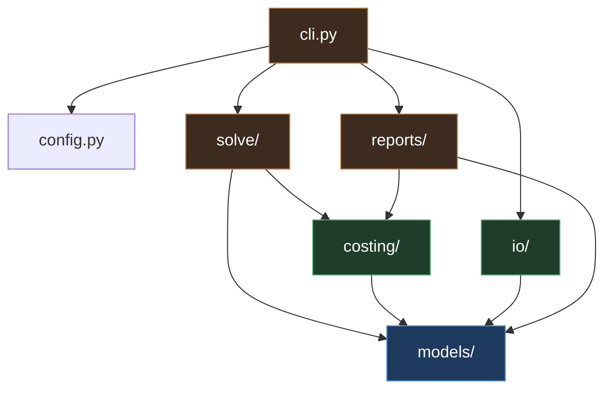

# 06. Code Structure and Dependencies

## Package layout

```
allocsolver/
    __init__.py
    config.py                 settings, env, weight defaults
    cli.py                    Typer entry points

    models/                   Pydantic. Depends on nothing internal.
        __init__.py
        calendar.py           Month type, horizon, ordering, parsing
        people.py
        projects.py           Project, RateStructure
        rates.py           Rate (salary, derived project/oh/fee), WrapRate
        capacity.py
        bounds.py          FTE-fraction hard/soft min/max
        targets.py
        allocation.py         AllocationRow, AllocationWrite
        plan.py               Plan aggregate: the full validated input set

    costing/                  Depends on models only.
        rates.py              loaded_rate(), the single cost composition
        masks.py              eligibility, PoP windows, employment windows

    solve/                    Depends on models + costing.
        variables.py          variable generation over E; FTE-bound to hours conversion
        constraints.py        C1 through C7
        objective.py          terms, normalization, weights
        build.py              assembles the model
        run.py                solve, timeout, gap, warm start
        elastic.py            always-feasible relaxation
        diagnostics.py        binding-constraint report, IIS wrapper
        result.py             SolveResult

    io/                       Depends on models only.
        grist.py              GristClient
        timekeeping.py        actuals parse, map, quarantine
        mapping.py            charge code and employee resolution
        snapshot.py           git-backed snapshot read and write
        mpxj_export.py        optional, guarded import

    reports/                  Depends on models + costing.
        views.py              task view, resource view pivots
        variance.py
        diff.py               snapshot comparison
        render.py             rich terminal output

tests/
    unit/
    property/                 hypothesis strategies over Plan
    fixtures/                 small hand-checked planning scenarios
    test_rate_parity.py       Python vs Grist formula agreement

grist/
    schema.json               document schema export, version controlled
    formulas/                 formula column source, mirrored from costing

deploy/
    docker-compose.yml
    .env.template
```

## Internal dependency graph



**Invariants, enforced by an import-linter contract in CI:**

- `models/` imports nothing from the package. It is pure schema.
- `costing/` never imports `solve/` or `io/`.
- `solve/` never imports `io/`. The solver receives a `Plan` object and returns a `SolveResult`. It has no idea Grist exists.
- No cycles anywhere.

That third rule is what makes the solver testable without a network, replayable from a snapshot, and swappable behind a different storage layer.

## External dependencies

### Core runtime

| Package | Version | License | Why |
|---|---|---|---|
| Python | 3.11+ | PSF | `datetime` improvements, `tomllib`, better typing |
| `pydantic` | ^2.7 | MIT | Schema, validation, JSON round trip for snapshots |
| `httpx` | ^0.27 | BSD-3 | Grist REST client, sync and async, connection reuse |
| `pulp` | ^2.8 | MIT | MILP modeling. Readable algebraic syntax. |
| `highspy` | ^1.7 | MIT | HiGHS solver. Fast open source MIP, IIS support. |
| `polars` | ^1.0 | MIT | Pivots and aggregation for views and ingest |
| `python-dateutil` | ^2.9 | Apache-2.0 / BSD-3 | Month arithmetic |
| `typer` | ^0.12 | MIT | CLI |
| `rich` | ^13 | MIT | Diagnostics and report rendering |
| `tomli-w` | ^1.0 | MIT | Weight config write-back |

### Optional

| Package | License | Guard |
|---|---|---|
| `mpxj` | LGPL-2.1 | Extra `[msproject]`. Pulls JPype and needs a JVM. |
| `JPype1` | Apache-2.0 | Transitive from `mpxj` |
| `openpyxl` | MIT | Extra `[excel]`, only if timekeeping exports `.xlsx` |
| `duckdb` | MIT | Extra `[analysis]`, ad hoc snapshot querying |

### Development

| Package | License | Why |
|---|---|---|
| `pytest` | MIT | |
| `hypothesis` | MPL-2.0 | Property tests over generated plans |
| `ruff` | MIT | Lint and format |
| `mypy` | MIT | Strict mode. The schema is the design; typing enforces it. |
| `import-linter` | BSD-2 | Enforces the layering contract above |

### Infrastructure

| Component | License | Notes |
|---|---|---|
| `grist-core` | Apache-2.0 | Self-hosted via Docker |
| SQLite | Public domain | Grist's document format |
| Git | GPL-2.0 | Snapshot store. Used as a tool, not linked. |

## Solver choice

**HiGHS via `highspy`, modeled through PuLP.** MIT licensed, actively developed, strong MIP performance, and it supports IIS extraction, which CBC does not. Modeling through PuLP rather than the HiGHS API directly keeps the model readable and leaves the solver swappable.

**Alternatives, and why not:**

- **CBC** (bundled with PuLP, EPL-2.0). Works, notably slower on MIPs of this shape, no IIS. Keep as a fallback so the tool runs with zero extra install.
- **OR-Tools** (Apache-2.0). Excellent, especially CP-SAT. CP-SAT wants integer domains, and hours here are naturally continuous; discretizing to quarter hours to use it is a real option but adds a modeling wrinkle for no clear gain. Its MIP path is a wrapper over other solvers anyway.
- **Pyomo** (BSD-3). More capable modeling layer than PuLP, more ceremony than this model needs.
- **Gurobi / CPLEX.** Faster and better diagnostics. Commercial licensing. Worth revisiting only if the design ceiling is approached in practice.

Isolate the choice behind `solve/run.py` so that swapping it is a one-file change. Do not let solver-specific types escape into `result.py`.

## License posture

Every runtime dependency is permissive (MIT, BSD, Apache-2.0). Nothing copyleft is linked into the service.

Two things to keep an eye on:

- **`mpxj` is LGPL-2.1.** Fine for internal use and fine as a dynamically linked optional extra. It becomes a question only if this tool is ever distributed as a binary artifact. Keeping it behind an optional extra means the default install has no LGPL component at all.
- **`hypothesis` is MPL-2.0.** Weak copyleft, dev-only, never shipped. Not an issue, but worth knowing it is there before someone runs a license scan and asks.
- **`grist-core` is Apache-2.0**, but the Grist Enterprise features (audit log streaming among them) are not. If audit logging becomes a requirement, that is a purchase decision, not a code decision. Do not build around assuming it is present.

## Pinning and reproducibility

Lock with `uv` or `pip-tools`; commit the lock file. Snapshots record the resolved versions of `allocsolver`, PuLP, and HiGHS in `meta.json`, because a solver version change can shift which optimal solution is returned among ties even when the objective value is identical. Without that record, a replay that produces a different plan is unexplainable.
