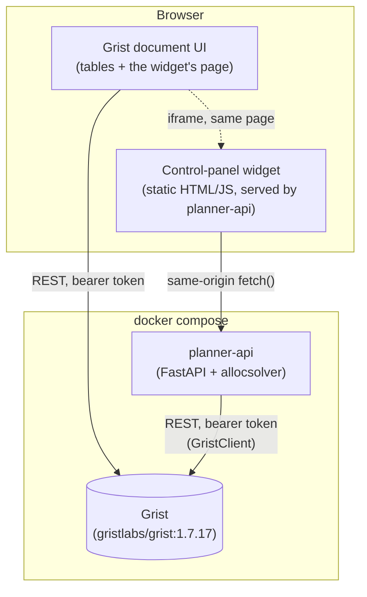
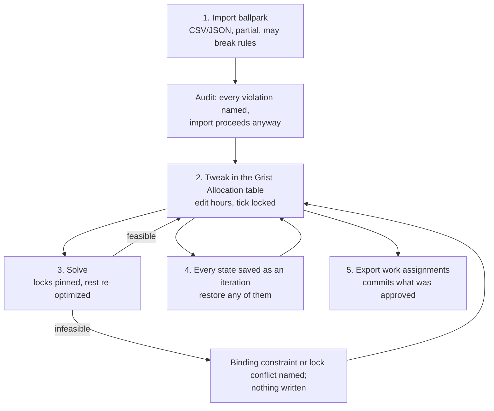
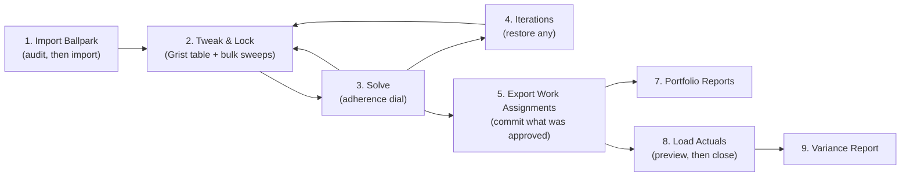

# 08. Grist Planner UI — Design

Implements the Grist integration `05-interfaces.md` and `02-architecture.md` describe
but had not yet been built (`GristClient` was "not yet built" as of `06-code-structure-
and-dependencies.md`). This is that build: a self-hosted Grist document holding every
input table, a small backend service wrapping `allocsolver`, and a control-panel
widget embedded in the document itself.

Lives in `grist_planner/`, deployed with `./grist_planner/deploy_planner.sh up`.

## Why a backend service, not Grist alone

Grist's own formula engine computes per-cell derived values (cost rollups, summary
tables) but deliberately cannot run the MILP itself (`02-architecture.md`'s "Explicit
non-responsibility"). Something outside Grist has to: pull the input tables, solve,
and write back. `planner_api/` is that service — a thin FastAPI wrapper around the
existing `allocsolver` package, so every button in the UI is a call to logic that
already exists and is already tested (`solve()`, `apply_pre_assignments()`,
`propose_reforecast()`, the `reports/` module), not new solver logic.

## Component diagram

The widget is embedded in Grist for convenience — it sits on its own page inside
the document, next to the data tables — but it does **not** talk to Grist directly
through the Custom Widget JS API (`grist.docApi`). Every Grist read/write goes
through `planner-api`'s own `GristClient`, authenticated with an API key the widget
never sees. See "Why the widget doesn't talk to Grist directly" below.

## The Grist document's tables

One table per `Plan` field (`allocsolver/models/plan.py`), column ids matching the
corresponding Pydantic model's field names exactly — a Grist record's `fields` dict
validates straight into the model, and `model_dump(mode="json")` writes straight
back as `fields`, with no separate mapping layer (`planner_api/schema.py`,
`plan_sync.py`). `Month` values are plain "YYYY-MM" text, same as `io/local.py`'s
JSON files.

| Table | Notes |
|---|---|
| `People`, `Projects`, `Rate_Structures`, `Rates`, `Wrap_Rates`, `Capacity`, `Targets` | The star schema, unchanged from `03-data-model.md` — pure human input. |
| `Bounds` | Unchanged from `03-data-model.md`: hour-range constraints (hard/soft min/max) per project/person/month, guiding the solver *before* it runs. What "Export Work Assignments" permanently merges each month's `Pre_Assignments` into. |
| `Allocation` | Unchanged schema, but its open months are now the **working assignment** — the imported ballpark, the hand-tweaked plan, the solver's starting point and the solver's output, all the same rows. See "The working assignment and the iterate-to-satisfaction loop" below. Closed months carry `hours_actual` (fixed, historical); open months carry `hours_assigned`, hand-editable, with a `locked` checkbox that pins a cell across the next solve. |
| `Pre_Assignments` | Same shape as `Bounds` — the manual pre-assignment inbox (`05-interfaces.md`), promoted from a hand-edited JSON file to a live, editable table. Expresses an hour *range* for a cell, which the hours-shaped working assignment cannot; retained alongside it. Cleared once "Export Work Assignments" merges it into `Bounds` for good. |
| `Assignment_History`, `Assignment_History_Cells` | The working assignment's append-only iteration history (`planner_api/history.py`) — one header row per saved state plus its cells. Generated; restoring an iteration is a button, not a hand-edit. |
| `Meta` | A single row: `horizon_start`, `horizon_end`, `closed_through` — `Plan`'s own top-level fields, which had nowhere else to live now that there's no `meta.json`. |
| `Report_WorkAssignments`, `Report_Variance`, `Report_BudgetSummary`, `Report_StaffingBalance`, `Report_SolveDiff`, `Report_BallparkAudit` | Generated, read-only. Overwritten wholesale on every relevant button click. **Don't hand-edit these** — the next report run replaces them entirely. |

`planner-api` provisions all of these once (idempotently — see "Provisioning" below);
nothing about the schema needs to be created by hand.

## The working assignment and the iterate-to-satisfaction loop

Planning is not one-shot, and it does not start from nothing. A planner arrives with a
hand-built, partial, approximate assignment — who should be on what, roughly — drawn up
without checking it against capacity or bounds. The tool's job is to take that
"ballpark", say what is wrong with it, optimize around the parts being held fixed, and
let the cycle repeat until the planner is satisfied.

**The working assignment is one object in three roles.** It lives in `Allocation`'s open
months (`allocsolver/io/working_assignment.py`), and it is simultaneously the imported
ballpark, the thing hand-tweaked in Grist, the solver's starting point, and the solver's
output. Because the output and the next input are the same rows, "the result of this
solve becomes the input to the next one" holds by construction rather than through a
conversion step that could lose or reshape anything.

### A ballpark is allowed to be wrong

Imported rows are not validated into submission. `audit` classifies each one and the
import proceeds regardless, because pulling an infeasible starting point back to
feasibility is exactly what the solve step does. Violations split into two kinds, and
the distinction is most of why the audit exists:

- **Over a cell's bounds, over capacity, over the concurrency ceiling.** The solver
  resolves these. Informational.
- **No eligible `Bounds` row for the cell.** `eligible_cells` generates no variable for
  it (`costing/masks.py`), so the solver cannot place anyone there and the ballpark's
  intent for that cell would vanish silently. These rows are reported, excluded from the
  import, and listed as `needs_bounds`. Re-importing with `make_eligible=true` adds
  permissive `Bounds` rows to open them — a real staffing decision, so never implicit.

### The ballpark steers the solve, by a dial

A baseline assignment reaches the solver as `solve(plan, baseline=...)`, whose churn term
is distance from that baseline. The mechanism already existed and was tested; nothing
passed it. It is now passed on every solve in the service.

Weight matters more than wiring. The default churn weight of 5 is calibrated for
revision-to-revision stability between two *solver outputs*, not for following a
hand-built assignment, and at that weight it mostly only breaks ties. Measured on
`tests/fixtures.two_person_two_project_plan` with a four-cell ballpark, as L1 distance
from it in hours:

| churn | distance | behavior |
|---|---|---|
| 0 | 313h | a mirror-image plan — the "equally optimal but different every run" instability `AGENTS.md` calls out |
| 5 | 113h | the same assignment a baseline-less solve returns; the ballpark picked the orientation and nothing else |
| 25 | 87h | follows the shape |
| 100 | 87h | |
| 500 | 0h | reproduces the ballpark exactly, and overshoots that month's spend target by ~40% to do it |

So adherence is a planner-facing control (`config.ADHERENCE_CHURN_WEIGHTS`), with four
named levels mapping to those weights: `free`, `loose` (the default — a planner who has
just imported a ballpark means for it to be followed), `close`, `exact`. The bottom row
is the trade-off the dial exists to expose: past a point, adherence is bought with the
spend targets this tool exists to hit, so `exact` answers "is my ballpark even
reachable" rather than producing a plan to send out.

### Locks are hard; a failed solve costs nothing

A `locked` cell is pinned exactly (`fixed_cells_and_values`, C5) and the rest
re-optimizes around it. An infeasible solve writes nothing at all and returns 422 with
the binding constraints and any lock conflicts named, so a planner can always retreat to
tweaking.

Lock conflicts need their own machinery (`allocsolver/solve/locks.py`). The elastic
relaxation re-pins locked cells verbatim, so when the locks themselves are the
contradiction the relaxation is infeasible too and its slack report comes back empty —
`INFEASIBLE. No binding constraints.`, the exact failure `AGENTS.md` warns about. Locks
are constants rather than variables, so the conflicts are arithmetic over known numbers
and are computed directly in Python instead: locked hours over a person-month's capacity
(C3), locked cells over `hard_max_concurrent_projects` (C6, which has no slack in either
model), locked spend over a hard target's ceiling (C4), and locks on ineligible cells,
which are not infeasibilities but silent no-ops reported even on a *successful* solve.

A lock above its own cell's `hard_max` is deliberately not a conflict: `constraints.py`
skips C1/C2 for fixed cells, so the lock overrides the bound by design.

### Every state is recoverable

Each import, hand-tweak, solve, lock sweep, restore and commit appends a numbered
iteration to `Assignment_History` and its cells to `Assignment_History_Cells`
(`planner_api/history.py`). Hand-edits made directly in the Grist table are what this
most exists for: nothing else observes them, and a solve would otherwise overwrite them
irrecoverably, so a solve snapshots the pre-solve state first whenever it differs from
the last iteration.

Append-only. Restoring iteration 4 does not delete 5 and 6 — it copies 4's cells back
into `Allocation` and appends them as iteration 7. Going back and then changing one's
mind loses nothing, so there is no branch to strand.

The `objective` column is not comparable between iterations: part of the objective is
distance from the baseline, and the baseline is whatever the working assignment held when
that solve started. Restoring an iteration and re-solving returns the identical
assignment scored 10.54 against the original run's 19.60, the whole difference being
where the solve started from.

### What is committed is what was approved

`export-work-assignments` exports the working assignment as it stands rather than
re-solving. Re-solving at commit time meant the sheet that went to the team came from a
different solver run than the one the planner reviewed — and with many equally optimal
assignments available, that run could legitimately return a different plan, changing it
after sign-off with nobody touching anything. The same reasoning applies to the report
and download endpoints, which read the working assignment (`_working_hours`) instead of
solving again; a budget report that disagreed with the `Allocation` table would be worse
than no report.

The cost of not re-solving is that an unsolved hand-tweak would ship unchecked, so that
is refused: committing after a tweak returns 409 asking for a solve first, with
`force=true` available for a planner who deliberately wants their own numbers out
regardless.

## Widget: the actions

The widget's sections follow the loop above, in the order a planner works through them.
Two postures throughout, matching `allocsolver.cli`'s dry-run/accept pattern — a `POST`
either previews or persists, never both.

1. **Import Ballpark** (`POST /api/working-assignment/import`, multipart CSV or JSON,
   columns `project_id, person_id, month, hours, locked`). Format is sniffed from the
   content rather than the extension; `hours_assigned` is accepted for `hours` so a
   sheet exported straight out of the `Allocation` table imports unrenamed. `dry_run=true`
   audits and writes nothing; `make_eligible=true` also adds permissive `Bounds` rows for
   cells that have none. The audit lands in `Report_BallparkAudit`.
   `GET /api/working-assignment/download` is the reverse trip, for reworking an iteration
   in a spreadsheet.
2. **Tweak & Lock.** Cell editing is the Grist `Allocation` table itself — already a
   spreadsheet, with sorting, filtering and a `locked` checkbox, and nothing the widget
   could add would improve on it. `POST /api/working-assignment/locks` covers the sweeps
   that are tedious cell by cell (`locked`, plus optional `project_id`/`person_id`/`month`
   filters and `only_nonzero`, on by default since locking a zero-hour cell pins it
   *empty*). `GET /api/working-assignment` renders the current state read-only.
3. **Solve** (`POST /api/run-planning?adherence=...`). Snapshots any hand-edits, merges
   the `Pre_Assignments` inbox in memory (`apply_pre_assignments`, with full `Plan`
   revalidation so a typo'd id is caught immediately), solves baselined on the working
   assignment, writes the result back over it, and diffs before-against-after into
   `Report_SolveDiff` across the whole open horizon — a diff stopping at the current
   month would hide the forward ripple, which is the part worth seeing. Never touches
   `Bounds`, `Targets` or `closed_through`.
4. **Iterations** (`GET /api/working-assignment/history`,
   `POST /api/working-assignment/restore?iteration=N`).
5. **Export Work Assignments** (`POST /api/export-work-assignments`). The commit point:
   merges `Pre_Assignments` into `Bounds` for good and clears that inbox (the same
   "the override persists permanently in bounds; the inbox isn't a log" contract as
   `io/pre_assignments.py`), writes `Report_WorkAssignments`, and exports the working
   assignment as it stands. Returns 409 on unsolved tweaks unless `force=true`. Writes
   only `Bounds`, `Allocation` and the report, not the whole plan via
   `save_plan_to_grist`, which would overwrite `Allocation` with the pre-commit copy the
   handler is holding.
6. **Bounds-shaped pre-assignments** (`POST /api/pre-assignments/upload`, multipart JSON
   shaped like `pre_assignments.json`) replaces the `Pre_Assignments` table wholesale;
   the table is also directly editable in Grist. Retained alongside the working
   assignment because it expresses something the hours-shaped form cannot: an hour
   *range* for a cell — "40 to 80 hours, exactly how many is the solver's problem". Three
   manual inputs, three different jobs: a **ballpark cell** is a starting number the
   solver may move, a **pre-assignment** is a range it must respect, and a **locked cell**
   is a number it cannot move at all.
7. **Portfolio Reports** (`POST /api/run-portfolio-reports`). Budget summary for every
   currently-active project plus the staffing balance assessment
   (`reports/staffing_balance.py`) — writes `Report_BudgetSummary` and
   `Report_StaffingBalance`, with a zip download of the same data as CSVs. Computed from
   the working assignment, not a fresh solve.
8. **Load Actuals** (`POST /api/actuals/upload`, CSV columns `person_id, project_id,
   hours_actual`). `dry_run=true` computes variance and a reforecast proposal
   (`propose_reforecast`) without writing. Re-submitting with `dry_run=false` (a real
   file, or an empty one to fall back to `io/synthetic.py` for practice) persists
   `hours_actual` into `Allocation`, advances `closed_through`, and — only if
   `accept_reforecast=true` — applies the proposed target updates. Variance is measured
   against the assignment on record for the month, never a re-solve: measuring a month
   against a plan nobody worked to is the one comparison a variance report must not make.
9. **Variance Report** (`GET /api/reports/variance?month=...`). The assigned-vs-actual
   delta for any already-closed month, retrievable later without re-uploading anything.

## Why the widget doesn't talk to Grist directly

Grist's Custom Widget JS API (`grist.docApi`) would let the widget read/write
tables straight from the browser, using the *viewer's own* Grist session — no
separate credential needed on the widget's side. That's the right choice for a
widget that's mostly a data view. This widget is mostly an **action trigger**
(run the solver, close a month), and the solver itself has to run somewhere with
`allocsolver` installed — which is `planner-api`, not the browser. Once a real
backend is unavoidable anyway, routing every Grist access through its own
`GristClient` (authenticated with a key `planner-api` holds, that the widget never
sees) is simpler than maintaining two separate paths into the same document. The
widget is served *from* `planner-api` (same origin, `/widget/*`), so its `fetch()`
calls need no CORS configuration beyond what's already in `main.py` for
completeness.

The tradeoff: the widget can't do anything `planner-api` doesn't expose as an
endpoint, and a person hand-editing a `Report_*` table won't affect what the
widget shows until the next report run (those tables are truly one-way, generated
output). Both are fine here — nothing about "load pre-assignments, run planning,
export, report, close the month" needs live collaborative editing of solver output.

## Provisioning

`deploy_planner.sh up` runs `planner_api/provisioning.py` once via `docker compose
run`. It is safe to re-run — this is the mechanism that makes `up` idempotent
across restarts, not just the first call:

1. **Boot-key admin login.** A bare `gristlabs/grist` image has no user yet.
   `GRIST_BOOT_KEY` (a random value `deploy_planner.sh` generates into `.env` on
   first run) authenticates as the install operator via Grist's own documented
   `/boot/verify-boot-key` + `/boot/login` flow (`Boot.js`), which creates (or
   logs into) a fixed admin user — no browser needed, this is a plain HTTP
   exchange. A **real bearer API key** is then minted once (`GET`/`POST
   /api/profile/apikey`) and is what `GristClient` uses from then on; the boot key
   itself is never used again unless `.grist_state.json` is lost.
2. **Org / workspace / doc.** The admin's personal org already exists right after
   login; a `Planner` workspace and a `Labor Allocation Planner` doc are created
   inside it if they don't already exist by name.
3. **Grant anonymous access.** `PATCH /api/orgs/{org}/access` grants the special
   `anon@getgrist.com` user `editors` on the org (`grant_anonymous_access`) — this,
   combined with `GRIST_IN_SERVICE=true` on the Grist container (`docker-compose.yml`),
   is what actually lets a planner's own browser open and edit the document with
   *no login step at all*, not just no boot key. The two are easy to conflate but
   solve different problems: `GRIST_IN_SERVICE=true` only lifts the boot-key
   "verify you have server access" wall in front of ordinary page loads (Grist's
   own documented "turn off this check" env var) — confirmed by actually testing
   both settings against a live container with Playwright, a fresh anonymous
   session still got "Access denied" opening the doc with `GRIST_IN_SERVICE=true`
   alone, since that document is privately owned by the admin's personal org. The
   access grant is what a real anonymous visitor needs on top of that. Re-applied
   on every `up` (idempotent), so a doc provisioned before this existed gets it
   backfilled (`GristClient.grant_anonymous_access`).
4. **Tables.** Every table in `planner_api/schema.py` that doesn't already exist
   gets created (`POST /api/docs/{doc}/tables`) — re-running this after a partial
   failure only adds what's missing.
5. **The widget page.** A new Grist page with a single custom-widget section is
   added via the `CreateViewSection` useraction, pointed at `WIDGET_URL`
   (`http://localhost:<port>/widget/index.html`) with `access: "none"` — the
   widget never calls `grist.docApi` (see below), so there's no elevated
   permission to grant. `_grist_Views_section.options` is a JSON-string column
   whose `customView` *property* is itself a JSON-encoded string (not a nested
   object) holding `{"mode": "url", "url": ..., "access": "none", ...}`
   (`ViewSectionRec.js`'s `customDef`) — reverse-engineered from a real "Add
   widget to page" flow driven with Playwright against a live container, since
   this detail isn't discoverable from reading the source in isolation: an
   earlier version of this method stored `customView` as a nested object, which
   silently broke the widget frame with "Cannot read properties of undefined"
   the first time anyone actually opened the page. `CreateViewSection`'s first
   argument also has to be the *real* existing tableRef (looked up from
   `_grist_Tables`), not `0` — passing `0` alongside a `tableId` string creates
   a duplicate table (e.g. `People2`) instead of attaching to the real one. This
   is, still, a plain REST/useraction call throughout — the whole provisioning
   flow is scriptable end to end with no manual browser step.
6. **State.** `org_domain`, `workspace_id`, `doc_id`, and the API key are written
   to `/data/.grist_state.json` (a docker volume, `planner_state`). On every
   subsequent `up`, finding this file short-circuits steps 1–2 entirely; steps
   3–4 still run (cheaply — re-granting access and adding missing tables) so a
   doc that was only partially provisioned before a crash gets completed rather
   than left broken.
7. **Seed data** (`--seed-dir`, wired by `deploy_planner.sh up --example <name>`
   to `examples/<name>/data/`, default `small_example`). Loads a `Plan` from a
   local JSON directory (`io/local.py`'s layout) and writes it in — skipped if
   `Meta` already has a row, so re-running `up` never clobbers a planner's
   in-progress work (switching examples on an already-seeded doc needs `reset`
   first).

`provisioning.py`'s own final line of output is the direct, clickable doc URL —
`{GRIST_PUBLIC_URL}/o/{org_domain}/doc/{doc_id}` — which `deploy_planner.sh up`
passes straight through. Use that link, not the bare Grist homepage: the home
page's default view is the anonymous visitor's *own* (empty) personal space, not
the org the doc actually lives in — `org_domain` is assigned by Grist per admin
account and isn't predictable ahead of time, so there's no fixed URL to
hardcode here.

## Auth and scope

Single-user, localhost-only, by design — this is a planning-team tool for 1-3
people on one machine or trusted network, matching `02-architecture.md`'s existing
"1 to 3 editors" framing, not a multi-tenant deployment. In service of that: a
planner's own browser needs **no login of any kind** — no boot key, no sign-in —
to open and edit the document (`grant_anonymous_access` + `GRIST_IN_SERVICE=true`,
above). The boot key still exists and still matters, just only for
`provisioning.py`'s own one-time, server-side admin login — a planner never
sees or needs it. `docker-compose.yml` sets no TLS, no reverse proxy, and CORS is
wide open (`allow_origins=["*"]`) since the widget and the API are same-origin in
practice and the whole stack isn't meant to be exposed beyond `localhost`. **This
combination — anonymous edit access, no boot-key wall, no TLS — means anyone who
can reach these ports has full read/write access to everything, no exceptions.**
Fine on a private, trusted machine or network; do not publish these ports beyond
one without adding real auth in front of both services first.

## Verification

Every mechanic here — the boot-key login, the API key, table/column creation,
record read/write, the custom-widget-section useraction and its exact `options`
JSON shape, and all six of the widget's actions — was driven against a real,
running `docker compose` stack (not just read from source or assumed): first via
`curl`/`httpx` for the REST mechanics, then via a headless Playwright browser
(no `chromium-cli`/Node available in this environment, so a `mcr.microsoft.com/
playwright/python` container was used directly instead) to confirm the widget
page actually *renders* inside Grist's own UI and each button produces the
expected result on screen — not just a 200 response from the backend.
Those screenshots have since been retired from `docs/09-planner-tutorial.md`: they
captured the widget's pre-loop layout and no longer match it. The image files remain in
`docs/images/grist_tutorial/` pending recapture.

Three real bugs only surfaced this way, invisible from a backend-only (`curl`)
test since the backend never renders the page itself or acts as a second,
unauthenticated visitor:

1. `CreateViewSection`'s first argument needs the target table's *real* ref
   (looked up from `_grist_Tables`), not `0` — `0` alongside a `tableId` string
   silently creates a duplicate table instead of attaching to the real one
   (`create_custom_widget_page`, `grist_client.py`).
2. `_grist_Views_section.options`'s `customView` property must itself be a
   JSON-encoded *string*, not a nested object — Grist's own client parses it as
   a string, and a nested object breaks that parse silently, surfacing only as
   "Cannot read properties of undefined" the moment a person actually opens the
   page (same location).
3. `GRIST_IN_SERVICE=true` alone does not give a planner's own browser
   login-free access to the doc, even though it removes the boot-key wall — a
   fresh anonymous Playwright session still got "Access denied" until
   `grant_anonymous_access` was added ("Auth and scope", above).

The tweak-and-resolve loop (locked `Allocation` cells surviving a re-solve
exactly as set, while unlocked cells re-optimize around them) was also verified
end to end this way: manually edited a cell via the REST API to simulate a
human hand-edit, re-ran Run Planning, and confirmed the edited cell held while
others visibly shifted to compensate.

All four are fixed and re-verified; see `grist_client.py` and `main.py`'s own
docstrings for the detail.

## Known limitations

- **`Report_*` tables duplicate a small amount of computation** from
  `allocsolver.reports.exports` (`planner_api/reports.py`'s `budget_summary_rows`
  mirrors `export_budget_summary`'s cumulative/"as of" logic in a different,
  long-format shape rather than reusing it directly) — a deliberate call to avoid
  touching the tested core `exports.py` module during this session, not a
  structural constraint. Worth extracting a shared computation helper later if the
  two ever need to change together.
- **The reforecast redistribution has no damping**, and a portfolio deliberately
  calibrated to run short of capacity most months (see `examples/medium_example`'s
  recent staffing-balance retuning) can compound into an escalating target over a
  long horizon — this doesn't affect the small 6-month tutorial dataset here, but
  is an open item from earlier the same session, not yet resolved.
- **`grist_planner/` is only partly covered by automated tests.** `planner_api/history.py`
  is tested against an in-memory store (`tests/unit/test_assignment_history.py`, which is
  what its `TableStore` protocol exists to allow — `httpx`/`fastapi` live in the container
  image, not the conda environment the suite runs in). The FastAPI handlers themselves
  have no automated coverage; they were verified by hand against a throwaway Grist stack
  on alternate ports, driving the whole loop through `curl`. A CI hook that spins up Grist
  and replays that sequence is the missing piece.
- **Importing a ballpark replaces every open month, wholesale** — there is no merge or
  upsert mode. `merged_allocation` treats an import as a statement about the whole open
  horizon, which is right when the ballpark *is* the plan (the small example) and
  dangerous mid-horizon: on the medium example a one-row import collapses ~4,700 cells to
  one. The iteration history makes it recoverable and
  `docs/10-medium-example-tutorial.md` demonstrates the recovery, but an explicit merge
  mode is the obvious missing option.
- **Cell editing happens in the Grist table, not the widget.** A deliberate choice — the
  `Allocation` table is already a spreadsheet with sorting, filtering and a checkbox
  column — but it does mean the loop spans two surfaces, and a hand-edit is invisible to
  the service until the next solve snapshots it.
- **Adherence levels are calibrated on a two-person fixture.** The weights in
  `ADHERENCE_CHURN_WEIGHTS` come from measurements on
  `tests/fixtures.two_person_two_project_plan`, where `norms.count` is 8 and the headcount
  term is correspondingly heavy. At the medium example's scale that normalizer is far
  larger, so the same weights are relatively stronger; the levels are a usable dial rather
  than a calibrated scale, and the right setting is found by trying one.
