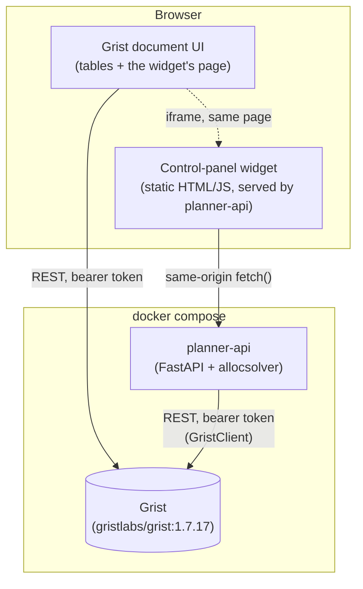
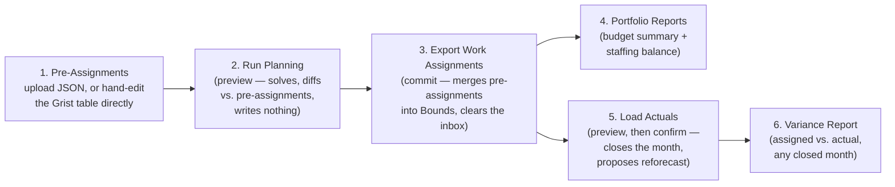

# 08. Grist Planner UI — Design

Implements the Grist integration `05-interfaces.md` and `02-architecture.md` describe
but had not yet been built (`GristClient` was "not yet built" as of `06-code-structure-
and-dependencies.md`). This is that build: a self-hosted Grist document holding every
input table, a small backend service wrapping `allocsolver`, and a control-panel
widget embedded in the document itself.

Lives in `grist_planner/`, deployed with `./grist_planner/deploy_planner.sh up`.

## Why a backend service, not Grist alone

Grist's own formula engine computes per-cell derived values (cost rollups, summary
tables) but deliberately cannot run the MILP itself (`02-architecture.md`'s "Explicit
non-responsibility"). Something outside Grist has to: pull the input tables, solve,
and write back. `planner_api/` is that service — a thin FastAPI wrapper around the
existing `allocsolver` package, so every button in the UI is a call to logic that
already exists and is already tested (`solve()`, `apply_pre_assignments()`,
`propose_reforecast()`, the `reports/` module), not new solver logic.

## Component diagram

The widget is embedded in Grist for convenience — it sits on its own page inside
the document, next to the data tables — but it does **not** talk to Grist directly
through the Custom Widget JS API (`grist.docApi`). Every Grist read/write goes
through `planner-api`'s own `GristClient`, authenticated with an API key the widget
never sees. See "Why the widget doesn't talk to Grist directly" below.

## The Grist document's tables

One table per `Plan` field (`allocsolver/models/plan.py`), column ids matching the
corresponding Pydantic model's field names exactly — a Grist record's `fields` dict
validates straight into the model, and `model_dump(mode="json")` writes straight
back as `fields`, with no separate mapping layer (`planner_api/schema.py`,
`plan_sync.py`). `Month` values are plain "YYYY-MM" text, same as `io/local.py`'s
JSON files.

| Table | Notes |
|---|---|
| `People`, `Projects`, `Rate_Structures`, `Rates`, `Wrap_Rates`, `Capacity`, `Bounds`, `Targets`, `Allocation` | The star schema, unchanged from `03-data-model.md`. |
| `Pre_Assignments` | New. Same shape as `Bounds` — the manual pre-assignment inbox (`05-interfaces.md`), promoted from a hand-edited JSON file to a live, editable table. Cleared once "Export Work Assignments" merges it into `Bounds` for good. |
| `Meta` | New. A single row: `horizon_start`, `horizon_end`, `closed_through` — `Plan`'s own top-level fields, which had nowhere else to live now that there's no `meta.json`. |
| `Report_WorkAssignments`, `Report_Variance`, `Report_BudgetSummary`, `Report_StaffingBalance`, `Report_SolveDiff` | New, generated, read-only. Overwritten wholesale on every relevant button click. **Don't hand-edit these** — the next report run replaces them entirely. |

`planner-api` provisions all of these once (idempotently — see "Provisioning" below);
nothing about the schema needs to be created by hand.

## Widget: the six actions

Each maps directly to a button the widget requested. Two postures throughout,
matching `allocsolver.cli`'s existing dry-run/accept pattern — a `POST` either
previews (nothing written) or commits (everything written), never both:

1. **Pre-Assignments.** `POST /api/pre-assignments/upload` (multipart JSON, same
   shape as `pre_assignments.json`) replaces the `Pre_Assignments` table wholesale.
   The table is also directly editable in Grist — either path lands in the same
   place, and both are read by the next two actions.
2. **Run Planning** (`POST /api/run-planning`). Loads the plan, merges the current
   `Pre_Assignments` in-memory (`apply_pre_assignments` — full `Plan` revalidation,
   so a typo'd id is caught immediately), solves, and diffs the solved hours
   against each pre-assignment's `soft_max` for the current open month. Writes the
   diff to `Report_SolveDiff` and returns it to the widget. **Nothing else is
   written** — a planner can run this as many times as they like while adjusting
   pre-assignments.
3. **Export Work Assignments** (`POST /api/export-work-assignments`). The commit
   point: re-solves, then actually merges `Pre_Assignments` into `Bounds` and saves
   the whole plan, and clears the `Pre_Assignments` table (same "the override
   persists permanently in bounds; the inbox isn't a log" contract as
   `io/pre_assignments.py`). Writes `Report_WorkAssignments` for the immediate open
   month. A CSV download is also available (`GET .../download`).
4. **Portfolio Reports** (`POST /api/run-portfolio-reports`). Budget summary for
   every currently-active project plus the staffing balance assessment
   (`reports/staffing_balance.py`) — writes `Report_BudgetSummary` and
   `Report_StaffingBalance`, with a zip download of the same data as CSVs.
5. **Load Actuals** (`POST /api/actuals/upload`, CSV columns `person_id,
   project_id, hours_actual`). `dry_run=true` (the widget's "Preview" button)
   computes variance and a reforecast proposal (`propose_reforecast`) without
   writing anything. Re-submitting with `dry_run=false` (a real file, or an empty
   one to fall back to `io/synthetic.py`'s synthetic actuals for practice)
   persists: `hours_actual` into `Allocation`, `closed_through` advances, and — only
   if `accept_reforecast=true` — the proposed target updates apply. Mirrors
   `advance-month`'s solve → simulate → close → propose → confirm sequence exactly,
   just split across two HTTP calls instead of one interactive CLI prompt.
6. **Variance Report** (`GET /api/reports/variance?month=...`). The assigned-vs-
   actual delta for any already-closed month — the same figures `Load Actuals`
   just computed, retrievable again later without re-uploading anything.

## Why the widget doesn't talk to Grist directly

Grist's Custom Widget JS API (`grist.docApi`) would let the widget read/write
tables straight from the browser, using the *viewer's own* Grist session — no
separate credential needed on the widget's side. That's the right choice for a
widget that's mostly a data view. This widget is mostly an **action trigger**
(run the solver, close a month), and the solver itself has to run somewhere with
`allocsolver` installed — which is `planner-api`, not the browser. Once a real
backend is unavoidable anyway, routing every Grist access through its own
`GristClient` (authenticated with a key `planner-api` holds, that the widget never
sees) is simpler than maintaining two separate paths into the same document. The
widget is served *from* `planner-api` (same origin, `/widget/*`), so its `fetch()`
calls need no CORS configuration beyond what's already in `main.py` for
completeness.

The tradeoff: the widget can't do anything `planner-api` doesn't expose as an
endpoint, and a person hand-editing a `Report_*` table won't affect what the
widget shows until the next report run (those tables are truly one-way, generated
output). Both are fine here — nothing about "load pre-assignments, run planning,
export, report, close the month" needs live collaborative editing of solver output.

## Provisioning

`deploy_planner.sh up` runs `planner_api/provisioning.py` once via `docker compose
run`. It is safe to re-run — this is the mechanism that makes `up` idempotent
across restarts, not just the first call:

1. **Boot-key admin login.** A bare `gristlabs/grist` image has no user yet.
   `GRIST_BOOT_KEY` (a random value `deploy_planner.sh` generates into `.env` on
   first run) authenticates as the install operator via Grist's own documented
   `/boot/verify-boot-key` + `/boot/login` flow (`Boot.js`), which creates (or
   logs into) a fixed admin user — no browser needed, this is a plain HTTP
   exchange. A **real bearer API key** is then minted once (`GET`/`POST
   /api/profile/apikey`) and is what `GristClient` uses from then on; the boot key
   itself is never used again unless `.grist_state.json` is lost.
2. **Org / workspace / doc.** The admin's personal org already exists right after
   login; a `Planner` workspace and a `Labor Allocation Planner` doc are created
   inside it if they don't already exist by name.
3. **Tables.** Every table in `planner_api/schema.py` that doesn't already exist
   gets created (`POST /api/docs/{doc}/tables`) — re-running this after a partial
   failure only adds what's missing.
4. **The widget page.** A new Grist page with a single custom-widget section is
   added via the `CreateViewSection` useraction, pointed at `WIDGET_URL`
   (`http://localhost:<port>/widget/index.html`) with `access: "full"` (no
   per-widget permission prompt) — `_grist_Views_section.options` is a JSON
   *string* column holding `{"customView": {"mode": "url", "url": ..., "access":
   "full"}}` (`ViewSectionRec.js`'s `customDef`). This, too, is a plain REST/
   useraction call — the whole provisioning flow is scriptable end to end with no
   manual browser step.
5. **State.** `org_domain`, `workspace_id`, `doc_id`, and the API key are written
   to `/data/.grist_state.json` (a docker volume, `planner_state`). On every
   subsequent `up`, finding this file short-circuits steps 1–2 entirely; step 3
   still runs (cheaply — it only adds missing tables) so a doc that was only
   partially provisioned before a crash gets completed rather than left broken.
6. **Seed data** (`--seed-dir`, only used by `deploy_planner.sh up`, wired to
   `grist_planner/tutorial_data/data/`). Loads a `Plan` from a local JSON directory
   (`io/local.py`'s layout) and writes it in — skipped if `Meta` already has a row,
   so re-running `up` never clobbers a planner's in-progress work.

## Auth and scope

Single-user, localhost-only, by design — this is a planning-team tool for 1-3
people on one machine or trusted network, matching `02-architecture.md`'s existing
"1 to 3 editors" framing, not a multi-tenant deployment. `docker-compose.yml` sets
no TLS, no reverse proxy, and CORS is wide open (`allow_origins=["*"]`) since the
widget and the API are same-origin in practice and the whole stack isn't meant to
be exposed beyond `localhost`. Don't publish these ports beyond a trusted network
without adding real auth in front of both services first.

## Known limitations / what to verify by hand

- **The widget's actual rendering inside Grist's iframe hasn't been visually
  confirmed.** Every mechanic behind it — the custom-widget-section useraction,
  the `options` JSON shape, the doc's tables, every backend endpoint — was tested
  directly against a running Grist container (`curl`, not a browser), since this
  environment has no browser available. Please open `http://localhost:8484` once
  and confirm the "Planner Control Panel" page actually shows the control panel as
  expected, rather than a blank iframe.
- **`Report_*` tables duplicate a small amount of computation** from
  `allocsolver.reports.exports` (`planner_api/reports.py`'s `budget_summary_rows`
  mirrors `export_budget_summary`'s cumulative/"as of" logic in a different,
  long-format shape rather than reusing it directly) — a deliberate call to avoid
  touching the tested core `exports.py` module during this session, not a
  structural constraint. Worth extracting a shared computation helper later if the
  two ever need to change together.
- **The reforecast redistribution has no damping**, and a portfolio deliberately
  calibrated to run short of capacity most months (see `examples/medium_example`'s
  recent staffing-balance retuning) can compound into an escalating target over a
  long horizon — this doesn't affect the small 6-month tutorial dataset here, but
  is an open item from earlier the same session, not yet resolved.
- No automated test suite covers `grist_planner/` yet (there's no CI hook running
  against a live Grist container) — everything here was verified by hand, once,
  against a real `docker compose` stack. Worth adding an integration test that
  spins up the stack and exercises the six actions, if this becomes a
  longer-lived part of the repo rather than a first cut.
