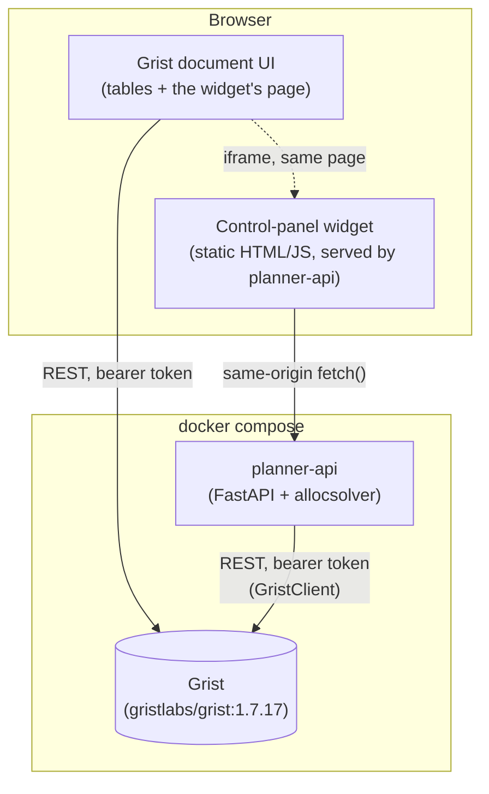
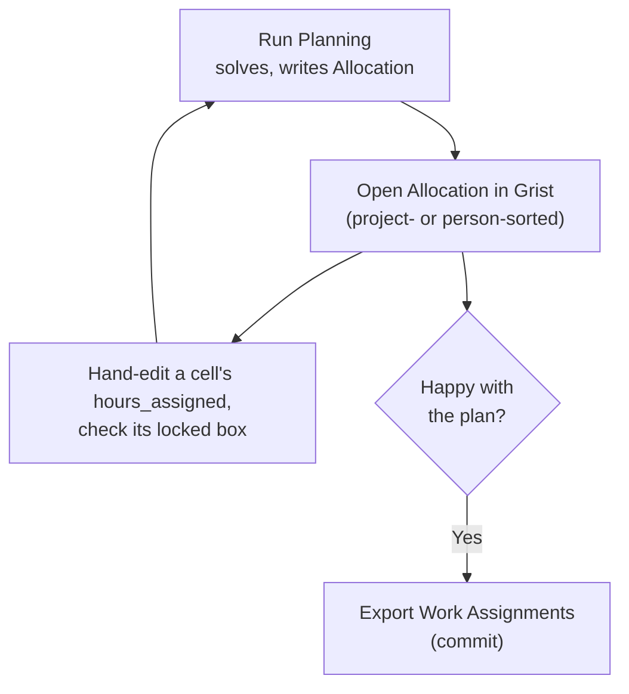
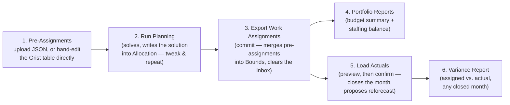

# 08. Grist Planner UI — Design

Implements the Grist integration `05-interfaces.md` and `02-architecture.md` describe
but had not yet been built (`GristClient` was "not yet built" as of `06-code-structure-
and-dependencies.md`). This is that build: a self-hosted Grist document holding every
input table, a small backend service wrapping `allocsolver`, and a control-panel
widget embedded in the document itself.

Lives in `grist_planner/`, deployed with `./grist_planner/deploy_planner.sh up`.

## Why a backend service, not Grist alone

Grist's own formula engine computes per-cell derived values (cost rollups, summary
tables) but deliberately cannot run the MILP itself (`02-architecture.md`'s "Explicit
non-responsibility"). Something outside Grist has to: pull the input tables, solve,
and write back. `planner_api/` is that service — a thin FastAPI wrapper around the
existing `allocsolver` package, so every button in the UI is a call to logic that
already exists and is already tested (`solve()`, `apply_pre_assignments()`,
`propose_reforecast()`, the `reports/` module), not new solver logic.

## Component diagram

The widget is embedded in Grist for convenience — it sits on its own page inside
the document, next to the data tables — but it does **not** talk to Grist directly
through the Custom Widget JS API (`grist.docApi`). Every Grist read/write goes
through `planner-api`'s own `GristClient`, authenticated with an API key the widget
never sees. See "Why the widget doesn't talk to Grist directly" below.

## The Grist document's tables

One table per `Plan` field (`allocsolver/models/plan.py`), column ids matching the
corresponding Pydantic model's field names exactly — a Grist record's `fields` dict
validates straight into the model, and `model_dump(mode="json")` writes straight
back as `fields`, with no separate mapping layer (`planner_api/schema.py`,
`plan_sync.py`). `Month` values are plain "YYYY-MM" text, same as `io/local.py`'s
JSON files.

| Table | Notes |
|---|---|
| `People`, `Projects`, `Rate_Structures`, `Rates`, `Wrap_Rates`, `Capacity`, `Targets` | The star schema, unchanged from `03-data-model.md` — pure human input. |
| `Bounds` | Unchanged from `03-data-model.md`: hour-range constraints (hard/soft min/max) per project/person/month, guiding the solver *before* it runs. What "Export Work Assignments" permanently merges each month's `Pre_Assignments` into. |
| `Allocation` | Unchanged schema, but now the editable **solution** a planner actually looks at and iterates on — see "The solution table and the tweak-and-resolve loop" below. Closed months carry `hours_actual` (fixed, historical); open months carry the latest solve's `hours_assigned`, hand-editable, with a `locked` checkbox that pins a cell across the next solve. |
| `Pre_Assignments` | Same shape as `Bounds` — the manual pre-assignment inbox (`05-interfaces.md`), promoted from a hand-edited JSON file to a live, editable table. Cleared once "Export Work Assignments" merges it into `Bounds` for good. |
| `Meta` | A single row: `horizon_start`, `horizon_end`, `closed_through` — `Plan`'s own top-level fields, which had nowhere else to live now that there's no `meta.json`. |
| `Report_WorkAssignments`, `Report_Variance`, `Report_BudgetSummary`, `Report_StaffingBalance`, `Report_SolveDiff` | Generated, read-only. Overwritten wholesale on every relevant button click. **Don't hand-edit these** — the next report run replaces them entirely. |

`planner-api` provisions all of these once (idempotently — see "Provisioning" below);
nothing about the schema needs to be created by hand.

## The solution table and the tweak-and-resolve loop

The single most important correction to this design, found by actually using it:
planning is not one-shot. A planner runs the solver, looks at what it produced,
overrides a handful of cells by hand, and re-solves around those overrides —
repeatedly — before anything is final. The data model already had the mechanism
for exactly this (`AllocationRow.locked`, `05-interfaces.md`: "Hand-editing
assigned hours is supported only through an explicit lock mechanism, which the
solver treats as a fixed variable" — `solve/build.py`'s `fixed_cells_and_values`,
C5) — it just wasn't wired into the Grist backend at first, so **Run Planning**
only ever showed an ephemeral preview with nowhere to look at or edit the actual
numbers. Fixed: **Run Planning now writes every open month's solved
`hours_assigned` into `Allocation`** (`main.py`'s `_write_solution_to_allocation`),
preserving whatever `locked` flags are already set, and never touching `Bounds`,
`Targets`, or `closed_through`.

A locked cell's `hours_assigned` is pinned exactly across the next solve — the
rest of the plan re-optimizes around it, and the ripple is visible immediately
(reducing one person's hours on a project can send another person's hours up
substantially, to keep that project's spend target covered). This loop can run
as many times as a planner likes; nothing else is committed until Export Work
Assignments.

## Widget: the six actions

Each maps directly to a button the widget requested. Two postures throughout,
matching `allocsolver.cli`'s existing dry-run/accept pattern — a `POST` either
previews (writes only the solution, nothing else) or commits (Bounds too), never
both:

1. **Pre-Assignments.** `POST /api/pre-assignments/upload` (multipart JSON, same
   shape as `pre_assignments.json`) replaces the `Pre_Assignments` table wholesale.
   The table is also directly editable in Grist — either path lands in the same
   place, and both are read by the next two actions. Distinct from a *locked*
   `Allocation` cell: a pre-assignment is a soft *range* nudge applied before the
   first solve; a locked cell is a hard, after-the-fact pin applied once a planner
   has already seen a solve's output and wants to force one specific value.
2. **Run Planning** (`POST /api/run-planning`). Loads the plan, merges the current
   `Pre_Assignments` in-memory (`apply_pre_assignments` — full `Plan` revalidation,
   so a typo'd id is caught immediately), solves, and writes every open month's
   result into `Allocation` (preserving any `locked` flags already there — see
   above). Also diffs the solved hours against each pre-assignment's `soft_max`
   for the current open month, written to `Report_SolveDiff`. **Never touches
   `Bounds`, `Targets`, or `closed_through`** — a planner can run this as many
   times as they like, hand-editing `Allocation` between runs.
3. **Export Work Assignments** (`POST /api/export-work-assignments`). The commit
   point: re-solves, then actually merges `Pre_Assignments` into `Bounds` (the
   hour-range constraints) and clears the `Pre_Assignments` table (same "the
   override persists permanently in bounds; the inbox isn't a log" contract as
   `io/pre_assignments.py`), and refreshes `Allocation` the same way Run Planning
   does — the two never disagree. Writes only `Bounds` and `Allocation`
   (`_write_solution_to_allocation`), not the whole plan via `save_plan_to_grist`:
   `plan.allocation` at the point this handler loads it is pre-solve, so a naive
   whole-plan save here would silently overwrite `Allocation` with stale data.
   Also writes `Report_WorkAssignments` for the immediate open month, with a CSV
   download available (`GET .../download`).
4. **Portfolio Reports** (`POST /api/run-portfolio-reports`). Budget summary for
   every currently-active project plus the staffing balance assessment
   (`reports/staffing_balance.py`) — writes `Report_BudgetSummary` and
   `Report_StaffingBalance`, with a zip download of the same data as CSVs.
5. **Load Actuals** (`POST /api/actuals/upload`, CSV columns `person_id,
   project_id, hours_actual`). `dry_run=true` (the widget's "Preview" button)
   computes variance and a reforecast proposal (`propose_reforecast`) without
   writing anything. Re-submitting with `dry_run=false` (a real file, or an empty
   one to fall back to `io/synthetic.py`'s synthetic actuals for practice)
   persists: `hours_actual` into `Allocation`, `closed_through` advances, and — only
   if `accept_reforecast=true` — the proposed target updates apply. Mirrors
   `advance-month`'s solve → simulate → close → propose → confirm sequence exactly,
   just split across two HTTP calls instead of one interactive CLI prompt.
6. **Variance Report** (`GET /api/reports/variance?month=...`). The assigned-vs-
   actual delta for any already-closed month — the same figures `Load Actuals`
   just computed, retrievable again later without re-uploading anything.

## Why the widget doesn't talk to Grist directly

Grist's Custom Widget JS API (`grist.docApi`) would let the widget read/write
tables straight from the browser, using the *viewer's own* Grist session — no
separate credential needed on the widget's side. That's the right choice for a
widget that's mostly a data view. This widget is mostly an **action trigger**
(run the solver, close a month), and the solver itself has to run somewhere with
`allocsolver` installed — which is `planner-api`, not the browser. Once a real
backend is unavoidable anyway, routing every Grist access through its own
`GristClient` (authenticated with a key `planner-api` holds, that the widget never
sees) is simpler than maintaining two separate paths into the same document. The
widget is served *from* `planner-api` (same origin, `/widget/*`), so its `fetch()`
calls need no CORS configuration beyond what's already in `main.py` for
completeness.

The tradeoff: the widget can't do anything `planner-api` doesn't expose as an
endpoint, and a person hand-editing a `Report_*` table won't affect what the
widget shows until the next report run (those tables are truly one-way, generated
output). Both are fine here — nothing about "load pre-assignments, run planning,
export, report, close the month" needs live collaborative editing of solver output.

## Provisioning

`deploy_planner.sh up` runs `planner_api/provisioning.py` once via `docker compose
run`. It is safe to re-run — this is the mechanism that makes `up` idempotent
across restarts, not just the first call:

1. **Boot-key admin login.** A bare `gristlabs/grist` image has no user yet.
   `GRIST_BOOT_KEY` (a random value `deploy_planner.sh` generates into `.env` on
   first run) authenticates as the install operator via Grist's own documented
   `/boot/verify-boot-key` + `/boot/login` flow (`Boot.js`), which creates (or
   logs into) a fixed admin user — no browser needed, this is a plain HTTP
   exchange. A **real bearer API key** is then minted once (`GET`/`POST
   /api/profile/apikey`) and is what `GristClient` uses from then on; the boot key
   itself is never used again unless `.grist_state.json` is lost.
2. **Org / workspace / doc.** The admin's personal org already exists right after
   login; a `Planner` workspace and a `Labor Allocation Planner` doc are created
   inside it if they don't already exist by name.
3. **Grant anonymous access.** `PATCH /api/orgs/{org}/access` grants the special
   `anon@getgrist.com` user `editors` on the org (`grant_anonymous_access`) — this,
   combined with `GRIST_IN_SERVICE=true` on the Grist container (`docker-compose.yml`),
   is what actually lets a planner's own browser open and edit the document with
   *no login step at all*, not just no boot key. The two are easy to conflate but
   solve different problems: `GRIST_IN_SERVICE=true` only lifts the boot-key
   "verify you have server access" wall in front of ordinary page loads (Grist's
   own documented "turn off this check" env var) — confirmed by actually testing
   both settings against a live container with Playwright, a fresh anonymous
   session still got "Access denied" opening the doc with `GRIST_IN_SERVICE=true`
   alone, since that document is privately owned by the admin's personal org. The
   access grant is what a real anonymous visitor needs on top of that. Re-applied
   on every `up` (idempotent), so a doc provisioned before this existed gets it
   backfilled (`GristClient.grant_anonymous_access`).
4. **Tables.** Every table in `planner_api/schema.py` that doesn't already exist
   gets created (`POST /api/docs/{doc}/tables`) — re-running this after a partial
   failure only adds what's missing.
5. **The widget page.** A new Grist page with a single custom-widget section is
   added via the `CreateViewSection` useraction, pointed at `WIDGET_URL`
   (`http://localhost:<port>/widget/index.html`) with `access: "none"` — the
   widget never calls `grist.docApi` (see below), so there's no elevated
   permission to grant. `_grist_Views_section.options` is a JSON-string column
   whose `customView` *property* is itself a JSON-encoded string (not a nested
   object) holding `{"mode": "url", "url": ..., "access": "none", ...}`
   (`ViewSectionRec.js`'s `customDef`) — reverse-engineered from a real "Add
   widget to page" flow driven with Playwright against a live container, since
   this detail isn't discoverable from reading the source in isolation: an
   earlier version of this method stored `customView` as a nested object, which
   silently broke the widget frame with "Cannot read properties of undefined"
   the first time anyone actually opened the page. `CreateViewSection`'s first
   argument also has to be the *real* existing tableRef (looked up from
   `_grist_Tables`), not `0` — passing `0` alongside a `tableId` string creates
   a duplicate table (e.g. `People2`) instead of attaching to the real one. This
   is, still, a plain REST/useraction call throughout — the whole provisioning
   flow is scriptable end to end with no manual browser step.
6. **State.** `org_domain`, `workspace_id`, `doc_id`, and the API key are written
   to `/data/.grist_state.json` (a docker volume, `planner_state`). On every
   subsequent `up`, finding this file short-circuits steps 1–2 entirely; steps
   3–4 still run (cheaply — re-granting access and adding missing tables) so a
   doc that was only partially provisioned before a crash gets completed rather
   than left broken.
7. **Seed data** (`--seed-dir`, wired by `deploy_planner.sh up --example <name>`
   to `examples/<name>/data/`, default `small_example`). Loads a `Plan` from a
   local JSON directory (`io/local.py`'s layout) and writes it in — skipped if
   `Meta` already has a row, so re-running `up` never clobbers a planner's
   in-progress work (switching examples on an already-seeded doc needs `reset`
   first).

`provisioning.py`'s own final line of output is the direct, clickable doc URL —
`{GRIST_PUBLIC_URL}/o/{org_domain}/doc/{doc_id}` — which `deploy_planner.sh up`
passes straight through. Use that link, not the bare Grist homepage: the home
page's default view is the anonymous visitor's *own* (empty) personal space, not
the org the doc actually lives in — `org_domain` is assigned by Grist per admin
account and isn't predictable ahead of time, so there's no fixed URL to
hardcode here.

## Auth and scope

Single-user, localhost-only, by design — this is a planning-team tool for 1-3
people on one machine or trusted network, matching `02-architecture.md`'s existing
"1 to 3 editors" framing, not a multi-tenant deployment. In service of that: a
planner's own browser needs **no login of any kind** — no boot key, no sign-in —
to open and edit the document (`grant_anonymous_access` + `GRIST_IN_SERVICE=true`,
above). The boot key still exists and still matters, just only for
`provisioning.py`'s own one-time, server-side admin login — a planner never
sees or needs it. `docker-compose.yml` sets no TLS, no reverse proxy, and CORS is
wide open (`allow_origins=["*"]`) since the widget and the API are same-origin in
practice and the whole stack isn't meant to be exposed beyond `localhost`. **This
combination — anonymous edit access, no boot-key wall, no TLS — means anyone who
can reach these ports has full read/write access to everything, no exceptions.**
Fine on a private, trusted machine or network; do not publish these ports beyond
one without adding real auth in front of both services first.

## Verification

Every mechanic here — the boot-key login, the API key, table/column creation,
record read/write, the custom-widget-section useraction and its exact `options`
JSON shape, and all six of the widget's actions — was driven against a real,
running `docker compose` stack (not just read from source or assumed): first via
`curl`/`httpx` for the REST mechanics, then via a headless Playwright browser
(no `chromium-cli`/Node available in this environment, so a `mcr.microsoft.com/
playwright/python` container was used directly instead) to confirm the widget
page actually *renders* inside Grist's own UI and each button produces the
expected result on screen — not just a 200 response from the backend.
`docs/09-planner-tutorial.md`'s screenshots are the artifacts of that
verification, not staged mockups.

Three real bugs only surfaced this way, invisible from a backend-only (`curl`)
test since the backend never renders the page itself or acts as a second,
unauthenticated visitor:

1. `CreateViewSection`'s first argument needs the target table's *real* ref
   (looked up from `_grist_Tables`), not `0` — `0` alongside a `tableId` string
   silently creates a duplicate table instead of attaching to the real one
   (`create_custom_widget_page`, `grist_client.py`).
2. `_grist_Views_section.options`'s `customView` property must itself be a
   JSON-encoded *string*, not a nested object — Grist's own client parses it as
   a string, and a nested object breaks that parse silently, surfacing only as
   "Cannot read properties of undefined" the moment a person actually opens the
   page (same location).
3. `GRIST_IN_SERVICE=true` alone does not give a planner's own browser
   login-free access to the doc, even though it removes the boot-key wall — a
   fresh anonymous Playwright session still got "Access denied" until
   `grant_anonymous_access` was added ("Auth and scope", above).

The tweak-and-resolve loop (locked `Allocation` cells surviving a re-solve
exactly as set, while unlocked cells re-optimize around them) was also verified
end to end this way: manually edited a cell via the REST API to simulate a
human hand-edit, re-ran Run Planning, and confirmed the edited cell held while
others visibly shifted to compensate.

All four are fixed and re-verified; see `grist_client.py` and `main.py`'s own
docstrings for the detail.

## Known limitations

- **`Report_*` tables duplicate a small amount of computation** from
  `allocsolver.reports.exports` (`planner_api/reports.py`'s `budget_summary_rows`
  mirrors `export_budget_summary`'s cumulative/"as of" logic in a different,
  long-format shape rather than reusing it directly) — a deliberate call to avoid
  touching the tested core `exports.py` module during this session, not a
  structural constraint. Worth extracting a shared computation helper later if the
  two ever need to change together.
- **The reforecast redistribution has no damping**, and a portfolio deliberately
  calibrated to run short of capacity most months (see `examples/medium_example`'s
  recent staffing-balance retuning) can compound into an escalating target over a
  long horizon — this doesn't affect the small 6-month tutorial dataset here, but
  is an open item from earlier the same session, not yet resolved.
- No *automated* test suite covers `grist_planner/` (no CI hook spins up a real
  Grist container and re-runs the verification above on every change) — worth
  adding if this becomes a longer-lived part of the repo rather than a first cut.
