# 09. Planner Tutorial

A hands-on walkthrough of the monthly planning cycle, using the small starting
scenario in `examples/small_example/` (8 people, 3 staggered projects, a 6-month
horizon, with the first month already closed as bootstrap history). Every
screenshot below is real output from a live deployment, not a mockup.

## The monthly cycle

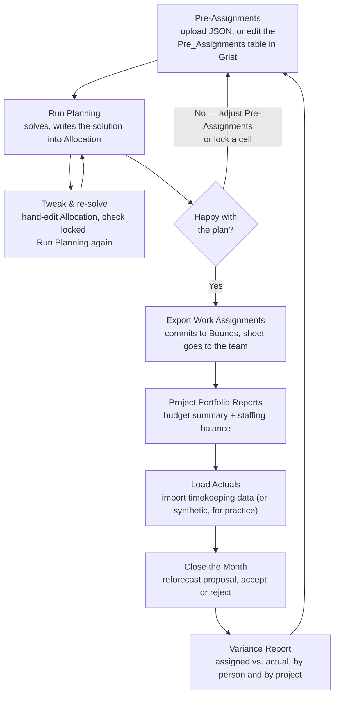

The loop at the top (Pre-Assignments / Run Planning / tweak & re-solve) can
repeat as many times as you like within a month — nothing is committed until
Export Work Assignments. Everything from there down happens once per month,
then the cycle repeats for the next one.

## 1. Start it up

```bash
cd grist_planner
./deploy_planner.sh up
```

First run: generates `.env` with a random Grist admin boot key, builds the
backend image, starts both containers, and provisions a fresh document —
schema, the control-panel widget page, and `examples/small_example/data/`.
Takes under a minute. **No login is needed** — `up` prints a direct link to the
document; open that link, not the bare `http://localhost:8484` (which shows an
empty anonymous space, not this doc — `org_domain` is assigned per admin
account and isn't the same every time, so there's no fixed URL to remember).

The document has one page per table on the left (`People`, `Projects`,
`Bounds`, `Allocation`, ... — the whole star schema from `03-data-model.md`)
plus a **Planner Control Panel** page holding the widget this tutorial uses for
everything else.

## 2. The starting scenario

Three projects, staggered on purpose:

| Project | PoP | Rate structure | Labor budget | Crew |
|---|---|---|---|---|
| Project Alpha | 2027-01 – 2027-06 (the whole horizon) | direct | $396,000 | 5 people |
| Project Beta | 2027-01 – 2027-04 (ends mid-horizon) | direct | $168,000 | 3 people |
| Project Gamma | 2027-03 – 2027-06 (starts mid-horizon) | oh_charged | $120,000 | 2 people |

The first month (2027-01) starts out already closed, with synthetic actuals
already in — a small bootstrap history, the same idea as `examples/medium_example`'s
two pre-closed months, just one month instead of two. **2027-02 is the first
month you actually plan.**

## 3. Setting up the roster, rates, and workable hours

Before (or between) planning cycles, this is where a planner maintains the
underlying facts the solver plans against — all of it lives in ordinary Grist
tables, editable like any spreadsheet:

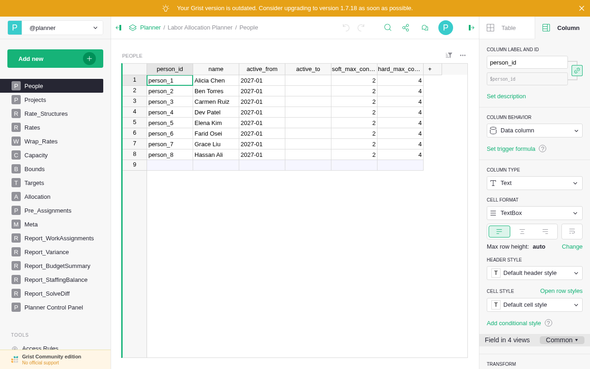

- **`People`** — the roster. Add a row for a new hire (`person_id`, `name`,
  `active_from`, and optionally `active_to` for someone leaving); adjust
  `soft_max_concurrent_projects` / `hard_max_concurrent_projects` per person if
  their fragmentation limits should differ from the defaults (2 soft, 4 hard).
- **`Rates`** — one row per person per month, `annual_salary` only (everything
  else about cost is derived, `03-data-model.md`'s "Derived" section). Giving
  someone a raise is adding/editing their row for the months it takes effect;
  since it's dense (one row per person per month), a raise typically means
  updating every month from the effective date forward, not just one row.
- **`Wrap_Rates`** — global, not per-person: one row per month with
  `workable_hours` (the standard reference hours for that month — weekdays
  minus holidays, `allocsolver.models.calendar.workable_hours()`) and the three
  wrap-rate multipliers (`project_wrap_rate`, `oh_wrap_rate`, `fee_wrap_rate`).
  These change at each corporate fiscal year boundary (July 1) in the bigger
  `examples/medium_example` scenario; this small scenario keeps them constant
  throughout for simplicity.
- **`Capacity`** — one row per person per month, `available_hours`: a specific
  person's *real* available hours that month, which can differ from the global
  `workable_hours` reference (part-time, planned leave, a partial month). This
  is the figure `Report_StaffingBalance`'s capacity side and the solver's own
  per-person monthly ceiling (C3, `04-solver-design.md`) are both built from.

None of these four tables are touched by the solver or by any of the widget's
buttons — they're pure human input, exactly like `Bounds` and `Targets` are
until a pre-assignment or a solve touches them.

## 4. Month 1 (2027-02): plan around a manual pre-assignment

Say a planner has already decided Alicia Chen (`person_1`) works 130 hours on
Project Alpha this month — a decision made before running the solver, the way
most of the workforce actually gets assigned in practice. Load it:

- On the widget's **1. Pre-Assignments** panel, choose
  `examples/small_example/sample_pre_assignment.json` and click **Load
  Pre-Assignment JSON**.

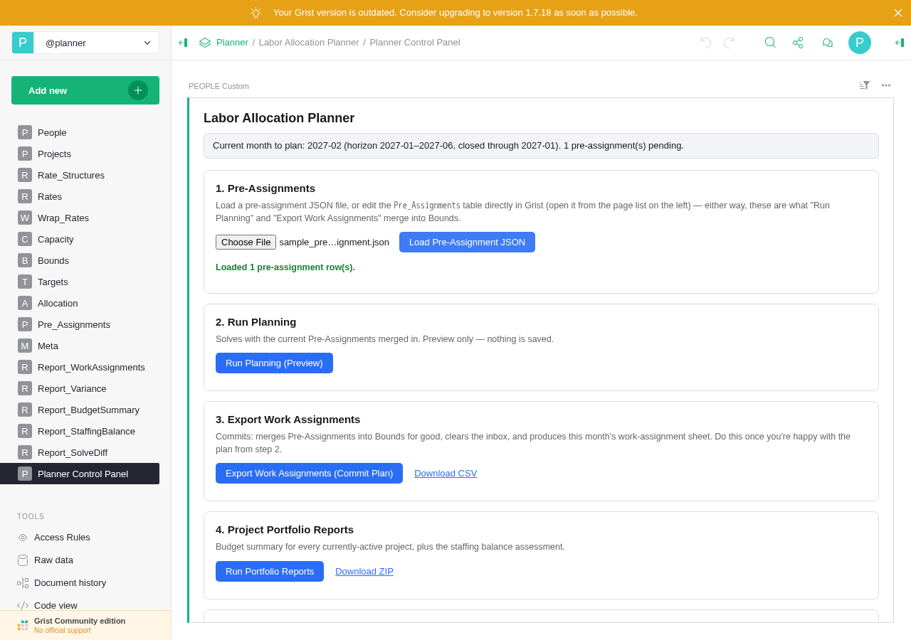

(Same shape as any pre-assignment file — you could hand-edit the
`Pre_Assignments` table instead, and get the identical result.)

Click **2. Run Planning**. This solves with that pre-assignment merged in, and
writes the result into the `Allocation` table:

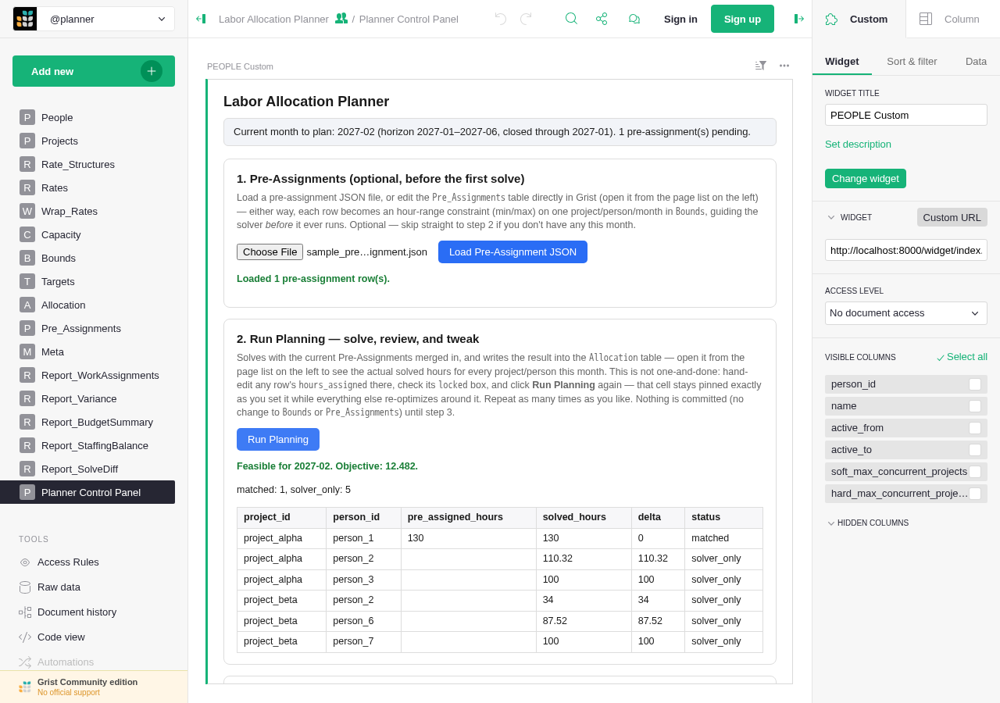

Alicia's row shows `matched` (solved exactly at her requested 130h); the other
rows are `solver_only` — assignments the solver picked on its own to cover the
rest of both projects' targets.

## 5. This is not one-and-done: tweak, then re-solve

Open the `Allocation` table (left sidebar). Rows for 2027-01 (already closed)
show both `hours_assigned` and `hours_actual`; rows for 2027-02 onward — the
month you just planned — show only `hours_assigned`, freshly written by Run
Planning, with `locked` unchecked:

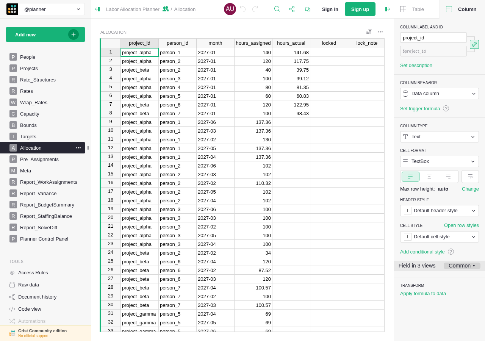

This is the actual solution, not a preview, and it's an ordinary editable Grist
table. Say Alicia should really only work 95 hours this month, not 130 — double-
click her `hours_assigned` cell for 2027-02, type `95`, hit Enter, then check
her `locked` box:

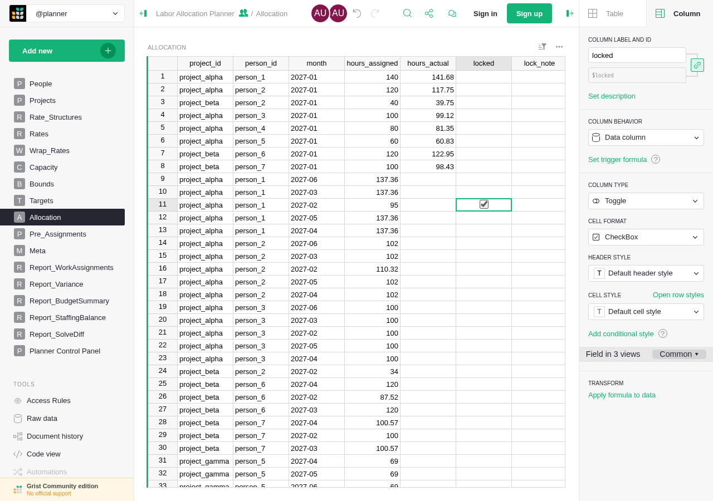

Go back to the Planner Control Panel and click **Run Planning** again. Alicia's
cell holds at exactly 95 (`solver_adjusted` — it now differs from her original
130h pre-assignment) while the rest of the plan re-optimizes around it — here,
Carmen Ruiz's hours on Project Alpha rise from 100 to 94.9 to help absorb the
difference:

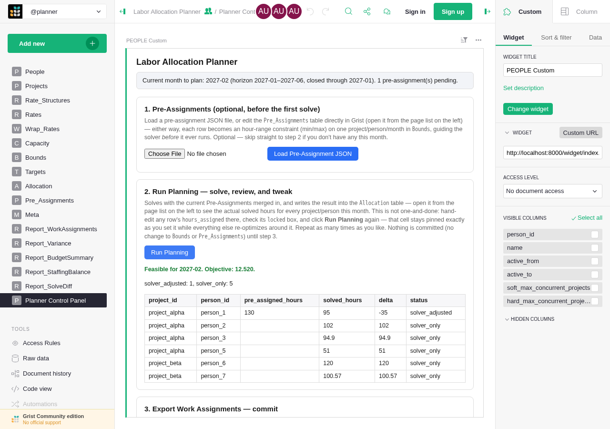

Repeat this as many times as you like — lock more cells, unlock others, adjust
the pre-assignment, re-run — nothing outside `Allocation` changes until the
next step.

## 6. Commit the plan

Click **3. Export Work Assignments**. This is the commit point: the
pre-assignment is merged into `Bounds` permanently, the `Pre_Assignments` table
clears, `Allocation` is refreshed once more, and this month's sheet is
produced — the one that would go out to the workforce (hours only, no cost,
`05-interfaces.md`'s workforce export):

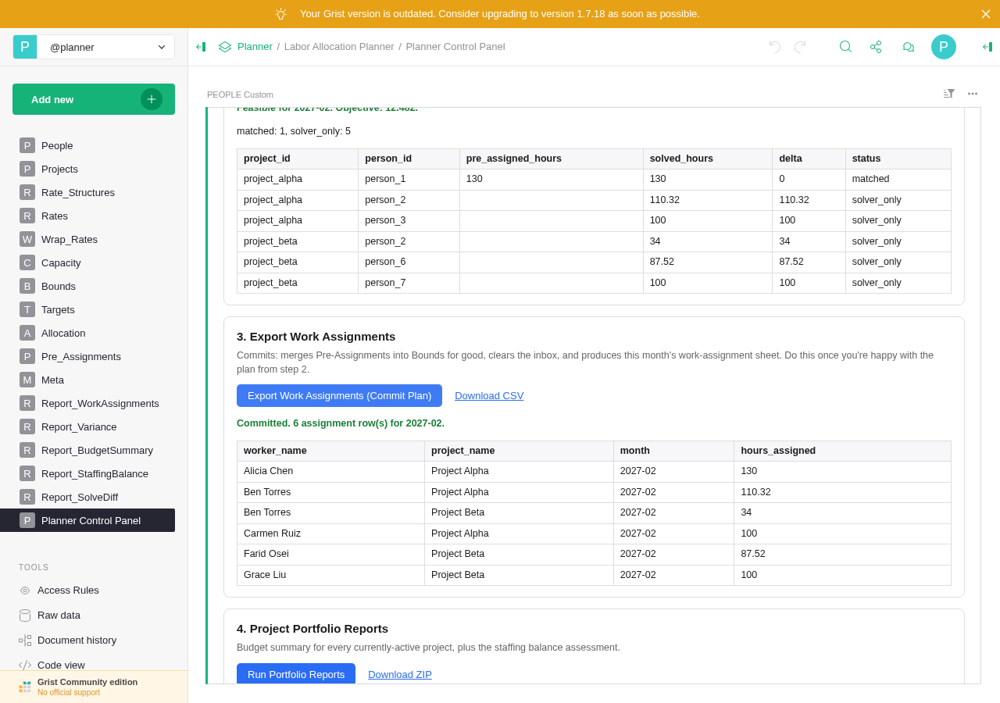

## 7. Check the portfolio

Click **4. Run Portfolio Reports**. Two things come back: a budget summary for
every currently-active project (planned spend populated for the whole PoP;
actual spend blank for anything not yet closed — `export_budget_summary`'s "as
of" rule), and the staffing balance assessment:

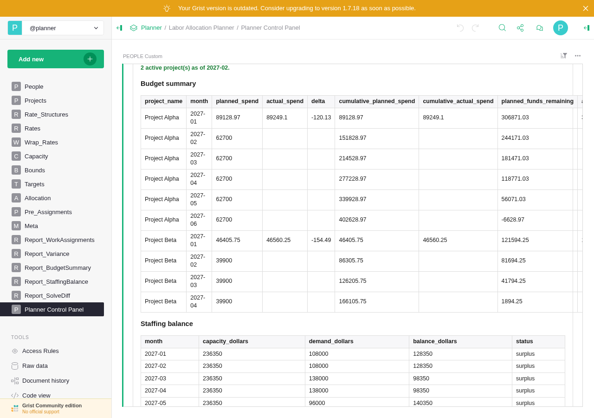

This toy scenario is deliberately staffed light relative to its 8-person pool —
unlike `examples/medium_example`'s calibrated-to-near-capacity portfolio, there's
nothing here to tune toward a realistic deficit. The point of this step is the
mechanism (capacity valued at the direct rate, demand from `Targets`, `08-grist-
ui-design.md`), not the specific numbers.

## 8. Close the month

No real timekeeping export exists yet, so leave the file input empty under
**5. Load Actuals** and click **Preview** — this falls back to the same
synthetic-actuals generator the standalone examples use (`io/synthetic.py`), so
the tutorial can be practiced before real data exists. Nothing is saved by
Preview. Check **Accept reforecast proposal**, then click **Confirm & Close
Month**:

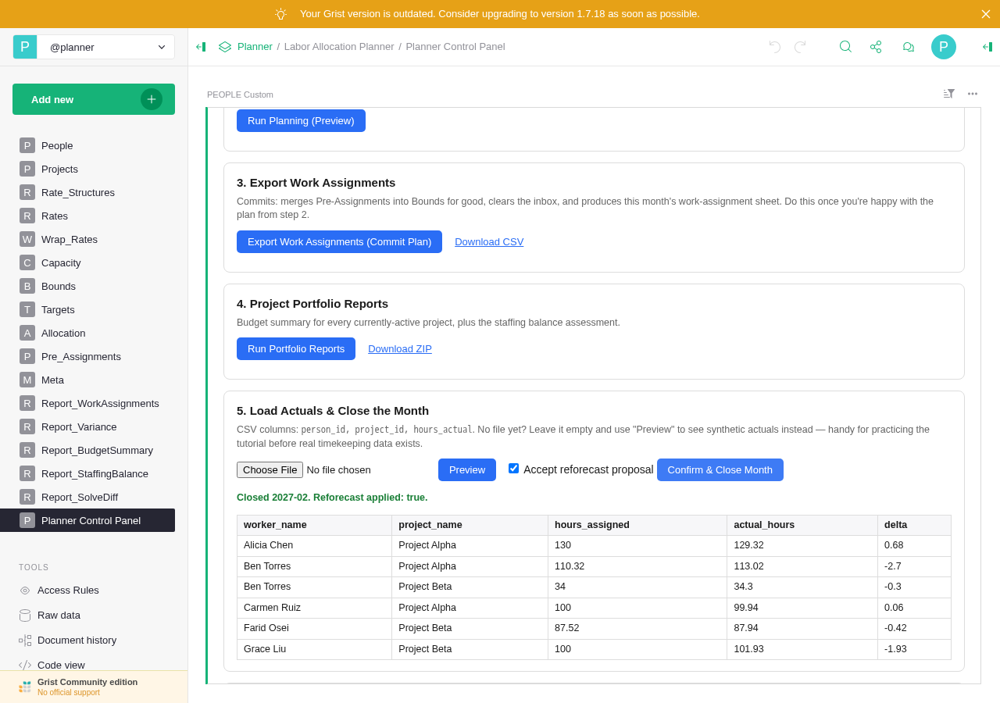

The state banner now reads `closed_through: 2027-02` — Project Alpha and Beta's
remaining targets have shifted slightly to absorb this month's variance
(`propose_reforecast`, `04-solver-design.md`'s Reforecasting section).

Use **6. Variance Report** any time afterward to pull the assigned-vs-actual
delta for any already-closed month back up — here, the original bootstrap
month (2027-01):

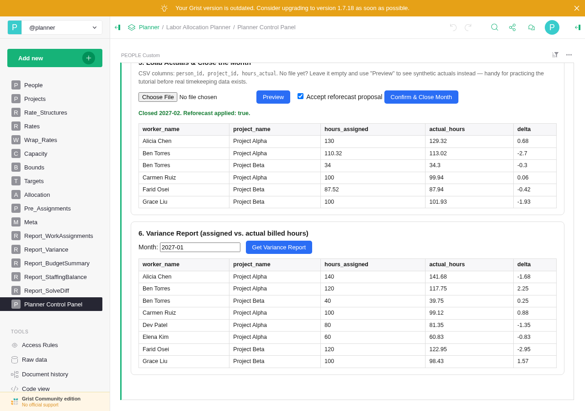

## 9. Repeat for the rest of the horizon

Months 2027-03 through 2027-06 follow the identical cycle from the diagram at
the top (skip the pre-assignment step in any month you don't have one — it's
optional every month, not required). Two months are worth watching for
specifically:

- **2027-03**: Project Gamma's PoP starts. Its two-person crew shows up in Run
  Planning's diff for the first time, `solver_only` since there's no
  pre-assignment for it — a fresh project coming online mid-horizon.
- **2027-04**: Project Beta's PoP ends. Its final month's budget summary is
  where a real portfolio would show a true-up — this small scenario's even
  target split doesn't specifically drive one; `examples/medium_example` is
  where that mechanism is exercised at scale.

By 2027-06, `/api/state`'s `horizon_exhausted` flips to `true` — nothing left
to plan.

## 10. Loading real actuals instead of synthetic ones

Once a real timekeeping export exists, build a CSV with exactly these columns —
`person_id, project_id, hours_actual` — and upload it in step 8's file input
instead of leaving it empty. Everything downstream (variance, reforecast) works
identically; only the source of the numbers changes.

## 11. Trying the medium example instead

The same deployment can run `examples/medium_example/` instead — 50 people,
~10-12 concurrently active projects, a 5-year horizon spanning several
corporate fiscal-year rate transitions:

```bash
./deploy_planner.sh reset       # a document can only be seeded once; start clean
./deploy_planner.sh up --example medium_example
```

The widget, buttons, and monthly cycle are identical — only the data is
bigger. Clicking through all 58 months by hand in Grist works, but it's slow;
`examples/medium_example/simulate_full_horizon.py` proves the same solve →
actuals → close → reforecast cycle holds up across the whole 5-year horizon in
one command-line run, without clicking anything. Use the Grist UI to look
closely at a handful of representative months, and the standalone script to
see the whole horizon at once.

## 12. Shutting down

```bash
./deploy_planner.sh down     # stop containers, keep all data
./deploy_planner.sh reset    # destroy everything, including the Grist document — asks to confirm
```

`down` is what you want between sessions. `reset` is for starting over from
scratch (e.g. to switch between the small and medium examples, or to re-run
this tutorial from a clean slate) — it deletes the `.env` file (with its boot
key) along with both docker volumes.
