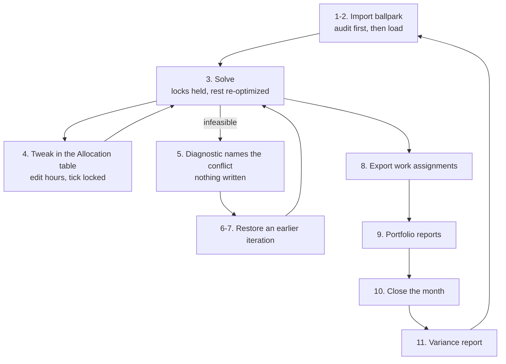

# 09. Planner Tutorial — Manual Test Protocol

A step-by-step protocol for exercising the planner by hand, against the small starting
scenario in `examples/small_example/` (8 people, 3 staggered projects, a 6-month
horizon, with the first month already closed as bootstrap history).

Every expected value below was captured from a real run of this exact sequence on a
freshly provisioned document. The solver is deterministic on this dataset, so the
numbers reproduce — with one exception, called out at step 10, where synthetic actuals
are randomly drawn.

Steps 1 through 7 are the loop `08-grist-ui-design.md` describes: import a ballpark,
tweak and lock, solve, repeat, and go back when a round turns out badly. Steps 8 through
12 are the rest of the monthly cycle, which happens once per month.

> **No screenshots.** The twelve images this walkthrough used to carry showed the
> previous widget layout and are all wrong now. They remain in
> `docs/images/grist_tutorial/` pending recapture rather than being referenced here.
> The expected-output blocks below are what verifies each step.

## The loop under test



## Setup

```bash
cd grist_planner
./deploy_planner.sh up
```

First run generates `.env` with a random Grist admin boot key, builds the backend image,
starts both containers, and provisions a fresh document — schema, the control-panel
widget page, and `examples/small_example/data/`. Under a minute.

**No login is needed.** `up` prints a direct link to the document; open that link, not
the bare `http://localhost:8484`, which shows an empty anonymous space (`org_domain` is
assigned per admin account and is not the same every time, so there is no fixed URL).

To re-run this protocol from the top, start from a clean document:

```bash
./deploy_planner.sh reset    # destroys the document and both volumes; asks to confirm
./deploy_planner.sh up
```

Re-running the protocol on a document that has already been through it produces
different iteration numbers and different solved hours. A clean document is what the
expected values below assume.

### The starting scenario

| Project | PoP | Rate structure | Labor budget | Eligible crew |
|---|---|---|---|---|
| Project Alpha | 2027-01 – 2027-06 | direct | $396,000 | person_1 … person_5 |
| Project Beta | 2027-01 – 2027-04 | direct | $168,000 | person_2, person_6, person_7 |
| Project Gamma | 2027-03 – 2027-06 | oh_charged | $120,000 | person_5, person_8 |

Everyone has 168 available hours per month, a `hard_max_concurrent_projects` of 4, and
all spend targets are **soft**. 2027-01 is already closed with synthetic actuals.
**2027-02 is the first month planned.**

### Confirming the starting state

The widget's banner should read:

```
Planning 2027-02 (horizon 2027-01–2027-06, closed through 2027-01).
No working assignment yet — import a ballpark in step 1, or solve from scratch in step 3.
```

The left sidebar should list one page per table, including the three this protocol
exercises: `Allocation`, `Assignment_History`, and `Report_BallparkAudit`. If
`Assignment_History` is missing, the document was provisioned by an older build — re-run
`./deploy_planner.sh up`, which adds missing tables idempotently.

## 1. Audit the ballpark

The file under test is `examples/small_example/sample_ballpark.csv`:

```csv
project_id,person_id,month,hours,locked
project_alpha,person_1,2027-02,150,true
project_alpha,person_2,2027-02,150,false
project_beta,person_2,2027-02,40,false
project_beta,person_6,2027-02,120,false
project_alpha,person_6,2027-02,80,false
project_gamma,person_8,2027-03,140,false
```

It is deliberately imperfect, in four different ways at once — which is the point, since
a hand-built starting assignment normally is.

On the widget's **1. Import the ballpark** panel, choose that file, leave *Also make
ineligible pairs eligible* **unchecked**, and click **Audit only**.

Expected — 6 rows parsed, 5 usable, 1 dropped:

| status | project | person | month | hours | meaning |
|---|---|---|---|---|---|
| `not_eligible` | project_alpha | person_6 | 2027-02 | 80 | no `Bounds` row exists — the solver has no variable for this cell |
| `above_hard_max` | project_alpha | person_2 | 2027-02 | 150 | over this cell's `hard_max` of 138h; the solver will pull it down |
| `ok` | project_alpha | person_1 | 2027-02 | 150 | locked |
| `ok` | project_beta | person_2 | 2027-02 | 40 | |
| `ok` | project_beta | person_6 | 2027-02 | 120 | |
| `ok` | project_gamma | person_8 | 2027-03 | 140 | |
| `over_capacity` | — | person_2 | 2027-02 | 190 | 190h against 168h of capacity; the solver must shed 22h |

**What this verifies.** Nothing was written — the banner still reads "No working
assignment yet". A ballpark is allowed to break the rules and is reported rather than
rejected. The `applied` column separates the violations the solver will resolve
(`above_hard_max`, `over_capacity`) from the one it structurally cannot: `not_eligible`
means no solver variable exists for that cell, so importing the row would write a number
nothing reads. The `over_capacity` row has no project, because no single row of the file
is wrong — person_2's 150h and 40h are each fine, and only their sum is not.

The same table is written to `Report_BallparkAudit` and can be sorted and filtered there.

## 2. Import it

Check **Also make ineligible pairs eligible**, and click **Import Ballpark**.

Expected: `Imported 6 of 6 row(s) as iteration 1.` and `Added 1 permissive Bounds
row(s).` The status counts become `above_hard_max: 1, ok: 5, over_capacity: 2` — opening
person_6's cell on Project Alpha put that person at 200h against 168h of capacity, so a
second over-capacity row appears that the first audit could not have known about.

The banner should now read:

```
Working assignment: 6 cell(s), 680.0h, 1 locked. Iteration 1 (import).
```

**What this verifies.** `make_eligible` is an explicit opt-in that adds permissive
`Bounds` rows, because making a person eligible for a project is a real staffing
decision. Open the `Bounds` table and confirm a new row for
`project_alpha / person_6 / 2027-02` with `hard_min` 0 and `eligible` checked.

## 3. Solve

On **3. Solve**, leave adherence at **loose** and click **Solve**.

Expected: `Feasible. Objective 18.86981, saved as iteration 2.` with changes
`added: 25, adjusted: 3, unchanged: 3`.

The 2027-02 rows of the diff:

| status | project | person | before | after | delta | locked |
|---|---|---|---|---|---|---|
| `unchanged` | project_alpha | person_1 | 150.0 | 150.0 | 0.00 | **yes** |
| `adjusted` | project_alpha | person_2 | 150.0 | 128.0 | −22.00 | |
| `added` | project_alpha | person_3 | — | 26.45 | +26.45 | |
| `adjusted` | project_alpha | person_6 | 80.0 | 48.0 | −32.00 | |
| `unchanged` | project_beta | person_2 | 40.0 | 40.0 | 0.00 | |
| `unchanged` | project_beta | person_6 | 120.0 | 120.0 | 0.00 | |
| `added` | project_beta | person_7 | — | 66.50 | +66.50 | |

**What this verifies — check each of these.**

- **The lock held exactly.** person_1 stayed at 150h even though nothing else did.
- **Both capacity overruns were resolved, to the hour.** person_2 is now 128 + 40 = 168;
  person_6 is now 48 + 120 = 168. Both land exactly on capacity.
- **The solver shed from the right cell.** person_2's 22h came off Project Alpha, which
  was also over that cell's 138h `hard_max`, not off Project Beta which was within
  bounds.
- **The ballpark was kept where it could be.** Three cells are untouched, and the two
  adjusted ones moved only as far as feasibility required. That is the baseline working:
  a solve with no baseline is free to rearrange everything.
- **The rest of the horizon was filled in.** 25 cells were added for 2027-03 through
  2027-06, which the ballpark said nothing about. The diff spans the whole open horizon
  on purpose — a change this month ripples forward.

Open the `Allocation` table. 2027-01 rows carry both `hours_assigned` and `hours_actual`;
2027-02 onward carry only `hours_assigned`, with `locked` checked on exactly one row.
There should be **31 rows** for open months and **no row with 0.00 hours**.

## 4. Tweak, then re-solve

Open the `Allocation` table and find the row for `project_alpha / person_1 / 2027-02`
(sorting by `month` then `person_id` is the quickest way). Double-click its
`hours_assigned` cell, change **150 to 100**, and press Enter. Leave `locked` checked.

Return to the control panel. The banner should now say `— unsaved hand-edits, the next
solve will save them first.`

Click **Solve** again.

Expected: `saved as iteration 4`, with the note `Your hand-edits were saved first as
iteration 3`. Changes: `adjusted: 1, unchanged: 30`.

The single adjusted cell:

| status | project | person | before | after | delta |
|---|---|---|---|---|---|
| `adjusted` | project_alpha | person_3 | 26.45 | 72.88 | +46.43 |

**What this verifies.** This is the heart of the loop.

- **Hand-edits made in Grist are captured.** Nothing but the solve observes them, so
  without the pre-solve snapshot at iteration 3 the edit would have been overwritten
  irrecoverably.
- **The lock survived the edit.** person_1 holds at 100h, the new value.
- **Exactly one other cell moved.** Carmen Ruiz absorbed the 50h drop on Project Alpha.
  Thirty cells are unchanged — the consequence of the edit is visible precisely because
  the baseline held everything else still. Without it, this diff would be noise.

## 5. Make it impossible on purpose

Back in the `Allocation` table, for 2027-02:

1. Set `project_alpha / person_2` to **150** hours and tick its `locked` box.
2. Tick the `locked` box on `project_beta / person_2` (leave it at 40).

Ben Torres is now pinned to 190 hours in a month with 168 available.

Click **Solve**.

Expected — an error, not a plan:

```
INFEASIBLE. These locks cannot all hold:

  capacity       person_2                 2027-02  190 vs limit 168
    person_2's locked cells in 2027-02 total 190h against 168h of capacity — 22h
    over. Unlock one, or lower a locked value.
    locked: project_alpha:150h, project_beta:40h

Also, minimum relaxation to reach feasibility:

  capacity     person_2                 2027-02  +22.0 h  (over available capacity)
```

**What this verifies.**

- **The failure names the cause, the cells responsible, and the fix** — not just "no
  solution". The second half is the elastic relaxation's generic view; the first half is
  the lock-specific diagnostic, which is the part that says *why* capacity is binding.
- **The failed solve wrote no plan.** The banner's iteration is now 5 with source
  `tweak`, not `solve`. `Allocation` still holds the previous assignment.
- **The edits were still saved.** Iteration 5 is the pre-solve snapshot, so the two locks
  just set are recoverable even though the solve failed. A failed solve costs nothing.

Note that setting person_2 to 150h did *not* produce a complaint about that cell's 138h
`hard_max`. That is deliberate: a lock overrides its cell's bounds by design
(`constraints.py` skips C1/C2 for fixed cells), so flagging it would be a false alarm.
Capacity, the concurrency ceiling, and hard spend targets are the three things locks can
genuinely break. This scenario has only 3 projects against a concurrency ceiling of 4 and
uses only soft targets, so capacity is the one reachable here.

## 6. Review the iterations

Click **Refresh iterations** on panel 4.

| # | source | cells | locked | hours | objective | label |
|---|---|---|---|---|---|---|
| 1 | `import` | 6 | 1 | 680.00 | | imported sample_ballpark.csv |
| 2 | `solve` | 31 | 1 | 3251.53 | 18.86981 | solved (loose adherence) |
| 3 | `tweak` | 31 | 1 | 3201.53 | | hand-edited in Grist |
| 4 | `solve` | 31 | 1 | 3247.96 | 10.71219 | solved (loose adherence) |
| 5 | `tweak` | 31 | 3 | 3269.96 | | hand-edited in Grist |

**What this verifies.** Every state is here: the import, both solves, both sets of hand
edits. The `source` column distinguishes the planner's own edits from the solver's
output.

Iterations 2 and 4 are the same 31 cells with different objectives — 18.87 against 10.71
— and this does **not** mean iteration 4 is a better plan. Part of the objective measures
distance from whatever the assignment held when that solve started, and those two solves
started from different places. Objectives are not comparable between rows.

## 7. Go back

Click **Restore** on iteration **4** — the good solve, before the impossible locks.

Expected: `Restored iteration 4 — 31 cell(s), 1 locked, saved as iteration 6.`

Confirm in the `Allocation` table that `project_alpha / person_2` is back to 128 hours
with `locked` cleared, and that person_1 is still at 100 and still locked.

Now click **Solve** once more.

Expected: feasible, saved as iteration 7, changes `unchanged: 31`.

**What this verifies.**

- **Restoring is non-destructive in both directions.** Iteration 5 is still in the list
  and still restorable; the restore appended iteration 6 rather than rewinding to 4.
  Going back and changing one's mind again costs nothing.
- **A solved plan is a fixed point.** Re-solving an already-solved assignment returns it
  unchanged, all 31 cells. This is the property that makes the loop usable at all: any
  difference a planner sees after a solve is a consequence of their own edit, never
  solver churn.

## 8. Commit

Click **Export Work Assignments** on panel 5.

Expected: `Committed 7 assignment(s) for 2027-02.`

| Worker | Project | Hours |
|---|---|---|
| Alicia Chen | Project Alpha | 100.00 |
| Ben Torres | Project Alpha | 128.00 |
| Ben Torres | Project Beta | 40.00 |
| Carmen Ruiz | Project Alpha | 72.88 |
| Farid Osei | Project Alpha | 48.00 |
| Farid Osei | Project Beta | 120.00 |
| Grace Liu | Project Beta | 66.50 |

**What this verifies.** These hours are identical to what step 7 showed. The commit
exports the working assignment as it stands rather than re-solving, so the sheet that
goes to the team is the plan that was reviewed — with many equally optimal assignments
available, a re-solve at this point could legitimately return a different one and change
the plan after sign-off.

### 8b. The commit guard

Edit any 2027-03 cell in `Allocation` — change a `hours_assigned` value — and click
**Export Work Assignments** again without solving.

Expected: refused, with `Commit anyway` offered.

```
The working assignment has changes that haven't been through a solve, so they've never
been checked against capacity, bounds or the spend targets. Run Solve first, or re-send
with force=true to commit them as they are.
```

Clicking **Commit anyway** succeeds and reports `(forced — not solved since the last
tweak)`. **What this verifies:** the cost of not re-solving at commit time is that an
unchecked hand-edit could ship, so that case is refused by default and allowed
deliberately. Solve, then commit again, before continuing.

## 9. Portfolio reports

Click **Run Portfolio Reports** on panel 7.

Expected: 2 active projects as of 2027-02, 10 budget rows, 6 staffing-balance rows.

Budget summary, Project Alpha's first rows:

| Project | Month | Planned spend | Cumulative planned | Planned funds remaining |
|---|---|---|---|---|
| Project Alpha | 2027-01 | 89,128.97 | 89,128.97 | 306,871.03 |
| Project Alpha | 2027-02 | 62,699.84 | 151,828.81 | 244,171.19 |
| Project Alpha | 2027-03 | 62,699.27 | 214,528.08 | 181,471.92 |

Staffing balance — every month `surplus`, capacity $236,350 against demand of $108,000
(2027-02), $138,000 (2027-03 to 2027-04), $96,000 (2027-05 to 2027-06).

**What this verifies.** These figures are computed from the committed working assignment,
not a fresh solve, so they agree with the `Allocation` table. A budget report that
disagreed with the plan it describes would be worse than no report.

This scenario is deliberately staffed light against its 8-person pool, so every month
shows surplus. The mechanism is the point here, not the numbers —
`examples/medium_example` is calibrated near capacity and does produce shortfalls.

## 10. Close the month

> **This step is not deterministic.** No real timekeeping export exists, so leaving the
> file input empty falls back to randomly drawn synthetic actuals (`io/synthetic.py`).
> The hours below are one draw. Different numbers on each Preview are correct behavior,
> not a failure.

On panel 8, leave the file input empty and click **Preview**. Nothing is saved.

Expected: 7 variance rows, one per committed assignment, each with a small delta — a
representative draw:

| Worker | Project | Assigned | Actual | Delta |
|---|---|---|---|---|
| Alicia Chen | Project Alpha | 100.00 | 101.20 | −1.20 |
| Ben Torres | Project Alpha | 128.00 | 125.60 | +2.40 |
| Ben Torres | Project Beta | 40.00 | 39.75 | +0.25 |
| Carmen Ruiz | Project Alpha | 72.88 | 72.24 | +0.64 |
| Farid Osei | Project Alpha | 48.00 | 48.10 | −0.10 |
| Farid Osei | Project Beta | 120.00 | 119.90 | +0.10 |
| Grace Liu | Project Beta | 66.50 | 68.14 | −1.64 |

Plus reforecast proposals for both active projects, each naming the remaining months
whose targets would shift.

**What this verifies.** The assigned column matches step 8's committed sheet exactly.
Variance is measured against the assignment on record, never a re-solve — measuring a
month against a plan nobody worked to is the one comparison a variance report must not
make.

Now check **Accept reforecast proposal** and click **Confirm & Close Month**.

Expected: `Closed 2027-02. Reforecast applied: true.` The banner moves to
`Planning 2027-03 ... closed through 2027-02`, and the working assignment drops from 31
cells to **24** — 2027-02's seven cells are now closed history, pinned to their actuals
and no longer part of the plan.

## 11. Variance report

On panel 9, enter `2027-02` and click **Get Variance Report** — 7 rows, the same figures
just computed, retrievable without re-uploading anything. Enter `2027-01` for the
bootstrap month — 8 rows.

## 12. Repeat for the rest of the horizon

2027-03 through 2027-06 run the identical cycle. The ballpark import is optional in any
month; solving from the existing working assignment is the normal case once the first
month is planned. Two months are worth watching:

- **2027-03** — Project Gamma's PoP starts, and the ballpark's one Gamma row
  (person_8, 140h) was already adjusted up to 149.5h at step 3, that cell's `hard_max`.
- **2027-04** — Project Beta's PoP ends. Its final budget summary is where a real
  portfolio would show a true-up.

By 2027-06 the banner reads `Horizon complete`.

## Checks that something is wrong

| Symptom | Likely cause |
|---|---|
| `Assignment_History` missing from the sidebar | Document provisioned by an older build. Re-run `./deploy_planner.sh up`. |
| Import reports rows as `unknown_person` / `unknown_project` | The ids in the file do not match the seeded data — check the document was seeded from `small_example`, not `medium_example`. |
| Solve reports lock conflicts that were never set | A previous protocol run left locks behind. Clear them with **Unlock matching** on panel 2, with no filters set. |
| A locked cell is silently ignored | The cell has no eligible `Bounds` row. The banner shows these under "Locks being ignored" — the lock has no variable to pin. |
| Rows showing 0.00 hours in `Allocation` | Should not occur. A cell whose hours round to zero is dropped unless it is locked, and locking a cell empty is deliberate. |
| Iteration numbers differ from this document | Extra solves insert extra iterations. The sequence here assumes each step is run once, on a clean document. |

## Loading real actuals instead of synthetic ones

Once a real timekeeping export exists, build a CSV with exactly these columns —
`person_id, project_id, hours_actual` — and upload it at step 10 instead of leaving the
input empty. Everything downstream works identically; only the source of the numbers
changes, and the step becomes deterministic.

## Round-tripping a ballpark through a spreadsheet

**Download current as CSV** on panel 1 exports the working assignment in the same shape
the import reads. Reworking an iteration in a spreadsheet and re-importing it is a
supported path, and re-importing an unmodified download is a useful check in itself: it
should report every row `ok` and change nothing.

## Trying the medium example instead

The same deployment can run `examples/medium_example/` — 50 people, ~10-12 concurrently
active projects, a 5-year horizon spanning several fiscal-year rate transitions:

```bash
./deploy_planner.sh reset       # a document can only be seeded once
./deploy_planner.sh up --example medium_example
```

The widget and the cycle are identical; only the data is bigger. Clicking through all 58
months by hand works but is slow — `examples/medium_example/simulate_full_horizon.py`
proves the same solve → actuals → close → reforecast cycle holds across the whole horizon
in one command-line run. Use the UI to look closely at a few representative months, and
the script to see the whole horizon at once.

Adherence is worth re-testing at this scale. The named levels in
`config.ADHERENCE_CHURN_WEIGHTS` were calibrated on a two-person fixture where the
headcount term is unusually heavy; at the medium example's scale the same weights are
relatively stronger, so `loose` may already follow a ballpark more closely than it does
here.

## Shutting down

```bash
./deploy_planner.sh down     # stop containers, keep all data
./deploy_planner.sh reset    # destroy everything including the document — asks to confirm
```

`down` is for between sessions. `reset` is for starting this protocol over from a clean
slate, or switching between the small and medium examples; it deletes `.env` with its
boot key along with both docker volumes.
