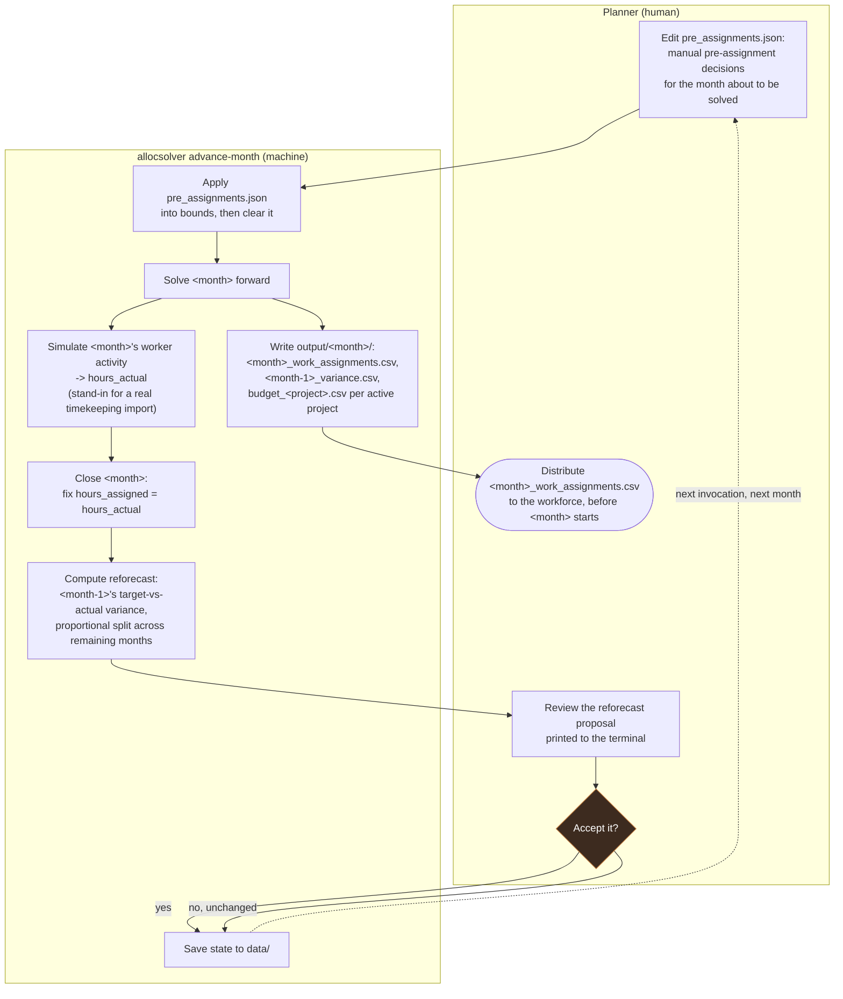

# Medium Example

A synthetic, medium-sized scenario for the labor allocation planner: 50 people,
roughly 10-12 concurrently active projects at any given time (independent projects,
numbered sequentially in chronological PoP-start order — project_1 starts earliest),
spanning 5 calendar years (2027-2031) so several corporate fiscal year (UFY)
wrap-rate transitions are visible.

This example is entirely local-file based — there is no live Grist document involved.
`allocsolver/io/local.py` is the practical stand-in: one JSON file per table in `data/`,
mirroring exactly what would be one Grist table each.

## Setup

From the repository root:

```bash
conda env create -f environment.yml
conda activate general_assignment_solver
```

This installs `allocsolver` itself (editable) along with OR-Tools, Pydantic, Polars,
Typer, Rich, and everything else needed. See the repository root README for more on
the environment.

## Running it

```bash
cd examples/medium_example

# 1. Generate the scenario (only needs to be re-run if you want a fresh random draw,
#    or pass --seed for a specific one; the checked-in data/ already has a run's output).
python generate_data.py --seed 42

# 2. Solve it and produce reports.
python run_example.py
```

> **The checked-in `data/` is fully closed.** Its `meta.json` carries
> `closed_through: 2031-12`, because those files are the end state of a
> `simulate_full_horizon.py` run rather than a fresh draw — there is no open month left
> in them. Anything that plans forward (the Grist planner in particular, see
> `docs/10-medium-example-tutorial.md`) needs step 1 run first, which resets
> `closed_through` to `2027-02`.

`run_example.py` walks through, in order: loading the plan, solving the full 5-year
horizon, rendering a sample of the task view and resource view, pointing out the
ramp-up pattern in the generated data, running the reforecast mechanism against the
closed months' (synthetic) actuals, and writing the three confirmed export formats
to `output/`.

A full solve over this scenario (3,000+ eligible cells, 5-year horizon) takes on the
order of 5-10 seconds on a normal laptop.

### Command-line interface

The same solve is available through `allocsolver`'s CLI, which is what a real
deployment would actually run:

```bash
allocsolver validate --data-dir data
allocsolver solve --data-dir data --export-dir output
```

`solve` prints the objective breakdown and renders every project's and person's task
view / resource view (all of them — for a scan of everything rather than the curated
sample `run_example.py` shows, redirect this to a file or a pager).

### The portfolio Gantt chart

```bash
python plot_gantt.py   # writes portfolio_gantt.png
```

One row per project, ordered chronologically top-to-bottom by PoP start, colored by
rate structure (direct / oh_charged / fee_charged), with year-month across the top
and two families of vertical reference lines: a dashed red line at every UFY
wrap-rate change (July 1) and a dotted green line at every October salary increase.
Needs `matplotlib` (`environment.yml` already includes it, or install
the `viz` extra: `pip install -e '.[viz]'`).

## What's real here, and what's aspirational

This build implements: the full data model, cost composition (`costing/`), the MILP
itself via OR-Tools/SCIP (`solve/`), the elastic-relaxation infeasibility diagnostic,
the reforecast mechanism, the task/resource views, the three confirmed exports
(workforce sheet, variance sheet, budget summary sheet, plus a `completed_project_reports/`
folder collecting each project's final budget summary), a manual pre-assignment
inbox (`pre_assignments.json`, `io/pre_assignments.py`), and a simulated real-time
engine (`advance-month` / `simulate_full_horizon.py`) that drives the whole
solve → actuals → close → reforecast cycle one month at a time.

Not built as part of this example (a live Grist document is a separate deployment,
`../../grist_planner/`, `../../docs/08-grist-ui-design.md`): the real
timekeeping-system ingest pipeline (this example's "actuals" are synthetic,
generated directly rather than imported from a CSV), and snapshot/diff/accept as
CLI commands. These are still described in `../../docs/05-interfaces.md` as the
target design — this example demonstrates the solver and reporting core, not the
full integration surface.

## A tutorial, for a planner

This section is written for the person who will actually use this tool to plan work
assignments, not for the person building it. It assumes you have a data directory
like this example's `data/` (in a real deployment, this would live in Grist).

### The mental model

You are looking at a grid: *people x projects x months*. For every cell where a
person could conceivably work on a project in a given month, you (or a prior planner)
set four numbers, in **hours**:

- **Hard min** — the least this person may work on this project, if they're on it at
  all. Usually 0.
- **Soft min** — the least you'd *like* them to work on it. The solver can go below
  this, but it costs a penalty in the objective — it will only do so when something
  else (a spend target, someone else's capacity) makes that necessary.
- **Soft max** — the most you'd like them to work on it. Same deal: crossable, but
  penalized.
- **Hard max** — the most they may *ever* work on this project this month. Never
  crossed.

If you don't want someone eligible for a project at all in a given month, you simply
don't create a row for that (project, person, month) — no row means ineligible, and
the solver never considers it.

The solver's job, every time you run it, is to pick an actual number of hours for
every eligible cell that:

1. Comes as close as it reasonably can to each project's monthly spend target,
2. Respects every hard bound and nobody's total capacity that month,
3. Tries not to violate soft bounds or leave people fragmented across too many
   projects (default: rarely more than 2, never more than 4), and
4. Changes as little as possible from whatever the last accepted plan was.

Priority (1) dominates the others by design — the tool's whole purpose is hitting the
spend target — but (3) and (4) matter enough that the solver won't casually blow past
them for a rounding error's worth of spend accuracy.

### Reading the task view

Run `allocsolver solve --data-dir data` (or look at `run_example.py`'s console output)
and you'll see, for each project, one row per person assigned to it that month: their
four bounds, how many hours the solver assigned them, what that costs, and — once
actuals exist for a closed month — how that compares to what they actually billed.

The **ramp-up** you'll notice in `project_1`'s first month versus its second: only a
handful of people show up in month one (the PIs and key technical staff), and the
full crew appears from month two onward. That's not a solver feature — it's you (or
whoever set up the input bounds) deliberately not making the rest of the crew eligible
until month two. The solver just fills in whatever bounds it's given.

### Reading the resource view

The same numbers, pivoted around a person instead of a project — everything one
person is doing this month, across all their projects, plus their **%FTE** figure:
what fraction of their available hours this month is actually assigned. This is a
reporting check, not something you enter — you enter hours, the tool tells you what
percentage that works out to.

### When a month closes

Once actuals land for a month (in this example, synthetically, for the first two
months), that month's hours get fixed to whatever was actually billed — the "planned
vs. actual" delta for a closed month is trivially zero by design, because the record
gets corrected to match reality once it's final. The interesting variance for a
closed month isn't "assigned vs. actual" (always zero once closed) — it's **target
vs. actual**, which is what reforecasting looks at.

### Reforecasting

Once a month closes, the tool computes the gap between that project's target for the
month and what was actually spent, and proposes spreading that gap across the
project's *remaining* open months (proportional to their existing target sizes), so
the total still lands close to the funded amount by the project's end. This is always
a *proposal* for you to review — nothing gets written to the targets until you accept
it. Step 5 of `run_example.py`'s output shows this for a few sample projects.

Whether to also re-solve the *current, already-distributed* month because of a big
miss (a "hot fix") is left entirely to your judgment — the tool doesn't try to guess
when a variance is "big enough."

### The exports

Three things come out of `output/` after a solve:

- **`assignments_YYYY-MM.csv`** (`run_example.py` / `allocsolver solve --export-dir`)
  or **`<month>_work_assignments.csv`** (the per-month `advance-month` folders, see
  below) — what you send to the workforce. Worker, project, hours for next month.
  Nothing else — no cost, no rate, no salary ever appears here.
- **`variance.csv`** or **`<month>_variance.csv`** — for you: worker, project,
  month, hours assigned, hours actually billed, and the delta, for every cell where
  actuals exist.
- **`budget_<project_id>.csv`** (or **`<month>_budget_<project_id>.csv`** in the
  per-month `advance-month` folders) — one per project: a metadata block (PoP dates,
  the project's fixed **`labor_budget`** — the funded ceiling it's planned against —
  and budget expended/remaining, planned and actual, measured against that ceiling)
  plus a month-by-month matrix: `planned_spend`, `actual_spend`, `delta`,
  `cumulative_planned_spend`, `cumulative_actual_spend`, `planned_funds_remaining`,
  `actual_funds_remaining` — so you can see the running total and countdown-to-zero
  directly, not just infer it by adding up the per-month row yourself.

`labor_budget` matters because it's the one number in this whole picture that
reforecasting *never* changes — reforecasting only redistributes how a project's
funded total lands across months, never the total itself. `budget_expended_planned` /
`budget_remaining_planned` are always measured against it, not against a sum of
whatever the monthly targets currently happen to say.

**Only the actual side goes blank for the future — the planned side never does.**
In the per-month folders, each `<month>_budget_<project_id>.csv` is "as of" its own
`<month>`: `actual_spend`, `delta`, `cumulative_actual_spend`, and
`actual_funds_remaining` are blank for `<month>` itself and everything after it — a
month's own actuals aren't knowable until the month after it closes (same reasoning
as the variance file below), so showing them, or a running total that includes them,
as of that month's own report would be reporting something not yet knowable.
`planned_spend`, `cumulative_planned_spend`, and `planned_funds_remaining` all stay
populated across the whole PoP regardless — they're forward budget figures, not
something that requires elapsed time to be meaningful, the same way any ordinary
budget-vs-actual report shows the full year's budget alongside actual-to-date.

A project's *final* budget summary is also written to a persistent
`output/completed_project_reports/` folder, named `<pop end date>_final_budget_<project_id>.csv`
— the *actual calendar date* the PoP ends on (e.g. `2027-11-30`), not just the month,
so these sort chronologically and are easy to find without hunting through every
dated folder. This is written one cycle *after* the project's own PoP-end month, not
during it — that month's own actuals aren't knowable until the month after (same
lag as everything else here), so a report generated during the PoP-end month's own
cycle would still show its own last month blank. Only the following cycle can
produce a report with nothing blank anywhere.

**Why the per-month filenames carry two different months.** In `output/<month>/`,
the work-assignments and budget-summary files are prefixed with *that same* month —
the plan and budget report for `<month>` itself, sent/filed before `<month>` starts.
The variance file is prefixed with the *previous* month instead: actuals for a month
only become known the month after it closes (the first week of the following month,
per the real cadence this mirrors), so the variance you can meaningfully report
*during* `<month>`'s cycle is for `<month> - 1`, not `<month>` itself — see the
process diagram below.

### Never leaving budget on the table

A project shouldn't finish with `actual_funds_remaining` sitting comfortably
positive — the goal is to spend every project out fully, landing at most 0.1%-1%
*over* `labor_budget`, never under. The philosophy behind this (stated plainly): the
org holds onto staff, or pulls them in part-time from elsewhere, specifically to hit
this. Two things in the code reflect that:

- **The final month's simulated actuals "true up"** (`io/synthetic.py`) — rather
  than ordinary noise, a project's last PoP month scales its actual hours (up *or*
  down) so cumulative actual spend lands in that 0.1%-1%-over band, capped only by
  real capacity (a physical limit synthetic noise shouldn't paper over).
- **`staffing_balance.csv`** (written by `run_example.py`, `simulate_full_horizon.py`,
  and every `advance-month` cycle) — a month-by-month and total comparison of
  available spend *capacity* against portfolio spend *demand*, in **dollars, not
  hours** — not all person-hours are equivalent, since salary and applicable wrap
  rate both vary person to person and month to month. This is what tells you
  *whether the true-up is even achievable*: a `shortfall` month means there wasn't
  enough capacity to true a project up without exceeding someone's hours — a real
  staffing gap to pull in outside help for, not a synthetic-data quirk. A `surplus`
  means there's slack capacity that could take on outside-portfolio work. This is an
  assessment, not an automatic fix — same as an infeasibility report names the
  binding constraint without resolving it for you.

This example is deliberately tuned to run at a **slight aggregate deficit** — a
few percent short overall, with a majority of individual months showing a
`shortfall` — rather than a comfortable surplus, matching the stated real-world
pattern: the org usually runs a little short-handed and covers the gap with
part-time staff pulled in from elsewhere, rather than routinely having idle
capacity sitting around.

### If a solve comes back infeasible

You'll see a report naming exactly which constraints couldn't all be satisfied
simultaneously, and by how much — e.g. a specific person over capacity in a specific
month, or a hard minimum that couldn't be met. The fix is almost always to relax one
of those bounds, or move someone's assignment elsewhere, then re-solve. The tool never
just tells you "infeasible" with no further information.

## The simulated real-time engine

`run_example.py` solves the whole 5-year horizon once, in a single shot. The
`advance-month` command instead walks forward **one month at a time**, the way an
actual monthly planning cycle would: a planner makes pre-assignment decisions, solve,
"watch" what workers actually did that month, close it, reforecast, repeat. This is
the tool to reach for if you want to make your own manual pre-assignment decisions
between months rather than just seeing one static outcome.

### Who does what, month to month



The one thing this diagram can't show: **actuals always lag by one cycle.** When
you're looking at the reforecast proposal during `<month>`'s run, it's reacting to
`<month - 1>`'s variance, not `<month>`'s — `<month>`'s own actuals don't exist
until *next* run. That's also why the variance file this run writes is named
`<month-1>_variance.csv`, not `<month>_variance.csv` — see "Why the per-month
filenames carry two different months" above.

### One cycle, step by step

```bash
allocsolver advance-month --data-dir data --yes
```

Each run does exactly this, in order:

1. **Applies `pre_assignments.json`** if you've put anything in it (see below), then
   clears it.
2. **Solves** the plan as it currently stands, for the current month forward (the
   "current month" is whatever comes right after `data/meta.json`'s
   `closed_through` — the freshly generated example starts at 2027-02, so the first
   run solves for 2027-03 onward).
3. **Shows you** that month's task view, right in the terminal.
4. **"Simulates worker activity"** for that month — perturbs the just-solved hours
   with realistic noise to invent plausible `hours_actual`, standing in for a real
   timekeeping import (`allocsolver/io/synthetic.py`). This is the one part of the
   cycle that's necessarily synthetic in this example; everything else is the real
   mechanism.
5. **Closes the month** — that month's hours are now fixed to the simulated
   actuals, and `closed_through` advances.
6. **Writes `output/<month>/`**: `<month>_work_assignments.csv` (every
   project/person for `<month>`), `<month-1>_variance.csv` (the *previous* month's
   assigned-vs-actual — see above), and one `<month>_budget_<project_id>.csv` per
   project active during `<month>`. One cycle after a project's own PoP-end month
   (once that month's own actuals are finally known), its genuinely final budget
   summary is additionally written to `output/completed_project_reports/`.
7. **Proposes a reforecast** for every project active during `<month - 1>`, based
   on the fresh actuals, and prints the proposed new targets for the remaining open
   months.
8. **Applies it** if you pass `--yes` (auto-accept, no prompt) — otherwise you're
   asked to confirm interactively.
9. **Saves everything back to `data_dir`**, so the *next* run of the same command
   picks up right where this one left off.

Run it again, and it solves 2027-04. Again, 2027-05. And so on — one command per
simulated month.

### Making your own pre-assignment decisions between months

This is the "manual" part, and it has one clearly-marked file for it:
**`data/pre_assignments.json`.** Before running `advance-month` for a given month,
open it and add an entry — the same shape as a `bounds.json` row (`project_id`,
`person_id`, `month`, `hard_min`, `soft_min`, `soft_max`, `hard_max`) — for whatever
manual staffing decision you want to make: bring someone new onto a project,
tighten a `hard_max`, whatever. For example, to pre-assign `person_7` onto
`project_3` at up to half time for 2027-06:

```json
[
  {
    "project_id": "project_3",
    "person_id": "person_7",
    "month": "2027-06",
    "hard_min": 0,
    "soft_min": 0,
    "soft_max": 80,
    "hard_max": 84,
    "eligible": true
  }
]
```

Save the file, then run `advance-month`. Your entry is applied — merged into
`bounds.json`, upserted by `(project_id, person_id, month)` — before that solve, and
`pre_assignments.json` is cleared back to `[]` once it's been absorbed: it's a
staging inbox for *this cycle's* new decisions, not a running log. The change itself
lives on permanently in `bounds.json`.

This is deliberately kept separate from hand-editing `bounds.json` directly (which
still works, for anything that isn't really a "pre-assignment" — e.g. adjusting
`capacity.json` for a leave of absence). `pre_assignments.json` exists so the one
input that's genuinely supposed to be planner-authored has an obvious, dedicated
place to go, rather than being just another edit buried in the full bounds table.

If your entry breaks a schema invariant (e.g. `soft_min > soft_max`) or references a
person or project that doesn't exist, you'll find out immediately, before anything
solves — pre-assignments go through full plan validation, the same as
`allocsolver validate`.

### A full run, start to finish

```bash
cd examples/medium_example
python generate_data.py --seed 42        # fresh, closed_through = 2027-02

allocsolver advance-month --data-dir data --yes    # solves 2027-03
# ... edit data/pre_assignments.json here if you want to make a manual call ...
allocsolver advance-month --data-dir data --yes    # solves 2027-04
# ... repeat, once per month ...
```

To run the *whole* 5-year horizon this way without typing the command 58 times (e.g.
to prove the cycle holds up end to end, or just to generate every month's output
folder in one go), use `simulate_full_horizon.py` — the same logic, looped in-process
with reforecast auto-accepted throughout:

```bash
python simulate_full_horizon.py --seed 7
```

This prints one line per month (feasible/infeasible, solve time, objective, how many
projects got reforecast) and a summary at the end. On this example it runs all 58
months feasibly in a few minutes, with solve time actually *decreasing* as the
simulation progresses — later months have more history locked in, which presolve
strips out entirely.
