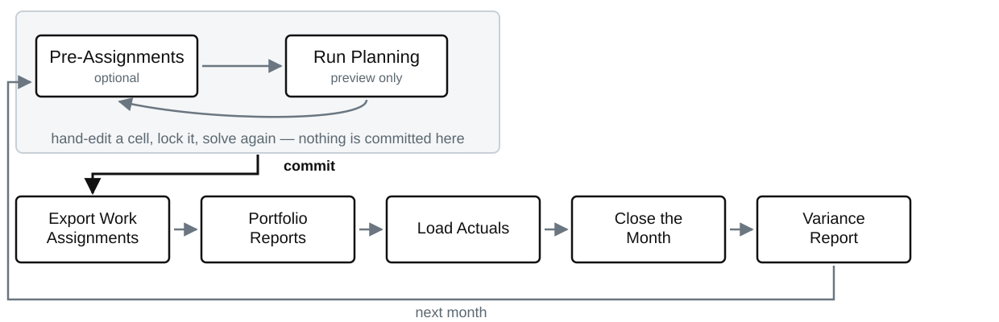
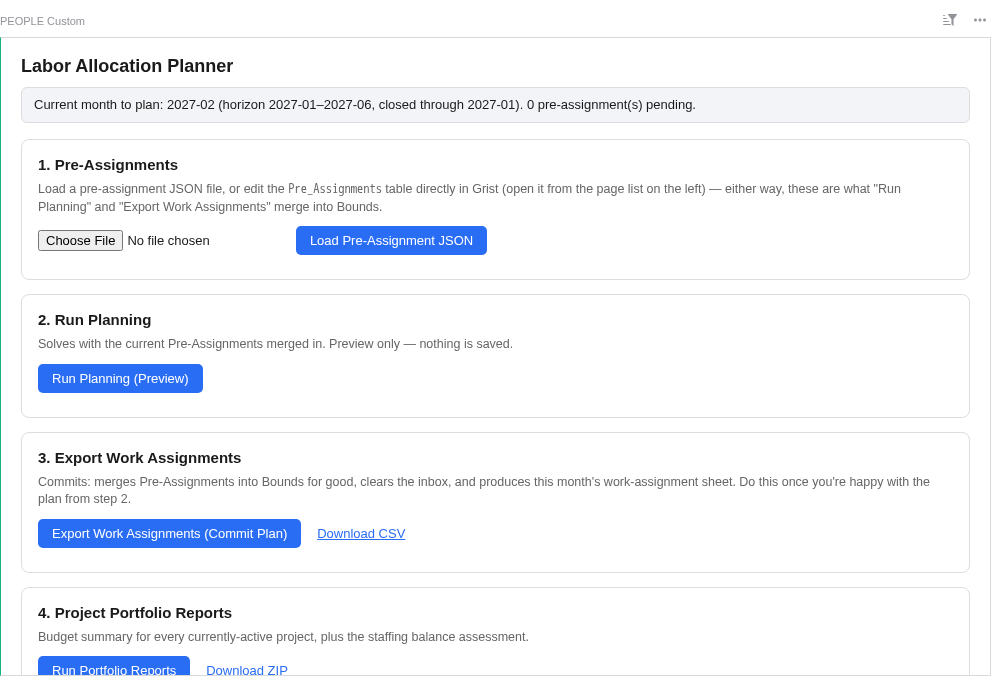
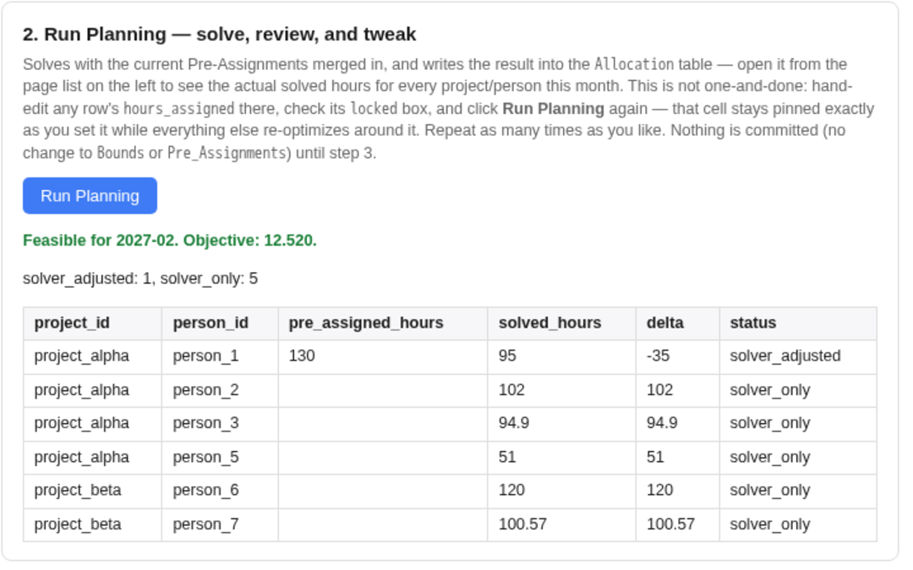
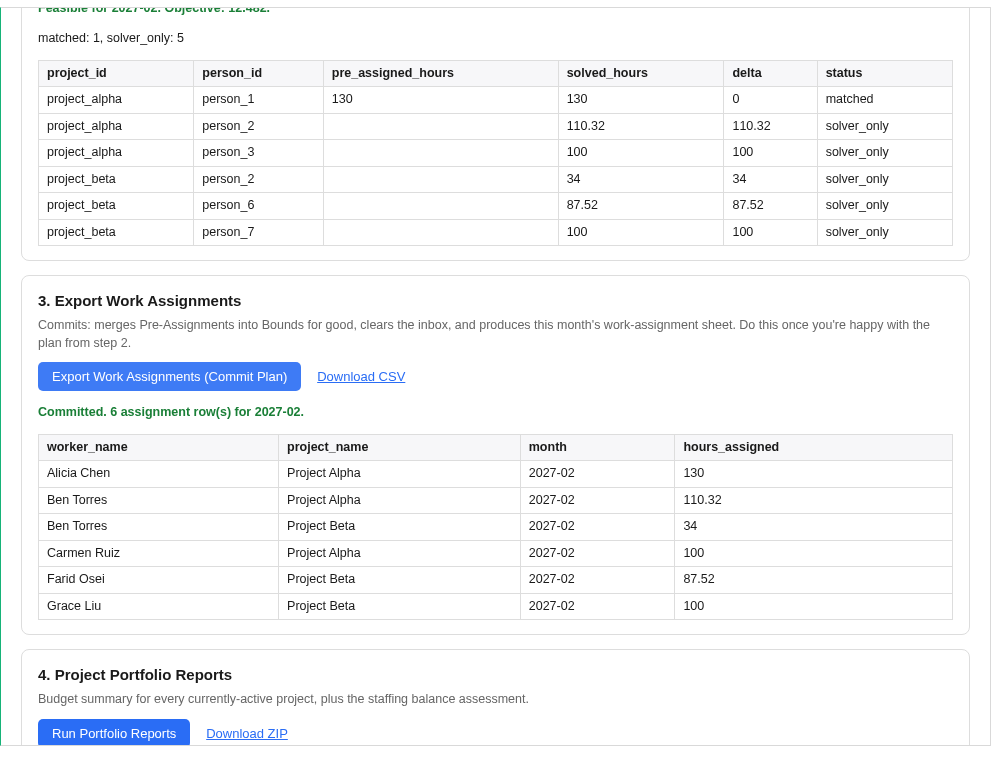
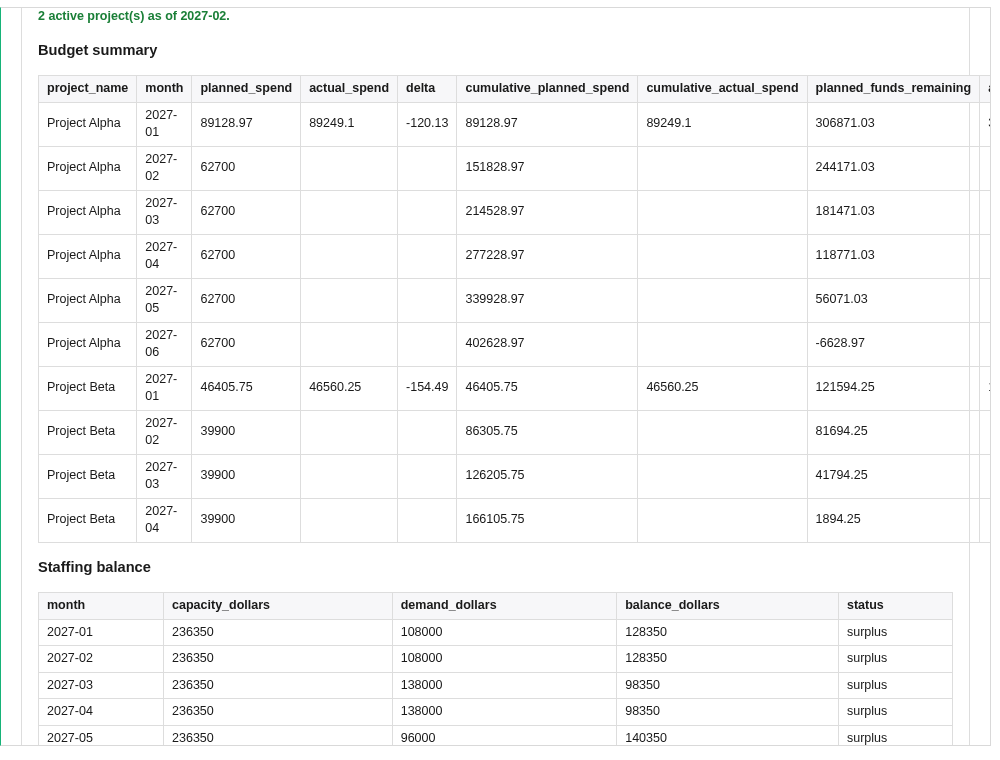
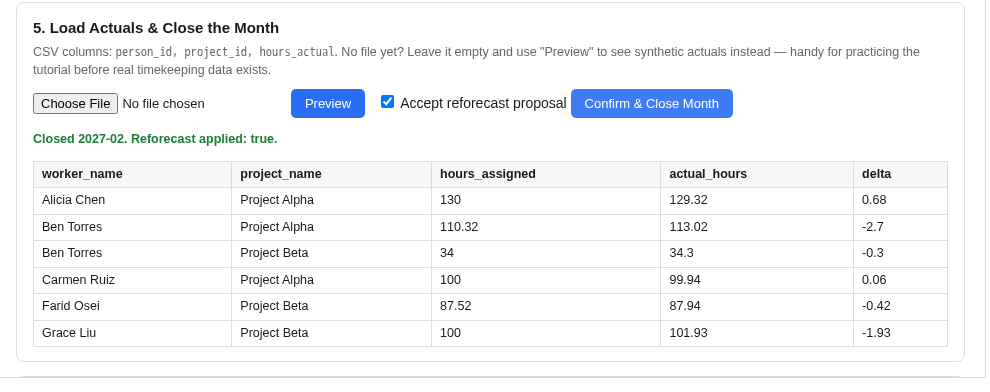
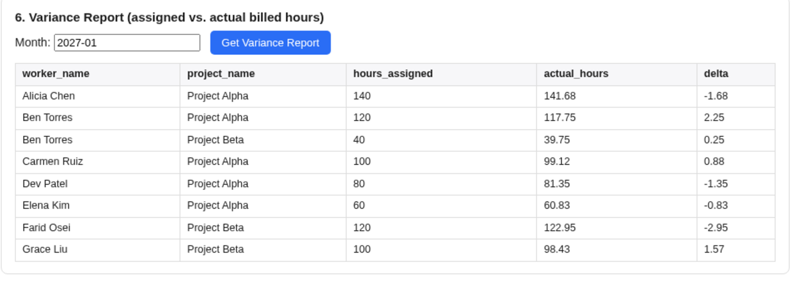

<!-- _class: title -->
<!-- _paginate: false -->
<!-- _footer: "" -->

# Planning a portfolio's labor, without the spreadsheet that fights back

**Labor Allocation Planner**

Hitting every project's monthly spend target, without overbooking anyone

---

# The job is not arithmetic. It is that every fix breaks something else

Several projects, one shared pool of people. Each project has a **monthly spend target** set by its funding profile, not by how the work is going. Each person has finite hours and a loaded cost that changes over time.

Move one person to rescue one project's month and you have just overbooked them, stranded a second project, and put a third person on five things at once.

That is hundreds of interacting cells, and a spreadsheet will let you break every one of them silently.

---

# What it has to get right is a short list, and none of it is optional

- **Land each project on its monthly spend target.**
- **Nobody over capacity**, and everyone inside the bounds you set for them.
- **A steady pulse** — no one dropped to zero one month and back the next.
- **Nobody fragmented** across more than a couple of projects at a time.
- **No project finishes with money unspent.**

A solver can satisfy all of these at once and tell you when it cannot. That is the whole reason this exists.

---

<!-- _class: evidence -->

# You work one loop a month, and only half of it is binding

Everything in the grey box can be repeated as often as you like. Nothing leaves it until you press Export.

---

<!-- _class: evidence -->

# It is six buttons on a page, in the order you use them

The planner control panel. The banner always says which month is being planned, what the horizon is, and how much is already closed.

---

<!-- _class: evidence -->

# Run Planning solves the month and shows you what it did

Feasible, with the objective value, and a row per assignment: what you asked for, what the solver chose, and the difference.

---

# The part that matters: you can overrule it, and it will work around you

Type `95` into somebody's hours, tick **locked**, and press Run Planning again.

That cell holds at exactly 95. **Everything else re-optimizes around it** — in the example above, one colleague's hours rise to absorb the difference while every target and capacity limit still holds.

Repeat as often as you like. Lock more cells, unlock others, change a pre-assignment. **Nothing is committed until you export.**

This is the difference between a tool that plans for you and one you can actually argue with.

---

<!-- _class: evidence -->

# Export commits the plan and produces the sheet the team receives

The workforce sheet carries worker, project and hours for the coming month — and deliberately no cost, rate or salary.

---

<!-- _class: evidence -->

# The portfolio view answers the two questions above your pay grade

Budget summary per active project, plus a staffing balance: whether the portfolio's demand and the organization's capacity actually match, in dollars, month by month.

---

<!-- _class: evidence -->

# When a month closes, the plan reforecasts itself — and asks first

Real months never land exactly on target. Rather than let the gap compound, closing a month redistributes its variance across that project's **remaining** open months, proportional to what they already carry.

**It is a proposal.** You see it, and you accept or reject it before anything is written.

The solver itself never trades away a target to keep the plan tidy. It always tries to hit whatever is in the plan; closing the month is what updates the plan to match reality.

---

<!-- _class: evidence -->

# And you get told what actually happened, by person and by project

Assigned against actual billed hours for a closed month. This is the number that drives next month's reforecast.

---

# When it cannot be done, it says which constraint is in the way

An infeasible month is the normal outcome of an over-committed portfolio, and "no solution" is not something a planner can act on.

Instead it names the binding constraint — the capacity, the bound, the target — so the conversation is about *that*, not about the tool.

The same applies to staffing balance and to idle people. **Both are surfaced for you to act on, never silently resolved by the solver.**

---

# What it deliberately is not

- **Not a scheduler.** No predecessors, no durations, no critical path. Projects are single tasks.
- **Not a timekeeping system.** Actual hours come from wherever they already come from, and are imported.
- **Not an accounting system.** Its numbers plan work; they do not close books or bill anyone.
- **Not a replacement for the funding document.** Dates and budgets are transcribed from the contract.

Each of these has killed a tool like this somewhere else, by being added.

---

# Where it stands

**Working today:** the full data model and validation, the solver with all its constraints, infeasibility diagnostics, reforecasting, the exports, the staffing-balance assessment, and the Grist planner you have been looking at. A five-year, 58-month horizon solves end to end.

**Not yet built:** the ingest pipeline from real timekeeping data — actuals are synthetic or a hand-built CSV for now — and scenario snapshot/diff/accept.

---

<!-- _class: closing -->

# Try it before you believe any of this

**A worked tutorial, from an empty document to a closed month**
`docs/09-planner-tutorial.md`

**Two ready-made examples**
`examples/small_example` to read by hand · `examples/medium_example` for something portfolio-sized

Bring a month you already planned by hand, and see whether it agrees with you.
